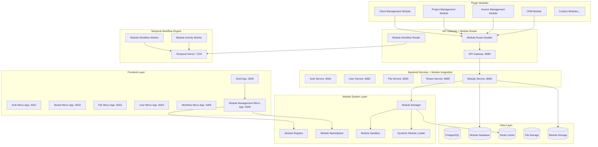

# ADX CORE Modules System Design

## Overview

The ADX CORE modules system provides a WordPress-style plugin architecture that enables extensible functionality while maintaining security, performance, and multi-tenant isolation. The system integrates seamlessly with the existing Temporal-first backend architecture and frontend microservices, allowing modules to extend both backend workflows and frontend components.

## Architecture

### High-Level Module System Architecture



### Module Architecture Patterns

#### 1. Module Structure

Each module follows a standardized structure similar to WordPress plugins:

```
modules/
├── client-management/
│   ├── module.toml                 # Module manifest
│   ├── src/
│   │   ├── lib.rs                 # Module entry point
│   │   ├── activities.rs          # Temporal activities
│   │   ├── workflows.rs           # Temporal workflows
│   │   ├── handlers.rs            # HTTP handlers
│   │   ├── models.rs              # Data models
│   │   └── migrations/            # Database migrations
│   ├── frontend/
│   │   ├── components/            # React components
│   │   ├── pages/                 # Module pages
│   │   ├── hooks/                 # Custom hooks
│   │   └── services/              # API services
│   ├── assets/
│   │   ├── icons/                 # Module icons
│   │   ├── images/                # Module images
│   │   └── styles/                # Module styles
│   ├── tests/
│   │   ├── unit/                  # Unit tests
│   │   ├── integration/           # Integration tests
│   │   └── e2e/                   # End-to-end tests
│   └── docs/
│       ├── README.md              # Module documentation
│       ├── API.md                 # API documentation
│       └── CHANGELOG.md           # Version history
```

#### 2. Module Manifest (module.toml)

```toml
[module]
name = "client-management"
display_name = "Client & Customer Management"
version = "1.2.0"
description = "Comprehensive client and customer management with branded portals"
author = "ADX CORE Team"
license = "MIT"
homepage = "https://adxcore.com/modules/client-management"
repository = "https://github.com/adxcore/modules/client-management"

[module.compatibility]
adx_core_version = ">=2.0.0"
rust_version = ">=1.88.0"
node_version = ">=18.0.0"

[module.dependencies]
temporal-sdk = "0.1.0"
serde = "1.0"
uuid = "1.0"
chrono = "0.4"

[module.permissions]
required = [
    "client.read",
    "client.write",
    "client.delete",
    "file.read",
    "file.write",
    "workflow.execute"
]
optional = [
    "billing.read",
    "analytics.read"
]

[module.resources]
max_memory = "512MB"
max_cpu = "50%"
max_storage = "1GB"
max_network_requests = 1000

[module.database]
migrations_path = "src/migrations"
schema_prefix = "client_mgmt_"

[module.frontend]
entry_point = "frontend/src/index.tsx"
routes = [
    { path = "/clients", component = "ClientListPage" },
    { path = "/clients/:id", component = "ClientDetailPage" },
    { path = "/client-portal", component = "ClientPortalPage" }
]

[module.workflows]
task_queue = "client-management-queue"
workflows = [
    "client_onboarding_workflow",
    "client_portal_setup_workflow",
    "client_project_creation_workflow"
]

[module.marketplace]
category = "Business Management"
tags = ["crm", "client-management", "portal", "business"]
price = 0  # Free module
screenshots = [
    "assets/screenshots/client-list.png",
    "assets/screenshots/client-detail.png",
    "assets/screenshots/client-portal.png"
]
```

## Components and Interfaces

### 1. Module Manager

The core component responsible for module lifecycle management:

```rust
use std::collections::HashMap;
use std::path::Path;
use std::sync::Arc;
use async_trait::async_trait;
use serde::{Deserialize, Serialize};
use temporal_sdk::WorkflowClient;
use uuid::Uuid;

#[derive(Debug, Clone, Serialize, Deserialize)]
pub struct ModuleMetadata {
    pub id: String,
    pub name: String,
    pub display_name: String,
    pub version: String,
    pub description: String,
    pub author: String,
    pub license: String,
    pub homepage: Option<String>,
    pub repository: Option<String>,
    pub compatibility: CompatibilityInfo,
    pub permissions: PermissionRequirements,
    pub resources: ResourceLimits,
    pub database: Option<DatabaseConfig>,
    pub frontend: Option<FrontendConfig>,
    pub workflows: Option<WorkflowConfig>,
    pub marketplace: Option<MarketplaceInfo>,
}

#[derive(Debug, Clone, Serialize, Deserialize)]
pub struct CompatibilityInfo {
    pub adx_core_version: String,
    pub rust_version: String,
    pub node_version: Option<String>,
}

#[derive(Debug, Clone, Serialize, Deserialize)]
pub struct PermissionRequirements {
    pub required: Vec<String>,
    pub optional: Vec<String>,
}

#[derive(Debug, Clone, Serialize, Deserialize)]
pub struct ResourceLimits {
    pub max_memory: String,
    pub max_cpu: String,
    pub max_storage: String,
    pub max_network_requests: u32,
}

#[derive(Debug, Clone, Serialize, Deserialize)]
pub struct DatabaseConfig {
    pub migrations_path: String,
    pub schema_prefix: String,
}

#[derive(Debug, Clone, Serialize, Deserialize)]
pub struct FrontendConfig {
    pub entry_point: String,
    pub routes: Vec<ModuleRoute>,
}

#[derive(Debug, Clone, Serialize, Deserialize)]
pub struct ModuleRoute {
    pub path: String,
    pub component: String,
}

#[derive(Debug, Clone, Serialize, Deserialize)]
pub struct WorkflowConfig {
    pub task_queue: String,
    pub workflows: Vec<String>,
}

#[derive(Debug, Clone, Serialize, Deserialize)]
pub struct MarketplaceInfo {
    pub category: String,
    pub tags: Vec<String>,
    pub price: u32, // Price in cents, 0 for free
    pub screenshots: Vec<String>,
}

// Core module trait - similar to WordPress plugin hooks
#[async_trait]
pub trait AdxModule: Send + Sync {
    // Module metadata
    fn metadata(&self) -> ModuleMetadata;
    
    // Lifecycle hooks
    async fn activate(&self, context: &ModuleContext) -> Result<(), ModuleError>;
    async fn deactivate(&self, context: &ModuleContext) -> Result<(), ModuleError>;
    async fn uninstall(&self, context: &ModuleContext) -> Result<(), ModuleError>;
    async fn upgrade(&self, from_version: &str, context: &ModuleContext) -> Result<(), ModuleError>;
    
    // Extension points
    fn register_routes(&self) -> Vec<ModuleRoute>;
    fn register_ui_components(&self) -> Vec<UiComponent>;
    fn register_workflows(&self) -> Vec<WorkflowDefinition>;
    fn register_activities(&self) -> Vec<ActivityDefinition>;
    fn register_database_migrations(&self) -> Vec<Migration>;
    fn register_event_handlers(&self) -> Vec<EventHandler>;
    fn register_permissions(&self) -> Vec<Permission>;
    
    // Configuration
    async fn get_default_config(&self) -> Result<serde_json::Value, ModuleError>;
    async fn validate_config(&self, config: &serde_json::Value) -> Result<bool, ModuleError>;
}

// Module manager implementation
pub struct ModuleManager {
    modules: HashMap<String, Box<dyn AdxModule>>,
    module_registry: Arc<ModuleRegistry>,
    event_bus: Arc<EventBus>,
    temporal_client: Arc<WorkflowClient>,
    database: Arc<DatabasePool>,
    sandbox: Arc<ModuleSandbox>,
    resource_monitor: Arc<ResourceMonitor>,
}

impl ModuleManager {
    pub fn new(
        registry: Arc<ModuleRegistry>,
        event_bus: Arc<EventBus>,
        temporal_client: Arc<WorkflowClient>,
        database: Arc<DatabasePool>,
    ) -> Self {
        Self {
            modules: HashMap::new(),
            module_registry: registry,
            event_bus,
            temporal_client,
            database,
            sandbox: Arc::new(ModuleSandbox::new()),
            resource_monitor: Arc::new(ResourceMonitor::new()),
        }
    }
    
    // WordPress-style module loading
    pub async fn load_module(&mut self, module_path: &Path, tenant_id: TenantId) -> Result<(), ModuleError> {
        // Load and validate module
        let module = self.load_module_from_path(module_path).await?;
        let metadata = module.metadata();
        
        // Validate compatibility
        self.validate_compatibility(&metadata).await?;
        
        // Validate dependencies
        self.validate_dependencies(&metadata).await?;
        
        // Validate permissions
        self.validate_permissions(&metadata, tenant_id).await?;
        
        // Create sandbox environment
        let sandbox_context = self.sandbox.create_context(&metadata, tenant_id).await?;
        
        // Register module in sandbox
        self.register_module_in_sandbox(module, sandbox_context, tenant_id).await?;
        
        Ok(())
    }
    
    // Hot-reload modules without restart
    pub async fn reload_module(&mut self, module_name: &str, tenant_id: TenantId) -> Result<(), ModuleError> {
        // Deactivate current module
        self.deactivate_module(module_name, tenant_id).await?;
        
        // Load updated module
        let module_path = self.get_module_path(module_name)?;
        self.load_module(&module_path, tenant_id).await?;
        
        // Activate updated module
        self.activate_module(module_name, tenant_id).await?;
        
        Ok(())
    }
    
    // Activate module for tenant
    pub async fn activate_module(&mut self, module_name: &str, tenant_id: TenantId) -> Result<(), ModuleError> {
        let module = self.modules.get(module_name)
            .ok_or_else(|| ModuleError::ModuleNotFound(module_name.to_string()))?;
        
        // Create module context
        let context = ModuleContext::new(
            tenant_id,
            self.temporal_client.clone(),
            self.database.clone(),
            self.event_bus.clone(),
        );
        
        // Execute database migrations
        self.execute_migrations(module, &context).await?;
        
        // Register workflows and activities
        self.register_workflows(module, &context).await?;
        self.register_activities(module, &context).await?;
        
        // Register HTTP routes
        self.register_routes(module, &context).await?;
        
        // Register UI components
        self.register_ui_components(module, &context).await?;
        
        // Register event handlers
        self.register_event_handlers(module, &context).await?;
        
        // Activate module
        module.activate(&context).await?;
        
        // Update module status
        self.module_registry.set_module_status(module_name, tenant_id, ModuleStatus::Active).await?;
        
        // Start resource monitoring
        self.resource_monitor.start_monitoring(module_name, tenant_id).await?;
        
        Ok(())
    }
    
    // Deactivate module for tenant
    pub async fn deactivate_module(&mut self, module_name: &str, tenant_id: TenantId) -> Result<(), ModuleError> {
        let module = self.modules.get(module_name)
            .ok_or_else(|| ModuleError::ModuleNotFound(module_name.to_string()))?;
        
        let context = ModuleContext::new(
            tenant_id,
            self.temporal_client.clone(),
            self.database.clone(),
            self.event_bus.clone(),
        );
        
        // Stop resource monitoring
        self.resource_monitor.stop_monitoring(module_name, tenant_id).await?;
        
        // Deactivate module
        module.deactivate(&context).await?;
        
        // Unregister components
        self.unregister_event_handlers(module, &context).await?;
        self.unregister_ui_components(module, &context).await?;
        self.unregister_routes(module, &context).await?;
        self.unregister_workflows(module, &context).await?;
        self.unregister_activities(module, &context).await?;
        
        // Update module status
        self.module_registry.set_module_status(module_name, tenant_id, ModuleStatus::Inactive).await?;
        
        Ok(())
    }
    
    // Install module from marketplace
    pub async fn install_module_from_marketplace(
        &mut self,
        module_id: &str,
        tenant_id: TenantId,
        user_id: UserId,
    ) -> Result<(), ModuleError> {
        // Get module info from marketplace
        let module_info = self.module_registry.get_marketplace_module(module_id).await?;
        
        // Validate tenant permissions
        self.validate_tenant_permissions(&module_info, tenant_id).await?;
        
        // Handle premium modules
        if module_info.price > 0 {
            self.process_module_payment(module_id, tenant_id, user_id).await?;
        }
        
        // Download module
        let module_path = self.download_module(module_id).await?;
        
        // Load and activate module
        self.load_module(&module_path, tenant_id).await?;
        self.activate_module(&module_info.name, tenant_id).await?;
        
        // Record installation
        self.module_registry.record_installation(module_id, tenant_id, user_id).await?;
        
        Ok(())
    }
    
    // Uninstall module
    pub async fn uninstall_module(&mut self, module_name: &str, tenant_id: TenantId) -> Result<(), ModuleError> {
        // Deactivate module first
        self.deactivate_module(module_name, tenant_id).await?;
        
        let module = self.modules.get(module_name)
            .ok_or_else(|| ModuleError::ModuleNotFound(module_name.to_string()))?;
        
        let context = ModuleContext::new(
            tenant_id,
            self.temporal_client.clone(),
            self.database.clone(),
            self.event_bus.clone(),
        );
        
        // Execute uninstall hook
        module.uninstall(&context).await?;
        
        // Clean up database
        self.cleanup_module_data(module, &context).await?;
        
        // Remove module files
        self.remove_module_files(module_name).await?;
        
        // Remove from registry
        self.module_registry.remove_module(module_name, tenant_id).await?;
        
        // Remove from memory
        self.modules.remove(module_name);
        
        Ok(())
    }
}
```

### 2. Module Sandbox

Provides secure isolation for module execution:

```rust
use std::collections::HashMap;
use std::sync::Arc;
use tokio::sync::RwLock;

pub struct ModuleSandbox {
    contexts: Arc<RwLock<HashMap<String, SandboxContext>>>,
    resource_limits: ResourceLimits,
    security_policies: SecurityPolicies,
}

#[derive(Debug, Clone)]
pub struct SandboxContext {
    pub module_id: String,
    pub tenant_id: TenantId,
    pub permissions: Vec<Permission>,
    pub resource_usage: ResourceUsage,
    pub network_restrictions: NetworkRestrictions,
    pub file_system_restrictions: FileSystemRestrictions,
}

#[derive(Debug, Clone)]
pub struct ResourceUsage {
    pub memory_used: u64,
    pub cpu_used: f64,
    pub storage_used: u64,
    pub network_requests: u32,
    pub database_connections: u32,
}

#[derive(Debug, Clone)]
pub struct NetworkRestrictions {
    pub allowed_domains: Vec<String>,
    pub blocked_domains: Vec<String>,
    pub max_requests_per_minute: u32,
    pub allowed_ports: Vec<u16>,
}

#[derive(Debug, Clone)]
pub struct FileSystemRestrictions {
    pub allowed_paths: Vec<String>,
    pub blocked_paths: Vec<String>,
    pub max_file_size: u64,
    pub allowed_extensions: Vec<String>,
}

impl ModuleSandbox {
    pub fn new() -> Self {
        Self {
            contexts: Arc::new(RwLock::new(HashMap::new())),
            resource_limits: ResourceLimits::default(),
            security_policies: SecurityPolicies::default(),
        }
    }
    
    pub async fn create_context(
        &self,
        metadata: &ModuleMetadata,
        tenant_id: TenantId,
    ) -> Result<SandboxContext, ModuleError> {
        let context = SandboxContext {
            module_id: metadata.id.clone(),
            tenant_id,
            permissions: self.resolve_permissions(&metadata.permissions).await?,
            resource_usage: ResourceUsage::default(),
            network_restrictions: self.create_network_restrictions(metadata).await?,
            file_system_restrictions: self.create_file_system_restrictions(metadata).await?,
        };
        
        let mut contexts = self.contexts.write().await;
        contexts.insert(metadata.id.clone(), context.clone());
        
        Ok(context)
    }
    
    pub async fn execute_in_sandbox<F, T>(
        &self,
        module_id: &str,
        operation: F,
    ) -> Result<T, ModuleError>
    where
        F: FnOnce() -> Result<T, ModuleError> + Send + 'static,
        T: Send + 'static,
    {
        let contexts = self.contexts.read().await;
        let context = contexts.get(module_id)
            .ok_or_else(|| ModuleError::SandboxContextNotFound(module_id.to_string()))?;
        
        // Check resource limits before execution
        self.check_resource_limits(context).await?;
        
        // Execute operation with monitoring
        let start_time = std::time::Instant::now();
        let result = tokio::task::spawn_blocking(operation).await
            .map_err(|e| ModuleError::SandboxExecutionFailed(e.to_string()))?;
        
        // Update resource usage
        self.update_resource_usage(module_id, start_time.elapsed()).await?;
        
        result
    }
    
    async fn check_resource_limits(&self, context: &SandboxContext) -> Result<(), ModuleError> {
        // Check memory usage
        if context.resource_usage.memory_used > self.resource_limits.max_memory {
            return Err(ModuleError::ResourceLimitExceeded("memory".to_string()));
        }
        
        // Check CPU usage
        if context.resource_usage.cpu_used > self.resource_limits.max_cpu {
            return Err(ModuleError::ResourceLimitExceeded("cpu".to_string()));
        }
        
        // Check storage usage
        if context.resource_usage.storage_used > self.resource_limits.max_storage {
            return Err(ModuleError::ResourceLimitExceeded("storage".to_string()));
        }
        
        // Check network requests
        if context.resource_usage.network_requests > context.network_restrictions.max_requests_per_minute {
            return Err(ModuleError::ResourceLimitExceeded("network_requests".to_string()));
        }
        
        Ok(())
    }
}
```

### 3. Module Registry

Manages module metadata and marketplace integration:

```rust
use std::collections::HashMap;
use std::sync::Arc;
use serde::{Deserialize, Serialize};
use sqlx::{PgPool, Row};
use uuid::Uuid;

#[derive(Debug, Clone, Serialize, Deserialize)]
pub struct ModuleRegistryEntry {
    pub id: String,
    pub metadata: ModuleMetadata,
    pub status: ModuleStatus,
    pub tenant_id: TenantId,
    pub installed_at: chrono::DateTime<chrono::Utc>,
    pub updated_at: chrono::DateTime<chrono::Utc>,
    pub configuration: serde_json::Value,
    pub usage_stats: ModuleUsageStats,
}

#[derive(Debug, Clone, Serialize, Deserialize)]
pub enum ModuleStatus {
    Available,
    Installing,
    Active,
    Inactive,
    Updating,
    Error,
    Uninstalling,
}

#[derive(Debug, Clone, Serialize, Deserialize)]
pub struct ModuleUsageStats {
    pub activation_count: u32,
    pub last_used: Option<chrono::DateTime<chrono::Utc>>,
    pub error_count: u32,
    pub performance_metrics: PerformanceMetrics,
}

#[derive(Debug, Clone, Serialize, Deserialize)]
pub struct PerformanceMetrics {
    pub average_response_time: f64,
    pub total_requests: u64,
    pub error_rate: f64,
    pub resource_usage: ResourceUsage,
}

pub struct ModuleRegistry {
    database: Arc<PgPool>,
    cache: Arc<RedisClient>,
    marketplace_client: Arc<MarketplaceClient>,
}

impl ModuleRegistry {
    pub fn new(
        database: Arc<PgPool>,
        cache: Arc<RedisClient>,
        marketplace_client: Arc<MarketplaceClient>,
    ) -> Self {
        Self {
            database,
            cache,
            marketplace_client,
        }
    }
    
    pub async fn register_module(
        &self,
        metadata: ModuleMetadata,
        tenant_id: TenantId,
    ) -> Result<(), ModuleError> {
        let entry = ModuleRegistryEntry {
            id: metadata.id.clone(),
            metadata,
            status: ModuleStatus::Available,
            tenant_id,
            installed_at: chrono::Utc::now(),
            updated_at: chrono::Utc::now(),
            configuration: serde_json::Value::Object(serde_json::Map::new()),
            usage_stats: ModuleUsageStats::default(),
        };
        
        // Store in database
        sqlx::query!(
            r#"
            INSERT INTO module_registry (
                id, tenant_id, metadata, status, installed_at, updated_at, configuration, usage_stats
            ) VALUES ($1, $2, $3, $4, $5, $6, $7, $8)
            ON CONFLICT (id, tenant_id) DO UPDATE SET
                metadata = $3,
                status = $4,
                updated_at = $6,
                configuration = $7,
                usage_stats = $8
            "#,
            entry.id,
            entry.tenant_id.to_string(),
            serde_json::to_value(&entry.metadata)?,
            serde_json::to_value(&entry.status)?,
            entry.installed_at,
            entry.updated_at,
            entry.configuration,
            serde_json::to_value(&entry.usage_stats)?,
        )
        .execute(&*self.database)
        .await?;
        
        // Cache for quick access
        self.cache.set(
            &format!("module:{}:{}", entry.id, entry.tenant_id),
            &serde_json::to_string(&entry)?,
            3600, // 1 hour TTL
        ).await?;
        
        Ok(())
    }
    
    pub async fn get_module(
        &self,
        module_id: &str,
        tenant_id: TenantId,
    ) -> Result<Option<ModuleRegistryEntry>, ModuleError> {
        // Check cache first
        let cache_key = format!("module:{}:{}", module_id, tenant_id);
        if let Some(cached) = self.cache.get(&cache_key).await? {
            return Ok(Some(serde_json::from_str(&cached)?));
        }
        
        // Query database
        let row = sqlx::query!(
            "SELECT * FROM module_registry WHERE id = $1 AND tenant_id = $2",
            module_id,
            tenant_id.to_string()
        )
        .fetch_optional(&*self.database)
        .await?;
        
        if let Some(row) = row {
            let entry = ModuleRegistryEntry {
                id: row.id,
                metadata: serde_json::from_value(row.metadata)?,
                status: serde_json::from_value(row.status)?,
                tenant_id: TenantId::from_str(&row.tenant_id)?,
                installed_at: row.installed_at,
                updated_at: row.updated_at,
                configuration: row.configuration,
                usage_stats: serde_json::from_value(row.usage_stats)?,
            };
            
            // Cache result
            self.cache.set(
                &cache_key,
                &serde_json::to_string(&entry)?,
                3600,
            ).await?;
            
            Ok(Some(entry))
        } else {
            Ok(None)
        }
    }
    
    pub async fn list_tenant_modules(
        &self,
        tenant_id: TenantId,
    ) -> Result<Vec<ModuleRegistryEntry>, ModuleError> {
        let rows = sqlx::query!(
            "SELECT * FROM module_registry WHERE tenant_id = $1 ORDER BY installed_at DESC",
            tenant_id.to_string()
        )
        .fetch_all(&*self.database)
        .await?;
        
        let mut modules = Vec::new();
        for row in rows {
            modules.push(ModuleRegistryEntry {
                id: row.id,
                metadata: serde_json::from_value(row.metadata)?,
                status: serde_json::from_value(row.status)?,
                tenant_id: TenantId::from_str(&row.tenant_id)?,
                installed_at: row.installed_at,
                updated_at: row.updated_at,
                configuration: row.configuration,
                usage_stats: serde_json::from_value(row.usage_stats)?,
            });
        }
        
        Ok(modules)
    }
    
    pub async fn search_marketplace_modules(
        &self,
        query: &str,
        filters: ModuleFilters,
    ) -> Result<Vec<MarketplaceModule>, ModuleError> {
        self.marketplace_client.search_modules(query, filters).await
    }
    
    pub async fn get_marketplace_module(
        &self,
        module_id: &str,
    ) -> Result<MarketplaceModule, ModuleError> {
        self.marketplace_client.get_module(module_id).await
    }
    
    pub async fn set_module_status(
        &self,
        module_id: &str,
        tenant_id: TenantId,
        status: ModuleStatus,
    ) -> Result<(), ModuleError> {
        sqlx::query!(
            "UPDATE module_registry SET status = $1, updated_at = $2 WHERE id = $3 AND tenant_id = $4",
            serde_json::to_value(&status)?,
            chrono::Utc::now(),
            module_id,
            tenant_id.to_string()
        )
        .execute(&*self.database)
        .await?;
        
        // Invalidate cache
        self.cache.del(&format!("module:{}:{}", module_id, tenant_id)).await?;
        
        Ok(())
    }
    
    pub async fn update_usage_stats(
        &self,
        module_id: &str,
        tenant_id: TenantId,
        stats: ModuleUsageStats,
    ) -> Result<(), ModuleError> {
        sqlx::query!(
            "UPDATE module_registry SET usage_stats = $1, updated_at = $2 WHERE id = $3 AND tenant_id = $4",
            serde_json::to_value(&stats)?,
            chrono::Utc::now(),
            module_id,
            tenant_id.to_string()
        )
        .execute(&*self.database)
        .await?;
        
        Ok(())
    }
}
```

### 4. Temporal Workflow Integration

Modules can define their own workflows and activities that integrate with the core Temporal infrastructure:

```rust
use temporal_sdk::{workflow, activity, WorkflowContext, ActivityContext};
use serde::{Deserialize, Serialize};

// Module workflow trait
#[async_trait]
pub trait ModuleWorkflow: Send + Sync {
    async fn execute(
        &self,
        context: WorkflowContext,
        input: serde_json::Value,
    ) -> Result<serde_json::Value, WorkflowError>;
}

// Module activity trait
#[async_trait]
pub trait ModuleActivity: Send + Sync {
    async fn execute(
        &self,
        context: ActivityContext,
        input: serde_json::Value,
    ) -> Result<serde_json::Value, ActivityError>;
}

// Example: Client Management Module Workflows
pub struct ClientManagementModule {
    client_repo: Arc<dyn ClientRepository>,
    notification_service: Arc<NotificationService>,
    portal_builder: Arc<ClientPortalBuilder>,
}

#[async_trait]
impl AdxModule for ClientManagementModule {
    fn metadata(&self) -> ModuleMetadata {
        ModuleMetadata {
            id: "client-management".to_string(),
            name: "client-management".to_string(),
            display_name: "Client & Customer Management".to_string(),
            version: "1.2.0".to_string(),
            description: "Comprehensive client and customer management with branded portals".to_string(),
            author: "ADX CORE Team".to_string(),
            license: "MIT".to_string(),
            // ... other metadata fields
        }
    }
    
    async fn activate(&self, context: &ModuleContext) -> Result<(), ModuleError> {
        // Register workflows
        context.register_workflow("client_onboarding_workflow", Box::new(ClientOnboardingWorkflow::new(
            self.client_repo.clone(),
            self.notification_service.clone(),
        ))).await?;
        
        context.register_workflow("client_portal_setup_workflow", Box::new(ClientPortalSetupWorkflow::new(
            self.portal_builder.clone(),
        ))).await?;
        
        // Register activities
        context.register_activity("create_client_activity", Box::new(CreateClientActivity::new(
            self.client_repo.clone(),
        ))).await?;
        
        context.register_activity("send_client_welcome_email_activity", Box::new(SendClientWelcomeEmailActivity::new(
            self.notification_service.clone(),
        ))).await?;
        
        // Register HTTP routes
        context.register_route("/api/clients", self.client_routes()).await?;
        context.register_route("/api/client-portal", self.portal_routes()).await?;
        
        // Register UI components
        context.register_ui_component("client-dashboard", ClientDashboard).await?;
        context.register_ui_component("client-list", ClientListView).await?;
        
        // Hook into existing workflows
        context.add_workflow_hook("user_onboarding_workflow", "after_user_creation", Box::new(|user_data| {
            // Automatically create client record for new users if they're external
            if user_data.user_type == "external" {
                // Trigger client creation workflow
                Box::pin(async move {
                    // Implementation here
                    Ok(())
                })
            } else {
                Box::pin(async move { Ok(()) })
            }
        })).await?;
        
        Ok(())
    }
    
    fn register_workflows(&self) -> Vec<WorkflowDefinition> {
        vec![
            WorkflowDefinition {
                name: "client_onboarding_workflow".to_string(),
                task_queue: "client-management-queue".to_string(),
                workflow: Box::new(ClientOnboardingWorkflow::new(
                    self.client_repo.clone(),
                    self.notification_service.clone(),
                )),
            },
            WorkflowDefinition {
                name: "client_portal_setup_workflow".to_string(),
                task_queue: "client-management-queue".to_string(),
                workflow: Box::new(ClientPortalSetupWorkflow::new(
                    self.portal_builder.clone(),
                )),
            },
        ]
    }
    
    fn register_activities(&self) -> Vec<ActivityDefinition> {
        vec![
            ActivityDefinition {
                name: "create_client_activity".to_string(),
                activity: Box::new(CreateClientActivity::new(self.client_repo.clone())),
            },
            ActivityDefinition {
                name: "setup_client_portal_activity".to_string(),
                activity: Box::new(SetupClientPortalActivity::new(self.portal_builder.clone())),
            },
            ActivityDefinition {
                name: "send_client_welcome_email_activity".to_string(),
                activity: Box::new(SendClientWelcomeEmailActivity::new(self.notification_service.clone())),
            },
        ]
    }
}

// Client onboarding workflow
pub struct ClientOnboardingWorkflow {
    client_repo: Arc<dyn ClientRepository>,
    notification_service: Arc<NotificationService>,
}

#[async_trait]
impl ModuleWorkflow for ClientOnboardingWorkflow {
    async fn execute(
        &self,
        context: WorkflowContext,
        input: serde_json::Value,
    ) -> Result<serde_json::Value, WorkflowError> {
        let request: ClientOnboardingRequest = serde_json::from_value(input)?;
        
        // Step 1: Create client record
        let client = call_activity(
            "create_client_activity",
            CreateClientRequest {
                name: request.name.clone(),
                email: request.email.clone(),
                company_name: request.company_name.clone(),
                tenant_id: request.tenant_id.clone(),
            },
        ).await?;
        
        // Step 2: Set up client portal if requested
        let portal_info = if request.enable_portal {
            Some(call_activity(
                "setup_client_portal_activity",
                SetupClientPortalRequest {
                    client_id: client.id.clone(),
                    portal_config: request.portal_config.clone(),
                },
            ).await?)
        } else {
            None
        };
        
        // Step 3: Send welcome email
        call_activity(
            "send_client_welcome_email_activity",
            SendClientWelcomeEmailRequest {
                client_id: client.id.clone(),
                email: client.email.clone(),
                portal_url: portal_info.as_ref().map(|p| p.url.clone()),
            },
        ).await?;
        
        // Step 4: Create initial project if specified
        let project = if let Some(project_request) = request.initial_project {
            Some(call_activity(
                "create_client_project_activity",
                CreateClientProjectRequest {
                    client_id: client.id.clone(),
                    project_name: project_request.name,
                    project_description: project_request.description,
                },
            ).await?)
        } else {
            None
        };
        
        Ok(serde_json::to_value(ClientOnboardingResult {
            client_id: client.id,
            portal_url: portal_info.map(|p| p.url),
            project_id: project.map(|p| p.id),
            onboarding_completed_at: chrono::Utc::now(),
        })?)
    }
}

// Client portal setup workflow
pub struct ClientPortalSetupWorkflow {
    portal_builder: Arc<ClientPortalBuilder>,
}

#[async_trait]
impl ModuleWorkflow for ClientPortalSetupWorkflow {
    async fn execute(
        &self,
        context: WorkflowContext,
        input: serde_json::Value,
    ) -> Result<serde_json::Value, WorkflowError> {
        let request: ClientPortalSetupRequest = serde_json::from_value(input)?;
        
        // Step 1: Create portal subdomain
        let subdomain = call_activity(
            "create_portal_subdomain_activity",
            CreatePortalSubdomainRequest {
                client_id: request.client_id.clone(),
                subdomain_preference: request.subdomain_preference.clone(),
            },
        ).await?;
        
        // Step 2: Apply branding configuration
        call_activity(
            "apply_portal_branding_activity",
            ApplyPortalBrandingRequest {
                client_id: request.client_id.clone(),
                branding_config: request.branding_config.clone(),
            },
        ).await?;
        
        // Step 3: Set up file access permissions
        call_activity(
            "setup_portal_file_permissions_activity",
            SetupPortalFilePermissionsRequest {
                client_id: request.client_id.clone(),
                file_permissions: request.file_permissions.clone(),
            },
        ).await?;
        
        // Step 4: Generate portal access credentials
        let credentials = call_activity(
            "generate_portal_credentials_activity",
            GeneratePortalCredentialsRequest {
                client_id: request.client_id.clone(),
                access_level: request.access_level.clone(),
            },
        ).await?;
        
        // Step 5: Send portal access information
        call_activity(
            "send_portal_access_email_activity",
            SendPortalAccessEmailRequest {
                client_id: request.client_id.clone(),
                portal_url: subdomain.url.clone(),
                credentials: credentials.clone(),
            },
        ).await?;
        
        Ok(serde_json::to_value(ClientPortalSetupResult {
            portal_url: subdomain.url,
            client_id: request.client_id,
            credentials,
            setup_completed_at: chrono::Utc::now(),
        })?)
    }
}
```

## Data Models

### Module Data Models

```rust
use serde::{Deserialize, Serialize};
use uuid::Uuid;
use chrono::{DateTime, Utc};

// Core module types
pub type ModuleId = String;
pub type TenantId = Uuid;
pub type UserId = Uuid;
pub type ClientId = Uuid;
pub type ProjectId = Uuid;

// Client management data models
#[derive(Debug, Clone, Serialize, Deserialize)]
pub struct Client {
    pub id: ClientId,
    pub tenant_id: TenantId,
    pub name: String,
    pub email: String,
    pub phone: Option<String>,
    pub company_name: Option<String>,
    pub address: Option<Address>,
    pub client_type: ClientType,
    pub status: ClientStatus,
    pub assigned_team_id: Option<TeamId>,
    pub assigned_user_id: Option<UserId>,
    pub custom_fields: std::collections::HashMap<String, serde_json::Value>,
    pub portal_access: Option<PortalAccess>,
    pub created_at: DateTime<Utc>,
    pub updated_at: DateTime<Utc>,
}

#[derive(Debug, Clone, Serialize, Deserialize)]
pub struct Address {
    pub street: String,
    pub city: String,
    pub state: String,
    pub postal_code: String,
    pub country: String,
}

#[derive(Debug, Clone, Serialize, Deserialize)]
pub enum ClientType {
    Individual,
    SmallBusiness,
    Enterprise,
    NonProfit,
    Government,
}

#[derive(Debug, Clone, Serialize, Deserialize)]
pub enum ClientStatus {
    Prospect,
    Active,
    Inactive,
    Former,
    Blocked,
}

#[derive(Debug, Clone, Serialize, Deserialize)]
pub struct PortalAccess {
    pub enabled: bool,
    pub subdomain: String,
    pub custom_domain: Option<String>,
    pub login_url: String,
    pub permissions: Vec<PortalPermission>,
    pub branding_config: Option<BrandingConfig>,
    pub last_login: Option<DateTime<Utc>>,
    pub login_count: u32,
    pub access_expires_at: Option<DateTime<Utc>>,
}

#[derive(Debug, Clone, Serialize, Deserialize)]
pub enum PortalPermission {
    ViewFiles,
    DownloadFiles,
    UploadFiles,
    ViewProjects,
    CommentOnFiles,
    ViewInvoices,
    ViewReports,
    ViewTimesheets,
    RequestSupport,
}

#[derive(Debug, Clone, Serialize, Deserialize)]
pub struct BrandingConfig {
    pub logo_url: Option<String>,
    pub primary_color: String,
    pub secondary_color: String,
    pub font_family: String,
    pub custom_css: Option<String>,
    pub favicon_url: Option<String>,
    pub company_name: String,
}

#[derive(Debug, Clone, Serialize, Deserialize)]
pub struct ClientProject {
    pub id: ProjectId,
    pub client_id: ClientId,
    pub tenant_id: TenantId,
    pub name: String,
    pub description: Option<String>,
    pub status: ProjectStatus,
    pub start_date: Option<DateTime<Utc>>,
    pub end_date: Option<DateTime<Utc>>,
    pub budget: Option<Decimal>,
    pub assigned_team_members: Vec<UserId>,
    pub file_ids: Vec<FileId>,
    pub custom_fields: std::collections::HashMap<String, serde_json::Value>,
    pub created_at: DateTime<Utc>,
    pub updated_at: DateTime<Utc>,
}

#[derive(Debug, Clone, Serialize, Deserialize)]
pub enum ProjectStatus {
    Planning,
    InProgress,
    OnHold,
    Completed,
    Cancelled,
}

// Workflow request/response types
#[derive(Debug, Clone, Serialize, Deserialize)]
pub struct ClientOnboardingRequest {
    pub name: String,
    pub email: String,
    pub company_name: Option<String>,
    pub tenant_id: TenantId,
    pub enable_portal: bool,
    pub portal_config: Option<PortalConfig>,
    pub initial_project: Option<InitialProjectRequest>,
}

#[derive(Debug, Clone, Serialize, Deserialize)]
pub struct PortalConfig {
    pub subdomain_preference: Option<String>,
    pub branding_config: BrandingConfig,
    pub permissions: Vec<PortalPermission>,
    pub access_level: AccessLevel,
}

#[derive(Debug, Clone, Serialize, Deserialize)]
pub enum AccessLevel {
    ReadOnly,
    Standard,
    Premium,
}

#[derive(Debug, Clone, Serialize, Deserialize)]
pub struct InitialProjectRequest {
    pub name: String,
    pub description: Option<String>,
    pub start_date: Option<DateTime<Utc>>,
}

#[derive(Debug, Clone, Serialize, Deserialize)]
pub struct ClientOnboardingResult {
    pub client_id: ClientId,
    pub portal_url: Option<String>,
    pub project_id: Option<ProjectId>,
    pub onboarding_completed_at: DateTime<Utc>,
}

#[derive(Debug, Clone, Serialize, Deserialize)]
pub struct ClientPortalSetupRequest {
    pub client_id: ClientId,
    pub subdomain_preference: Option<String>,
    pub branding_config: BrandingConfig,
    pub file_permissions: Vec<FilePermission>,
    pub access_level: AccessLevel,
}

#[derive(Debug, Clone, Serialize, Deserialize)]
pub struct ClientPortalSetupResult {
    pub portal_url: String,
    pub client_id: ClientId,
    pub credentials: PortalCredentials,
    pub setup_completed_at: DateTime<Utc>,
}

#[derive(Debug, Clone, Serialize, Deserialize)]
pub struct PortalCredentials {
    pub username: String,
    pub temporary_password: String,
    pub password_reset_required: bool,
    pub mfa_enabled: bool,
}
```

## Error Handling

### Module Error Types

```rust
use std::fmt;
use serde::{Deserialize, Serialize};

#[derive(Debug, Clone, Serialize, Deserialize)]
pub enum ModuleError {
    // Loading and installation errors
    ModuleNotFound(String),
    ModuleLoadFailed(String),
    ModuleInstallationFailed(String),
    ModuleUninstallationFailed(String),
    
    // Compatibility errors
    IncompatibleVersion(String),
    MissingDependencies(Vec<String>),
    ConflictingDependencies(String),
    
    // Permission errors
    InsufficientPermissions(Vec<String>),
    PermissionDenied(String),
    TenantIsolationViolation(String),
    
    // Resource errors
    ResourceLimitExceeded(String),
    SandboxViolation(String),
    SandboxContextNotFound(String),
    SandboxExecutionFailed(String),
    
    // Configuration errors
    InvalidConfiguration(String),
    ConfigurationValidationFailed(Vec<String>),
    MissingRequiredConfiguration(String),
    
    // Database errors
    DatabaseError(String),
    MigrationFailed(String),
    DataIntegrityError(String),
    
    // Workflow errors
    WorkflowRegistrationFailed(String),
    ActivityRegistrationFailed(String),
    WorkflowExecutionFailed(String),
    
    // Marketplace errors
    MarketplaceConnectionFailed(String),
    ModuleNotFoundInMarketplace(String),
    PaymentProcessingFailed(String),
    LicenseValidationFailed(String),
    
    // Runtime errors
    ModuleRuntimeError(String),
    ModuleTimeoutError(String),
    ModuleCrashed(String),
    
    // Security errors
    SecurityViolation(String),
    MaliciousModuleDetected(String),
    SignatureVerificationFailed(String),
    
    // Network errors
    NetworkError(String),
    ExternalServiceError(String),
    
    // Serialization errors
    SerializationError(String),
    DeserializationError(String),
}

impl fmt::Display for ModuleError {
    fn fmt(&self, f: &mut fmt::Formatter<'_>) -> fmt::Result {
        match self {
            ModuleError::ModuleNotFound(name) => write!(f, "Module '{}' not found", name),
            ModuleError::ModuleLoadFailed(reason) => write!(f, "Failed to load module: {}", reason),
            ModuleError::IncompatibleVersion(version) => write!(f, "Incompatible module version: {}", version),
            ModuleError::InsufficientPermissions(perms) => write!(f, "Insufficient permissions: {:?}", perms),
            ModuleError::ResourceLimitExceeded(resource) => write!(f, "Resource limit exceeded: {}", resource),
            ModuleError::SandboxViolation(violation) => write!(f, "Sandbox violation: {}", violation),
            ModuleError::InvalidConfiguration(config) => write!(f, "Invalid configuration: {}", config),
            ModuleError::DatabaseError(error) => write!(f, "Database error: {}", error),
            ModuleError::WorkflowExecutionFailed(error) => write!(f, "Workflow execution failed: {}", error),
            ModuleError::SecurityViolation(violation) => write!(f, "Security violation: {}", violation),
            _ => write!(f, "Module error: {:?}", self),
        }
    }
}

impl std::error::Error for ModuleError {}

// Error recovery strategies
impl ModuleError {
    pub fn is_recoverable(&self) -> bool {
        match self {
            ModuleError::NetworkError(_) => true,
            ModuleError::ExternalServiceError(_) => true,
            ModuleError::ModuleTimeoutError(_) => true,
            ModuleError::ResourceLimitExceeded(_) => true,
            ModuleError::ConfigurationValidationFailed(_) => true,
            _ => false,
        }
    }
    
    pub fn retry_strategy(&self) -> Option<RetryStrategy> {
        match self {
            ModuleError::NetworkError(_) => Some(RetryStrategy::ExponentialBackoff {
                max_attempts: 3,
                initial_delay: std::time::Duration::from_secs(1),
                max_delay: std::time::Duration::from_secs(10),
            }),
            ModuleError::ExternalServiceError(_) => Some(RetryStrategy::ExponentialBackoff {
                max_attempts: 5,
                initial_delay: std::time::Duration::from_secs(2),
                max_delay: std::time::Duration::from_secs(30),
            }),
            ModuleError::ModuleTimeoutError(_) => Some(RetryStrategy::Linear {
                max_attempts: 2,
                delay: std::time::Duration::from_secs(5),
            }),
            _ => None,
        }
    }
    
    pub fn requires_user_intervention(&self) -> bool {
        match self {
            ModuleError::InsufficientPermissions(_) => true,
            ModuleError::InvalidConfiguration(_) => true,
            ModuleError::PaymentProcessingFailed(_) => true,
            ModuleError::LicenseValidationFailed(_) => true,
            ModuleError::SecurityViolation(_) => true,
            _ => false,
        }
    }
}

#[derive(Debug, Clone)]
pub enum RetryStrategy {
    Linear {
        max_attempts: u32,
        delay: std::time::Duration,
    },
    ExponentialBackoff {
        max_attempts: u32,
        initial_delay: std::time::Duration,
        max_delay: std::time::Duration,
    },
}
```

## Testing Strategy

### Module Testing Framework

```rust
#[cfg(test)]
mod tests {
    use super::*;
    use temporal_sdk_core_test_utils::TestWorkflowEnvironment;
    use tokio_test;
    
    // Module testing utilities
    pub struct ModuleTestEnvironment {
        pub module_manager: ModuleManager,
        pub test_tenant_id: TenantId,
        pub test_database: Arc<PgPool>,
        pub mock_temporal_client: Arc<MockTemporalClient>,
    }
    
    impl ModuleTestEnvironment {
        pub async fn new() -> Self {
            let test_db = setup_test_database().await;
            let mock_temporal = Arc::new(MockTemporalClient::new());
            let registry = Arc::new(ModuleRegistry::new(
                test_db.clone(),
                Arc::new(MockRedisClient::new()),
                Arc::new(MockMarketplaceClient::new()),
            ));
            let event_bus = Arc::new(EventBus::new());
            
            let module_manager = ModuleManager::new(
                registry,
                event_bus,
                mock_temporal.clone(),
                test_db.clone(),
            );
            
            Self {
                module_manager,
                test_tenant_id: TenantId::new_v4(),
                test_database: test_db,
                mock_temporal_client: mock_temporal,
            }
        }
        
        pub async fn load_test_module(&mut self, module_name: &str) -> Result<(), ModuleError> {
            let module_path = format!("tests/fixtures/modules/{}", module_name);
            self.module_manager.load_module(
                Path::new(&module_path),
                self.test_tenant_id,
            ).await
        }
    }
    
    #[tokio::test]
    async fn test_module_loading() {
        let mut env = ModuleTestEnvironment::new().await;
        
        // Test loading a valid module
        let result = env.load_test_module("client-management").await;
        assert!(result.is_ok());
        
        // Verify module is registered
        let module = env.module_manager.module_registry
            .get_module("client-management", env.test_tenant_id)
            .await
            .unwrap();
        assert!(module.is_some());
        assert_eq!(module.unwrap().status, ModuleStatus::Available);
    }
    
    #[tokio::test]
    async fn test_module_activation() {
        let mut env = ModuleTestEnvironment::new().await;
        
        // Load and activate module
        env.load_test_module("client-management").await.unwrap();
        let result = env.module_manager.activate_module(
            "client-management",
            env.test_tenant_id,
        ).await;
        
        assert!(result.is_ok());
        
        // Verify workflows are registered
        assert!(env.mock_temporal_client.is_workflow_registered("client_onboarding_workflow"));
        assert!(env.mock_temporal_client.is_activity_registered("create_client_activity"));
    }
    
    #[tokio::test]
    async fn test_module_workflow_execution() {
        let mut env = ModuleTestEnvironment::new().await;
        
        // Set up module
        env.load_test_module("client-management").await.unwrap();
        env.module_manager.activate_module("client-management", env.test_tenant_id).await.unwrap();
        
        // Test workflow execution
        let workflow_input = serde_json::json!({
            "name": "Test Client",
            "email": "test@example.com",
            "tenant_id": env.test_tenant_id,
            "enable_portal": true
        });
        
        let result = env.mock_temporal_client
            .execute_workflow("client_onboarding_workflow", workflow_input)
            .await;
        
        assert!(result.is_ok());
        
        let output: ClientOnboardingResult = serde_json::from_value(result.unwrap()).unwrap();
        assert!(!output.client_id.is_nil());
        assert!(output.portal_url.is_some());
    }
    
    #[tokio::test]
    async fn test_module_sandbox_isolation() {
        let mut env = ModuleTestEnvironment::new().await;
        
        // Load module with resource limits
        env.load_test_module("resource-heavy-module").await.unwrap();
        
        // Test resource limit enforcement
        let result = env.module_manager.sandbox.execute_in_sandbox(
            "resource-heavy-module",
            || {
                // Simulate resource-intensive operation
                std::thread::sleep(std::time::Duration::from_secs(10));
                Ok(())
            },
        ).await;
        
        // Should fail due to resource limits
        assert!(result.is_err());
        assert!(matches!(result.unwrap_err(), ModuleError::ResourceLimitExceeded(_)));
    }
    
    #[tokio::test]
    async fn test_module_tenant_isolation() {
        let mut env = ModuleTestEnvironment::new().await;
        let tenant1 = TenantId::new_v4();
        let tenant2 = TenantId::new_v4();
        
        // Load module for tenant1
        env.module_manager.load_module(
            Path::new("tests/fixtures/modules/client-management"),
            tenant1,
        ).await.unwrap();
        
        // Try to access module data from tenant2
        let result = env.module_manager.module_registry
            .get_module("client-management", tenant2)
            .await
            .unwrap();
        
        // Should not find module for different tenant
        assert!(result.is_none());
    }
    
    #[tokio::test]
    async fn test_module_marketplace_integration() {
        let mut env = ModuleTestEnvironment::new().await;
        
        // Mock marketplace response
        env.module_manager.module_registry.marketplace_client
            .expect_get_module()
            .with(eq("premium-crm-module"))
            .returning(|_| Ok(MarketplaceModule {
                id: "premium-crm-module".to_string(),
                name: "Premium CRM".to_string(),
                price: 2999, // $29.99
                // ... other fields
            }));
        
        // Test marketplace installation
        let result = env.module_manager.install_module_from_marketplace(
            "premium-crm-module",
            env.test_tenant_id,
            UserId::new_v4(),
        ).await;
        
        // Should handle payment processing
        assert!(result.is_err()); // Will fail in test due to mock payment processor
        assert!(matches!(result.unwrap_err(), ModuleError::PaymentProcessingFailed(_)));
    }
    
    #[tokio::test]
    async fn test_module_error_recovery() {
        let mut env = ModuleTestEnvironment::new().await;
        
        // Load module that will fail during activation
        env.load_test_module("failing-module").await.unwrap();
        
        let result = env.module_manager.activate_module(
            "failing-module",
            env.test_tenant_id,
        ).await;
        
        assert!(result.is_err());
        
        // Verify module status is set to error
        let module = env.module_manager.module_registry
            .get_module("failing-module", env.test_tenant_id)
            .await
            .unwrap()
            .unwrap();
        
        assert_eq!(module.status, ModuleStatus::Error);
    }
}
```

This comprehensive design document provides a robust foundation for the ADX CORE modules system that integrates seamlessly with the existing Temporal-first architecture while providing WordPress-style extensibility and security.