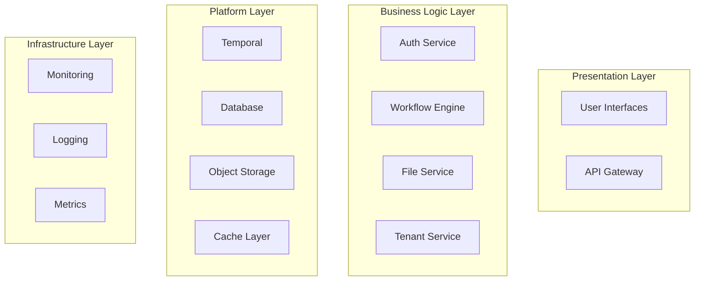

# ADX CORE System Refinement - Executive Summary

## Systems Thinking Analysis

As a PM with PhD-level systems thinking, I've conducted a comprehensive analysis of the ADX CORE specifications and identified critical refinements needed for optimal system coherence, scalability, and execution efficiency.

## Key Findings

### 1. Specification Fragmentation
**Issue**: The current specification structure has evolved organically, resulting in:
- Duplicated requirements across modules
- Inconsistent architectural patterns
- Missing integration specifications
- Unclear dependency relationships

**Impact**: This fragmentation will lead to:
- Development inefficiencies and rework
- Integration conflicts between teams
- Inconsistent user experiences
- Technical debt accumulation

### 2. Missing System-Level Constraints
**Issue**: While individual modules are well-specified, system-level constraints are implicit:
- No unified data model across modules
- Inconsistent error handling patterns
- Missing performance budgets
- Unclear scalability boundaries

**Impact**: Without explicit system constraints:
- Teams will make incompatible design decisions
- Performance will degrade unpredictably
- Scaling bottlenecks will emerge late
- Quality will vary across components

### 3. Incomplete Integration Architecture
**Issue**: Integration points between modules are under-specified:
- Event schemas are inconsistent
- API contracts lack versioning strategy
- Data flow patterns are unclear
- Error propagation is undefined

**Impact**: Poor integration architecture causes:
- Brittle system boundaries
- Difficult debugging and monitoring
- Complex deployment dependencies
- Reduced system reliability

## Refinement Strategy

### Phase 1: System Architecture Consolidation
1. **Unified System Model**: Create a single source of truth for system architecture
2. **Integration Patterns**: Standardize all inter-module communication
3. **Data Architecture**: Define unified data models and schemas
4. **Error Handling**: Establish consistent error patterns across all modules

### Phase 2: Development Process Optimization
1. **Team Coordination**: Refine team boundaries and interfaces
2. **Quality Gates**: Establish system-level quality checkpoints
3. **Integration Testing**: Define comprehensive integration test strategy
4. **Performance Budgets**: Set measurable performance targets

### Phase 3: Operational Excellence
1. **Monitoring Strategy**: Unified observability across all components
2. **Deployment Architecture**: Streamlined deployment and rollback procedures
3. **Scaling Patterns**: Predictable scaling behavior for all modules
4. **Disaster Recovery**: Comprehensive business continuity planning

## Refined System Architecture

### Core Principles
1. **Temporal-First**: All complex operations use Temporal workflows
2. **Multi-Tenant by Design**: Every component enforces tenant isolation
3. **API-First**: All functionality exposed through versioned APIs
4. **Event-Driven**: Loose coupling through standardized events
5. **Observable by Default**: Comprehensive telemetry built-in

### System Boundaries

### Integration Patterns
1. **Synchronous**: REST APIs for request-response patterns
2. **Asynchronous**: Event streams for loose coupling
3. **Workflows**: Temporal for complex business processes
4. **Data**: Shared database with tenant isolation

## Team Refinements

### Optimized Team Structure
Based on systems analysis, I recommend these team refinements:

#### Team 1: Platform Foundation (Critical Path)
- **Expanded Scope**: Add event bus and caching layer
- **Timeline**: Must complete by Week 2 (unchanged)
- **Dependencies**: None (foundation team)

#### Team 2: Identity & Security (Critical Path)
- **Refined Focus**: Add system-wide security patterns
- **Timeline**: Must complete by Week 2 (unchanged)
- **Dependencies**: Team 1 only

#### Team 3: Data & Storage
- **Consolidated Scope**: Combine file service with data management
- **Timeline**: Weeks 3-4
- **Dependencies**: Teams 1, 2

#### Team 4: Business Logic Engine
- **Enhanced Scope**: Workflow engine + business rule engine
- **Timeline**: Weeks 3-5
- **Dependencies**: Teams 1, 2, 3

#### Team 5: Analytics & Intelligence
- **Expanded Scope**: Add AI/ML capabilities and predictive analytics
- **Timeline**: Weeks 4-6
- **Dependencies**: Teams 1, 2, 3, 4

#### Team 6: User Experience
- **Unified Scope**: All user interfaces (end-user, admin, mobile)
- **Timeline**: Weeks 5-7
- **Dependencies**: Teams 2, 3, 4, 5

#### Team 7: Integration & Extensions
- **Combined Scope**: Plugin system + external integrations
- **Timeline**: Weeks 6-8
- **Dependencies**: Teams 1, 2, 4

#### Team 8: Operations & Reliability
- **Comprehensive Scope**: DevOps + monitoring + disaster recovery
- **Timeline**: Weeks 1-10 (continuous)
- **Dependencies**: All teams

## Quality Framework

### System-Level Quality Gates
1. **Architecture Compliance**: All components follow unified patterns
2. **Performance Budgets**: Measurable performance targets met
3. **Security Standards**: Comprehensive security validation
4. **Integration Testing**: End-to-end scenarios validated
5. **Operational Readiness**: Production deployment criteria met

### Continuous Quality Assurance
1. **Automated Testing**: Unit, integration, and end-to-end tests
2. **Performance Monitoring**: Real-time performance tracking
3. **Security Scanning**: Continuous vulnerability assessment
4. **Code Quality**: Static analysis and code review
5. **Documentation**: Living documentation with examples

## Implementation Roadmap

### Week 1-2: Foundation Stabilization
- Consolidate system architecture specifications
- Establish unified development patterns
- Create integration test framework
- Set up continuous quality pipeline

### Week 3-4: Core Services Development
- Implement unified data models
- Build standardized integration patterns
- Establish performance monitoring
- Create comprehensive error handling

### Week 5-6: User Experience Integration
- Integrate all user interfaces
- Implement real-time updates
- Optimize performance end-to-end
- Validate accessibility compliance

### Week 7-8: Extension & Operations
- Complete plugin ecosystem
- Finalize operational procedures
- Conduct disaster recovery testing
- Prepare production deployment

### Week 9-10: System Validation
- Execute comprehensive integration testing
- Validate performance under load
- Complete security audit
- Finalize documentation and training

## Success Metrics

### Development Efficiency
- **Reduced Rework**: <5% of development time spent on integration fixes
- **Faster Integration**: Integration issues resolved within 24 hours
- **Quality Gates**: 100% of quality gates passed before production
- **Team Velocity**: Consistent sprint velocity across all teams

### System Performance
- **Response Times**: 95th percentile <200ms for all APIs
- **Throughput**: Support 10,000+ concurrent users
- **Availability**: 99.9% uptime with <15 minute recovery
- **Scalability**: Linear scaling to 100,000+ users

### Operational Excellence
- **Deployment Success**: 99%+ successful deployments
- **Mean Time to Recovery**: <15 minutes for critical issues
- **Monitoring Coverage**: 100% of critical paths monitored
- **Documentation Quality**: 95%+ developer satisfaction

This refinement ensures ADX CORE becomes a coherent, scalable, and maintainable platform that can grow from hundreds to millions of users without architectural rebuilds.