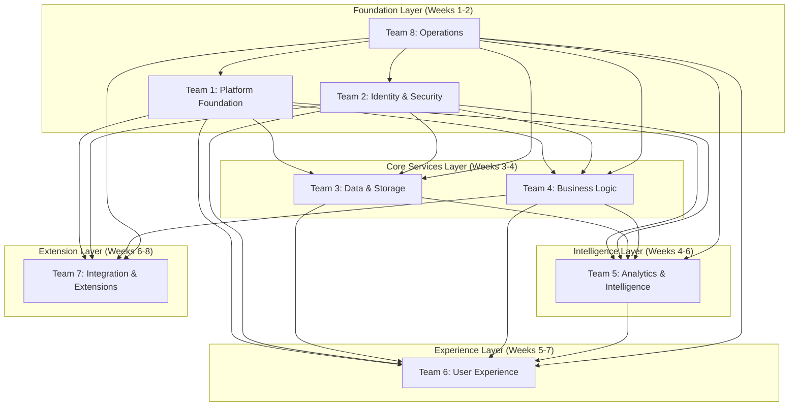

# ADX CORE Refined Team Structure

## Systems Thinking Analysis

Based on comprehensive analysis of the ADX CORE architecture, dependencies, and integration requirements, I've refined the team structure to optimize for parallel development, minimize blocking dependencies, and ensure system coherence.

## Refined Team Organization

### Team 1: Platform Foundation (Critical Path)
**Mission**: Build the foundational infrastructure that enables all other teams to work independently.

**Expanded Scope**:
- Database infrastructure with multi-tenant isolation
- Temporal workflow orchestration framework
- API Gateway with routing and middleware
- Event bus for asynchronous communication
- Caching layer with distributed cache management
- Observability infrastructure (logging, metrics, tracing)

**Timeline**: Weeks 1-2 (Critical Path - Must Complete First)

**Team Composition**:
- 1 Senior Infrastructure Architect (Team Lead)
- 2 Database Specialists
- 2 Temporal/Workflow Experts
- 1 API Gateway Specialist
- 1 Observability Engineer

**Key Deliverables**:
```yaml
foundation_deliverables:
  database_layer:
    - Multi-provider database abstraction
    - Zero-downtime migration framework
    - Multi-tenant isolation strategies
    - Connection pooling with failover
  
  temporal_framework:
    - Workflow/Activity macros and patterns
    - Testing utilities and mocks
    - Error handling and retry strategies
    - Worker lifecycle management
  
  api_gateway:
    - Request routing and load balancing
    - Authentication and authorization middleware
    - Rate limiting and throttling
    - Health check endpoints
  
  event_infrastructure:
    - Event bus with pub/sub patterns
    - Event schema registry
    - Dead letter queue handling
    - Event replay capabilities
  
  observability:
    - Structured logging framework
    - Metrics collection and aggregation
    - Distributed tracing setup
    - Alert management system
```

**Success Criteria**:
- All foundation services deployed and operational
- Other teams can begin development using provided infrastructure
- Performance benchmarks met (>1000 QPS, <50ms routing)
- Comprehensive monitoring and alerting in place

---

### Team 2: Identity & Security (Critical Path)
**Mission**: Establish the security foundation and identity management for the entire platform.

**Refined Focus**:
- Multi-provider authentication system
- Role-based authorization with fine-grained permissions
- User lifecycle management
- Tenant management and provisioning
- System-wide security patterns and middleware
- Audit logging and compliance

**Timeline**: Weeks 1-2 (Critical Path - Parallel with Team 1)

**Team Composition**:
- 1 Security Architect (Team Lead)
- 2 Authentication/Authorization Specialists
- 1 Identity Management Expert
- 1 Compliance/Audit Specialist
- 1 Security Testing Engineer

**Key Deliverables**:
```yaml
security_deliverables:
  authentication:
    - Multi-provider auth (OAuth2, SAML, LDAP)
    - JWT token management with refresh
    - Multi-factor authentication
    - Session management and security
  
  authorization:
    - RBAC with hierarchical roles
    - Permission evaluation engine (<10ms)
    - Tenant-aware access control
    - Policy-based authorization
  
  user_management:
    - User registration and verification
    - Profile management and preferences
    - Password policies and security
    - User directory and search
  
  tenant_management:
    - Tenant provisioning workflows
    - Configuration management
    - Billing context and limits
    - Isolation enforcement
```

**Dependencies**: Team 1 (Database, API Gateway, Observability)

---

### Team 3: Data & Storage (Consolidated)
**Mission**: Handle all data storage, file management, and data processing needs across the platform.

**Consolidated Scope**:
- File service with multi-cloud storage
- Data processing workflows
- Search and indexing capabilities
- Data archival and compliance
- Backup and disaster recovery

**Timeline**: Weeks 3-4

**Team Composition**:
- 1 Data Architect (Team Lead)
- 2 File Storage Specialists
- 1 Search/Indexing Expert
- 1 Data Processing Engineer
- 1 Backup/Recovery Specialist

**Key Deliverables**:
```yaml
data_deliverables:
  file_service:
    - Multi-part upload with resumption
    - Multi-cloud storage abstraction
    - File processing workflows
    - File sharing and permissions
    - Version control and metadata
  
  data_processing:
    - ETL pipelines for analytics
    - Data transformation workflows
    - Real-time data streaming
    - Data quality validation
  
  search_capabilities:
    - Full-text search across all content
    - Faceted search and filtering
    - Search analytics and optimization
    - Auto-complete and suggestions
  
  data_management:
    - Automated backup systems
    - Data archival policies
    - Compliance data handling
    - Disaster recovery procedures
```

**Dependencies**: Teams 1, 2 (Foundation, Authentication)

---

### Team 4: Business Logic Engine (Enhanced)
**Mission**: Implement the core business logic, workflow orchestration, and business rule engine.

**Enhanced Scope**:
- Workflow engine with visual designer
- Business rule engine
- Approval and escalation workflows
- Process automation and triggers
- Integration framework for external systems

**Timeline**: Weeks 3-5

**Team Composition**:
- 1 Business Logic Architect (Team Lead)
- 2 Workflow Engine Specialists
- 1 Business Rules Expert
- 1 Integration Specialist
- 1 Process Automation Engineer

**Key Deliverables**:
```yaml
business_logic_deliverables:
  workflow_engine:
    - Visual workflow designer
    - Workflow execution engine
    - Process monitoring and analytics
    - Workflow template library
  
  business_rules:
    - Rule definition and management
    - Rule evaluation engine
    - A/B testing for rules
    - Rule performance optimization
  
  approval_system:
    - Multi-step approval workflows
    - Escalation and delegation
    - Approval analytics and reporting
    - SLA monitoring and alerts
  
  automation:
    - Event-driven automation
    - Scheduled task execution
    - Conditional logic processing
    - External system integration
```

**Dependencies**: Teams 1, 2, 3 (Foundation, Auth, Data)

---

### Team 5: Analytics & Intelligence (Expanded)
**Mission**: Provide comprehensive analytics, monitoring, and AI/ML capabilities for the platform.

**Expanded Scope**:
- Usage analytics and business intelligence
- System monitoring and alerting
- Notification service with multiple channels
- AI/ML capabilities and predictive analytics
- Reporting engine with custom dashboards

**Timeline**: Weeks 4-6

**Team Composition**:
- 1 Analytics Architect (Team Lead)
- 2 Data Analytics Specialists
- 1 ML/AI Engineer
- 1 Monitoring/Alerting Expert
- 1 Reporting Specialist

**Key Deliverables**:
```yaml
analytics_deliverables:
  business_analytics:
    - Usage tracking and analysis
    - User behavior analytics
    - Business performance metrics
    - Predictive analytics models
  
  system_monitoring:
    - Real-time system health monitoring
    - Performance metrics and alerting
    - Capacity planning and forecasting
    - Anomaly detection and response
  
  notification_system:
    - Multi-channel notifications (email, SMS, push)
    - Notification templates and personalization
    - Delivery tracking and analytics
    - Subscription management
  
  reporting_engine:
    - Custom dashboard creation
    - Scheduled report generation
    - Data visualization components
    - Export capabilities (PDF, Excel, CSV)
```

**Dependencies**: Teams 1, 2, 3, 4 (All core services for data collection)

---

### Team 6: User Experience (Unified)
**Mission**: Create all user-facing interfaces with consistent design and excellent user experience.

**Unified Scope**:
- End-user web and mobile interfaces
- Admin interfaces (company admin, super admin)
- Design system and component library
- Real-time updates and collaboration features
- Accessibility and internationalization

**Timeline**: Weeks 5-7

**Team Composition**:
- 1 UX Architect (Team Lead)
- 2 Frontend Developers (React/TypeScript)
- 1 Mobile Developer (React Native)
- 1 UX/UI Designer
- 1 Accessibility Specialist

**Key Deliverables**:
```yaml
ux_deliverables:
  end_user_interface:
    - Personal dashboard and task management
    - File management with collaboration
    - Workflow participation interfaces
    - Real-time messaging and notifications
  
  admin_interfaces:
    - Super admin platform management
    - Company admin organization management
    - Analytics and reporting dashboards
    - Configuration and settings management
  
  design_system:
    - Component library and design tokens
    - Responsive design patterns
    - Accessibility compliance (WCAG 2.1 AA)
    - Internationalization framework
  
  mobile_experience:
    - Native mobile apps (iOS/Android)
    - Progressive Web App (PWA)
    - Offline functionality and sync
    - Push notifications
```

**Dependencies**: Teams 2, 3, 4, 5 (Auth, Data, Workflows, Analytics)

---

### Team 7: Integration & Extensions (Combined)
**Mission**: Enable platform extensibility through plugins and external integrations.

**Combined Scope**:
- Plugin framework with multi-language support
- Plugin marketplace and developer tools
- External system integrations (APIs, webhooks)
- Third-party service connectors
- Integration monitoring and management

**Timeline**: Weeks 6-8

**Team Composition**:
- 1 Integration Architect (Team Lead)
- 2 Plugin Framework Developers
- 1 Multi-language SDK Specialist
- 1 External Integration Expert
- 1 Developer Tools Engineer

**Key Deliverables**:
```yaml
integration_deliverables:
  plugin_framework:
    - Multi-language plugin support
    - Plugin lifecycle management
    - Security sandboxing and isolation
    - Plugin performance monitoring
  
  developer_ecosystem:
    - Plugin marketplace platform
    - Developer tools and CLI
    - SDK for multiple languages
    - Documentation and examples
  
  external_integrations:
    - REST API connectors
    - Webhook management system
    - Third-party service adapters
    - Integration testing framework
  
  integration_management:
    - Integration monitoring dashboard
    - Error handling and retry logic
    - Rate limiting and throttling
    - Integration analytics and reporting
```

**Dependencies**: Teams 1, 2, 4 (Foundation, Auth, Workflows)

---

### Team 8: Operations & Reliability (Comprehensive)
**Mission**: Ensure platform reliability, scalability, and operational excellence.

**Comprehensive Scope**:
- DevOps and CI/CD pipelines
- Infrastructure as Code and deployment automation
- Monitoring, alerting, and incident response
- Disaster recovery and business continuity
- Performance optimization and scaling
- Security operations and compliance

**Timeline**: Weeks 1-10 (Continuous across all phases)

**Team Composition**:
- 1 DevOps Architect (Team Lead)
- 2 Infrastructure Engineers
- 1 Site Reliability Engineer (SRE)
- 1 Security Operations Specialist
- 1 Performance Engineer

**Key Deliverables**:
```yaml
operations_deliverables:
  devops_automation:
    - CI/CD pipelines for all services
    - Infrastructure as Code (Terraform)
    - Automated testing and quality gates
    - Blue-green deployment strategies
  
  reliability_engineering:
    - Service level objectives (SLOs)
    - Error budgets and monitoring
    - Chaos engineering and fault injection
    - Incident response procedures
  
  scalability_management:
    - Auto-scaling configurations
    - Load balancing and traffic management
    - Performance monitoring and optimization
    - Capacity planning and forecasting
  
  security_operations:
    - Security monitoring and alerting
    - Vulnerability management
    - Compliance auditing and reporting
    - Incident response and forensics
```

**Dependencies**: All teams (provides operational support to everyone)

## Team Interaction Model

### Communication Patterns


### Integration Checkpoints
```yaml
integration_schedule:
  week_2_checkpoint:
    participants: [Team 1, Team 2, Team 8]
    deliverables:
      - Foundation infrastructure operational
      - Authentication and authorization working
      - CI/CD pipelines established
    validation:
      - Integration tests between foundation services
      - Performance benchmarks met
      - Security validation completed
  
  week_4_checkpoint:
    participants: [Team 3, Team 4, plus foundation teams]
    deliverables:
      - Data services integrated with foundation
      - Workflow engine operational
      - End-to-end data flow working
    validation:
      - Cross-service integration tests
      - Data consistency validation
      - Workflow execution verification
  
  week_6_checkpoint:
    participants: [Team 5, plus all previous teams]
    deliverables:
      - Analytics data flowing
      - Monitoring and alerting operational
      - Notification system working
    validation:
      - Analytics pipeline validation
      - Monitoring coverage verification
      - Alert response testing
  
  week_7_checkpoint:
    participants: [Team 6, plus all backend teams]
    deliverables:
      - User interfaces integrated
      - Real-time updates working
      - Mobile experience functional
    validation:
      - End-to-end user journey testing
      - Performance validation under load
      - Accessibility compliance verification
  
  week_8_checkpoint:
    participants: [Team 7, plus all teams]
    deliverables:
      - Plugin system operational
      - External integrations working
      - Developer tools available
    validation:
      - Plugin development and deployment
      - External integration testing
      - Developer experience validation
```

## Quality Assurance Integration

### Cross-Team Quality Standards
```yaml
quality_standards:
  code_quality:
    - Consistent coding standards across all teams
    - Shared code review guidelines
    - Common static analysis tools and rules
    - Unified testing frameworks and patterns
  
  integration_quality:
    - Standardized API contracts and versioning
    - Consistent event schemas and patterns
    - Unified error handling and propagation
    - Common observability and monitoring
  
  performance_quality:
    - Shared performance budgets and targets
    - Consistent load testing approaches
    - Common performance monitoring tools
    - Unified capacity planning processes
  
  security_quality:
    - Consistent security patterns and practices
    - Shared security testing tools and processes
    - Common vulnerability management
    - Unified compliance and audit procedures
```

### Quality Gates by Team
```yaml
team_quality_gates:
  foundation_teams:
    - Infrastructure performance benchmarks
    - Security baseline establishment
    - Scalability validation
    - Reliability testing
  
  service_teams:
    - API contract compliance
    - Event schema validation
    - Data consistency verification
    - Business logic correctness
  
  experience_teams:
    - User experience validation
    - Accessibility compliance
    - Performance optimization
    - Cross-browser compatibility
  
  extension_teams:
    - Plugin security validation
    - Integration reliability testing
    - Developer experience verification
    - Marketplace functionality
```

## Success Metrics

### Team Performance Metrics
```yaml
team_metrics:
  velocity:
    - Story points completed per sprint
    - Feature delivery rate
    - Technical debt reduction
    - Quality gate pass rate
  
  quality:
    - Defect escape rate
    - Test coverage percentage
    - Code review effectiveness
    - Security vulnerability count
  
  collaboration:
    - Cross-team integration success rate
    - Dependency resolution time
    - Communication effectiveness
    - Knowledge sharing frequency
  
  innovation:
    - Process improvement initiatives
    - Tool and technology adoption
    - Best practice development
    - Learning and development progress
```

### System-Level Success Metrics
```yaml
system_metrics:
  functionality:
    - Feature completeness (100% of requirements)
    - User acceptance rate (>95%)
    - Business process automation (>80%)
    - Integration success rate (>99%)
  
  performance:
    - Response time targets met (p95 <200ms)
    - Throughput targets achieved (>10K RPS)
    - Scalability validated (10x load capacity)
    - Resource efficiency optimized (<70% utilization)
  
  reliability:
    - Availability target met (99.9% uptime)
    - MTTR under target (<15 minutes)
    - Error rate under threshold (<0.1%)
    - Data durability guaranteed (99.999999999%)
  
  security:
    - Zero critical vulnerabilities
    - 100% compliance with standards
    - Security incident response (<1 hour)
    - Audit trail completeness (100%)
```

This refined team structure optimizes for parallel development while ensuring system coherence, quality, and successful delivery of ADX CORE within the 10-week timeline.