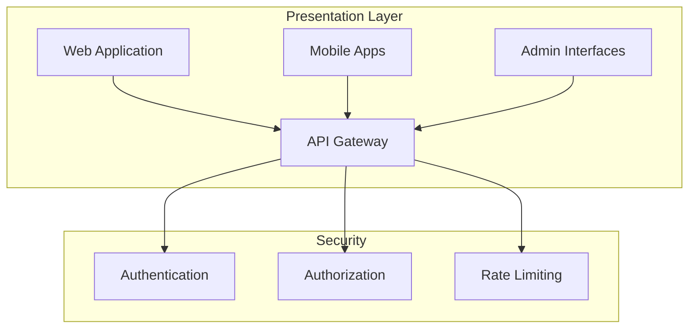
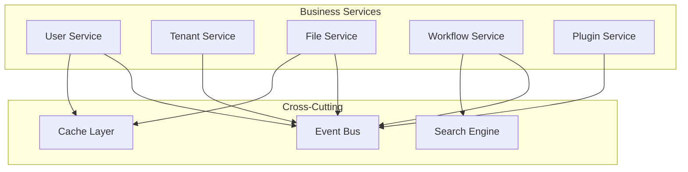
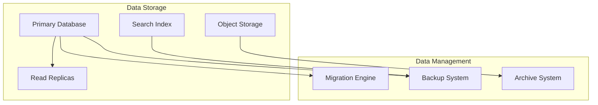
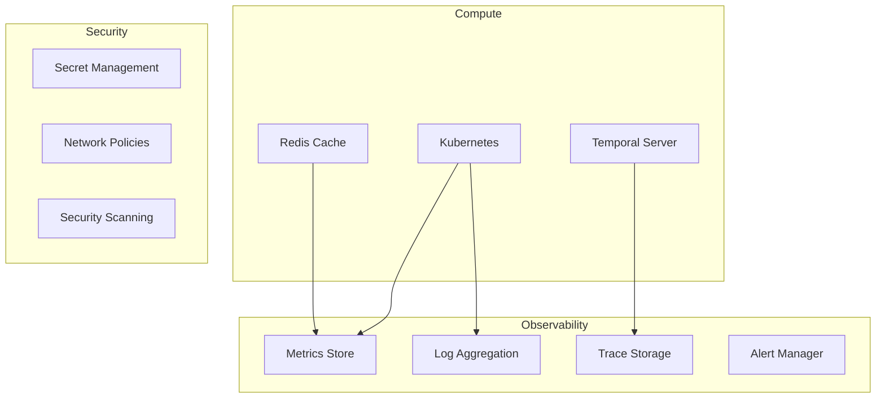

# ADX CORE Unified Architecture Specification

## System Architecture Overview

This document defines the unified architecture for ADX CORE, establishing consistent patterns, interfaces, and constraints across all modules and teams.

## Core Architectural Principles

### 1. Temporal-First Architecture
```
PRINCIPLE: All complex business operations MUST be implemented as Temporal workflows
RATIONALE: Ensures reliability, observability, and maintainability at scale
IMPLEMENTATION: Use #[workflow] and #[activity] macros for all multi-step operations
```

### 2. Multi-Tenant by Design
```
PRINCIPLE: Every component MUST enforce tenant isolation by default
RATIONALE: Prevents data leakage and ensures proper tenant boundaries
IMPLEMENTATION: All database queries, API calls, and workflows include tenant_id
```

### 3. Event-Driven Architecture
```
PRINCIPLE: Components communicate through standardized events
RATIONALE: Enables loose coupling and independent scaling
IMPLEMENTATION: Use unified event bus with consistent event schemas
```

### 4. API-First Development
```
PRINCIPLE: All functionality MUST be exposed through versioned APIs
RATIONALE: Enables parallel development and external integrations
IMPLEMENTATION: OpenAPI specifications define all interfaces
```

### 5. Observable by Default
```
PRINCIPLE: All components MUST include comprehensive telemetry
RATIONALE: Enables effective monitoring, debugging, and optimization
IMPLEMENTATION: Structured logging, metrics, and distributed tracing built-in
```

## System Layers

### Presentation Layer


**Responsibilities:**
- User interface rendering and interaction
- API request routing and load balancing
- Authentication and authorization enforcement
- Rate limiting and security policies

**Key Components:**
- React-based web applications with SSR
- React Native mobile applications
- API Gateway with middleware pipeline
- Admin dashboards with role-based access

### Business Logic Layer


**Responsibilities:**
- Business rule implementation and validation
- Workflow orchestration and execution
- Data processing and transformation
- Event publishing and subscription

**Key Components:**
- Microservices with clear domain boundaries
- Temporal workflows for complex operations
- Event-driven communication patterns
- Shared caching and search infrastructure

### Data Layer


**Responsibilities:**
- Data persistence and retrieval
- Data consistency and integrity
- Backup and disaster recovery
- Data archival and compliance

**Key Components:**
- PostgreSQL with multi-tenant isolation
- Object storage for files and media
- Elasticsearch for full-text search
- Automated backup and recovery systems

### Infrastructure Layer


**Responsibilities:**
- Container orchestration and scaling
- Service discovery and load balancing
- Monitoring and alerting
- Security and compliance

**Key Components:**
- Kubernetes for container orchestration
- Temporal for workflow orchestration
- Prometheus/Grafana for monitoring
- Vault for secret management

## Unified Data Model

### Core Entities
```sql
-- Tenant (Root entity for multi-tenancy)
CREATE TABLE tenants (
    id UUID PRIMARY KEY DEFAULT gen_random_uuid(),
    name VARCHAR(255) NOT NULL,
    domain VARCHAR(255) UNIQUE,
    settings JSONB NOT NULL DEFAULT '{}',
    created_at TIMESTAMPTZ NOT NULL DEFAULT NOW(),
    updated_at TIMESTAMPTZ NOT NULL DEFAULT NOW()
);

-- User (Belongs to tenant)
CREATE TABLE users (
    id UUID PRIMARY KEY DEFAULT gen_random_uuid(),
    tenant_id UUID NOT NULL REFERENCES tenants(id),
    email VARCHAR(255) NOT NULL,
    profile JSONB NOT NULL DEFAULT '{}',
    created_at TIMESTAMPTZ NOT NULL DEFAULT NOW(),
    updated_at TIMESTAMPTZ NOT NULL DEFAULT NOW(),
    UNIQUE(tenant_id, email)
);

-- Resource (Base for all tenant resources)
CREATE TABLE resources (
    id UUID PRIMARY KEY DEFAULT gen_random_uuid(),
    tenant_id UUID NOT NULL REFERENCES tenants(id),
    resource_type VARCHAR(100) NOT NULL,
    name VARCHAR(255) NOT NULL,
    metadata JSONB NOT NULL DEFAULT '{}',
    created_by UUID NOT NULL REFERENCES users(id),
    created_at TIMESTAMPTZ NOT NULL DEFAULT NOW(),
    updated_at TIMESTAMPTZ NOT NULL DEFAULT NOW()
);

-- Events (System-wide event log)
CREATE TABLE events (
    id UUID PRIMARY KEY DEFAULT gen_random_uuid(),
    tenant_id UUID REFERENCES tenants(id),
    event_type VARCHAR(255) NOT NULL,
    aggregate_id UUID,
    aggregate_type VARCHAR(100),
    event_data JSONB NOT NULL,
    metadata JSONB NOT NULL DEFAULT '{}',
    created_at TIMESTAMPTZ NOT NULL DEFAULT NOW()
);
```

### Data Access Patterns
```rust
// Unified repository pattern
#[async_trait]
pub trait Repository<T>: Send + Sync {
    async fn create(&self, tenant_id: TenantId, entity: &T) -> Result<T, RepositoryError>;
    async fn get_by_id(&self, tenant_id: TenantId, id: Uuid) -> Result<Option<T>, RepositoryError>;
    async fn list(&self, tenant_id: TenantId, filters: &Filters) -> Result<Vec<T>, RepositoryError>;
    async fn update(&self, tenant_id: TenantId, id: Uuid, entity: &T) -> Result<T, RepositoryError>;
    async fn delete(&self, tenant_id: TenantId, id: Uuid) -> Result<(), RepositoryError>;
}

// Multi-tenant query enforcement
pub struct TenantAwareQuery {
    tenant_id: TenantId,
    base_query: String,
}

impl TenantAwareQuery {
    pub fn new(tenant_id: TenantId, base_query: &str) -> Self {
        Self {
            tenant_id,
            base_query: format!("{} AND tenant_id = $1", base_query),
        }
    }
}
```

## Integration Patterns

### Event-Driven Communication
```rust
// Unified event schema
#[derive(Debug, Clone, Serialize, Deserialize)]
pub struct DomainEvent {
    pub id: Uuid,
    pub tenant_id: Option<TenantId>,
    pub event_type: String,
    pub aggregate_id: Uuid,
    pub aggregate_type: String,
    pub event_data: serde_json::Value,
    pub metadata: EventMetadata,
    pub timestamp: DateTime<Utc>,
}

#[derive(Debug, Clone, Serialize, Deserialize)]
pub struct EventMetadata {
    pub correlation_id: Uuid,
    pub causation_id: Option<Uuid>,
    pub user_id: Option<Uuid>,
    pub source_service: String,
    pub version: String,
}

// Event publishing
#[async_trait]
pub trait EventPublisher: Send + Sync {
    async fn publish(&self, event: DomainEvent) -> Result<(), EventError>;
    async fn publish_batch(&self, events: Vec<DomainEvent>) -> Result<(), EventError>;
}

// Event subscription
#[async_trait]
pub trait EventHandler: Send + Sync {
    async fn handle(&self, event: &DomainEvent) -> Result<(), EventError>;
    fn event_types(&self) -> Vec<String>;
}
```

### API Communication
```rust
// Unified API client
pub struct ApiClient {
    base_url: String,
    auth_token: String,
    tenant_id: TenantId,
    http_client: reqwest::Client,
}

impl ApiClient {
    pub async fn get<T>(&self, path: &str) -> Result<T, ApiError>
    where
        T: DeserializeOwned,
    {
        let response = self.http_client
            .get(&format!("{}/{}", self.base_url, path))
            .header("Authorization", format!("Bearer {}", self.auth_token))
            .header("X-Tenant-ID", self.tenant_id.to_string())
            .send()
            .await?;
            
        self.handle_response(response).await
    }
    
    pub async fn post<T, R>(&self, path: &str, body: &T) -> Result<R, ApiError>
    where
        T: Serialize,
        R: DeserializeOwned,
    {
        let response = self.http_client
            .post(&format!("{}/{}", self.base_url, path))
            .header("Authorization", format!("Bearer {}", self.auth_token))
            .header("X-Tenant-ID", self.tenant_id.to_string())
            .json(body)
            .send()
            .await?;
            
        self.handle_response(response).await
    }
}
```

### Workflow Integration
```rust
// Unified workflow patterns
#[workflow]
pub async fn standard_business_workflow(
    input: WorkflowInput,
) -> WorkflowResult<WorkflowOutput> {
    // 1. Input validation
    let validation_result = validate_input_activity(input.clone()).await?;
    if !validation_result.is_valid {
        return Err(WorkflowError::InvalidInput(validation_result.errors));
    }
    
    // 2. Authorization check
    check_authorization_activity(
        input.tenant_id,
        input.user_id,
        &input.required_permissions,
    ).await?;
    
    // 3. Business logic execution
    let business_result = execute_business_logic_activity(input.clone()).await?;
    
    // 4. Event publication
    publish_domain_event_activity(DomainEvent {
        id: Uuid::new_v4(),
        tenant_id: Some(input.tenant_id),
        event_type: format!("{}.completed", input.workflow_type),
        aggregate_id: business_result.id,
        aggregate_type: input.aggregate_type,
        event_data: serde_json::to_value(&business_result)?,
        metadata: EventMetadata {
            correlation_id: input.correlation_id,
            causation_id: None,
            user_id: Some(input.user_id),
            source_service: "workflow-service".to_string(),
            version: "1.0.0".to_string(),
        },
        timestamp: Utc::now(),
    }).await?;
    
    // 5. Return result
    Ok(WorkflowOutput {
        id: business_result.id,
        status: ProcessingStatus::Completed,
        result: business_result,
    })
}
```

## Error Handling Strategy

### Unified Error Types
```rust
// System-wide error hierarchy
#[derive(Debug, thiserror::Error)]
pub enum SystemError {
    #[error("Validation error: {0}")]
    Validation(#[from] ValidationError),
    
    #[error("Authorization error: {0}")]
    Authorization(#[from] AuthorizationError),
    
    #[error("Database error: {0}")]
    Database(#[from] DatabaseError),
    
    #[error("External service error: {0}")]
    ExternalService(#[from] ExternalServiceError),
    
    #[error("Business logic error: {0}")]
    BusinessLogic(#[from] BusinessLogicError),
    
    #[error("System unavailable: {0}")]
    SystemUnavailable(String),
}

// Error context and correlation
#[derive(Debug, Clone)]
pub struct ErrorContext {
    pub correlation_id: Uuid,
    pub tenant_id: Option<TenantId>,
    pub user_id: Option<Uuid>,
    pub service_name: String,
    pub operation: String,
    pub timestamp: DateTime<Utc>,
}

impl SystemError {
    pub fn with_context(self, context: ErrorContext) -> ContextualError {
        ContextualError {
            error: self,
            context,
        }
    }
}
```

### Error Propagation
```rust
// Consistent error handling across services
pub async fn handle_service_error<T>(
    result: Result<T, SystemError>,
    context: ErrorContext,
) -> Result<T, ContextualError> {
    match result {
        Ok(value) => Ok(value),
        Err(error) => {
            // Log error with context
            tracing::error!(
                correlation_id = %context.correlation_id,
                tenant_id = ?context.tenant_id,
                user_id = ?context.user_id,
                service = %context.service_name,
                operation = %context.operation,
                error = %error,
                "Service operation failed"
            );
            
            // Publish error event for monitoring
            publish_error_event(&error, &context).await;
            
            Err(error.with_context(context))
        }
    }
}
```

## Performance Architecture

### Performance Budgets
```yaml
performance_targets:
  api_response_time:
    p50: 50ms
    p95: 200ms
    p99: 500ms
  
  database_query_time:
    p50: 10ms
    p95: 50ms
    p99: 100ms
  
  workflow_execution:
    simple: 1s
    complex: 30s
    batch: 300s
  
  throughput:
    api_requests: 10000/second
    concurrent_users: 50000
    workflow_executions: 1000/second
  
  resource_usage:
    memory_per_service: 512MB
    cpu_per_service: 1_core
    database_connections: 100_per_service
```

### Caching Strategy
```rust
// Multi-level caching architecture
pub struct CacheManager {
    l1_cache: Arc<LocalCache>,      // In-memory cache
    l2_cache: Arc<RedisCache>,      // Distributed cache
    l3_cache: Arc<DatabaseCache>,   // Database query cache
}

impl CacheManager {
    pub async fn get<T>(&self, key: &str) -> Result<Option<T>, CacheError>
    where
        T: DeserializeOwned + Clone,
    {
        // L1: Check local cache first
        if let Some(value) = self.l1_cache.get(key).await? {
            return Ok(Some(value));
        }
        
        // L2: Check distributed cache
        if let Some(value) = self.l2_cache.get(key).await? {
            // Populate L1 cache
            self.l1_cache.set(key, &value, Duration::from_secs(300)).await?;
            return Ok(Some(value));
        }
        
        // L3: Check database cache
        if let Some(value) = self.l3_cache.get(key).await? {
            // Populate L2 and L1 caches
            self.l2_cache.set(key, &value, Duration::from_secs(3600)).await?;
            self.l1_cache.set(key, &value, Duration::from_secs(300)).await?;
            return Ok(Some(value));
        }
        
        Ok(None)
    }
}
```

## Security Architecture

### Security Layers
```rust
// Multi-layered security approach
pub struct SecurityManager {
    authentication: Arc<dyn AuthenticationService>,
    authorization: Arc<dyn AuthorizationService>,
    encryption: Arc<dyn EncryptionService>,
    audit: Arc<dyn AuditService>,
}

impl SecurityManager {
    pub async fn secure_operation<T, F, Fut>(
        &self,
        context: SecurityContext,
        operation: F,
    ) -> Result<T, SecurityError>
    where
        F: FnOnce() -> Fut,
        Fut: Future<Output = Result<T, SystemError>>,
    {
        // 1. Authenticate user
        let user = self.authentication.authenticate(&context.token).await?;
        
        // 2. Authorize operation
        self.authorization.authorize(
            user.id,
            context.tenant_id,
            &context.resource,
            &context.action,
        ).await?;
        
        // 3. Execute operation with audit
        let start_time = Instant::now();
        let result = operation().await;
        let duration = start_time.elapsed();
        
        // 4. Audit operation
        self.audit.log_operation(AuditEvent {
            user_id: user.id,
            tenant_id: context.tenant_id,
            resource: context.resource,
            action: context.action,
            result: result.is_ok(),
            duration,
            timestamp: Utc::now(),
        }).await?;
        
        result.map_err(SecurityError::from)
    }
}
```

This unified architecture ensures all ADX CORE components follow consistent patterns, enabling reliable integration, predictable performance, and maintainable code across all teams.