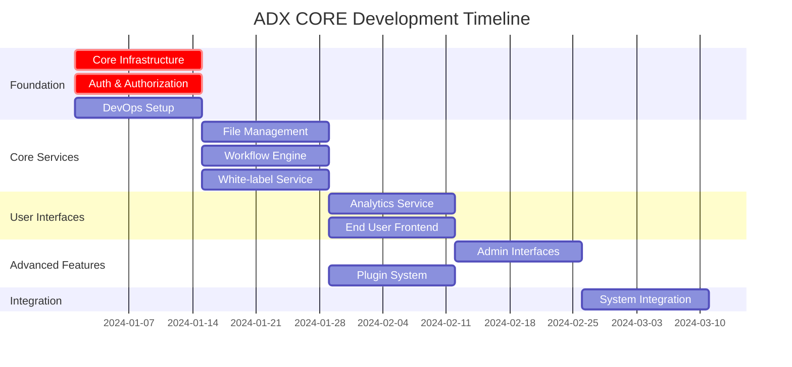

# Sprint Refinement for Parallel AI Development Teams

## Overview

This document refines all sprints, modules, and plugins for optimal parallel development by AI coder teams, ensuring minimal dependencies, clear interfaces, and maximum development velocity.

## Refined Sprint Structure

### Sprint 1: Foundation Infrastructure (Weeks 1-2)
**Objective**: Establish core infrastructure that all other teams depend on

#### Team 1: Core Infrastructure
```yaml
Sprint_1_Team_1:
  focus: "Foundation Services"
  priority: "Critical Path - Blocks all other teams"
  
  deliverables:
    database_infrastructure:
      - Multi-tenant database abstraction layer
      - Zero-downtime migration framework
      - Connection pooling and sharding support
      - Database provider abstraction (PostgreSQL, MySQL)
    
    temporal_infrastructure:
      - Temporal server setup and configuration
      - Workflow and activity framework
      - Error handling and retry patterns
      - Workflow testing utilities
    
    api_gateway:
      - Request routing and load balancing
      - Rate limiting and throttling
      - CORS and security headers
      - Health check endpoints
    
    observability:
      - Structured logging framework
      - Metrics collection (Prometheus)
      - Distributed tracing (Jaeger)
      - Error tracking and alerting

  interfaces_provided:
    - DatabasePool trait and implementations
    - Temporal workflow/activity macros
    - API routing and middleware
    - Logging and metrics utilities
    
  success_criteria:
    - Database migrations run successfully
    - Temporal workflows execute reliably
    - API gateway routes requests correctly
    - Observability data flows to monitoring systems
```

#### Team 2: Authentication & Authorization
```yaml
Sprint_1_Team_2:
  focus: "Identity and Access Control"
  priority: "Critical Path - Required by all user-facing features"
  
  deliverables:
    authentication_service:
      - Multi-provider authentication (OAuth2, SAML, LDAP)
      - JWT token generation and validation
      - Session management and refresh tokens
      - Multi-factor authentication support
    
    authorization_service:
      - Role-based access control (RBAC)
      - Permission evaluation engine
      - Policy-based authorization
      - Tenant-level permission isolation
    
    user_management:
      - User registration and profile management
      - Password policies and security
      - User lifecycle workflows
      - Account activation and recovery
    
    tenant_management:
      - Tenant provisioning workflows
      - Tenant isolation and boundaries
      - Tenant configuration management
      - Billing context and limits

  interfaces_provided:
    - AuthenticationService trait
    - AuthorizationService trait
    - User and Tenant repositories
    - JWT middleware and validation
    
  dependencies:
    - Team 1: Database infrastructure, API gateway
    
  success_criteria:
    - Users can authenticate with multiple providers
    - Permissions are enforced correctly
    - Tenant isolation is maintained
    - JWT tokens work across services
```

#### Team 10: DevOps Foundation
```yaml
Sprint_1_Team_10:
  focus: "Development and Deployment Infrastructure"
  priority: "Enables all team productivity"
  
  deliverables:
    ci_cd_pipeline:
      - GitHub Actions workflows
      - Automated testing and quality gates
      - Docker image building and scanning
      - Artifact storage and versioning
    
    infrastructure_as_code:
      - Terraform modules for core infrastructure
      - Kubernetes manifests and Helm charts
      - Environment configuration management
      - Secret management and encryption
    
    development_environment:
      - Local development setup scripts
      - Docker Compose for local services
      - Development database seeding
      - Hot reload and debugging support
    
    monitoring_setup:
      - Prometheus and Grafana deployment
      - Log aggregation with ELK stack
      - Alert manager configuration
      - Service mesh observability

  interfaces_provided:
    - CI/CD pipeline templates
    - Infrastructure deployment scripts
    - Development environment setup
    - Monitoring and alerting infrastructure
    
  success_criteria:
    - All teams can deploy to staging
    - Automated testing runs on every commit
    - Infrastructure is provisioned via code
    - Monitoring captures all service metrics
```

---

### Sprint 2: Core Business Services (Weeks 3-4)
**Objective**: Build essential business functionality

#### Team 3: File Management
```yaml
Sprint_2_Team_3:
  focus: "File Storage and Processing"
  priority: "High - Required by frontend and plugins"
  
  deliverables:
    file_service:
      - Multi-part file upload with resumption
      - File metadata and versioning
      - Tenant-isolated file storage
      - File sharing and permissions
    
    storage_abstraction:
      - Multi-provider storage (S3, GCS, Azure)
      - Storage tier management (hot, warm, cold)
      - Content delivery network integration
      - Storage quota and billing tracking
    
    file_processing:
      - Virus scanning workflows
      - Image thumbnail generation
      - Document format conversion
      - File compression and optimization
    
    backup_archive:
      - Automated backup workflows
      - Data retention policies
      - Archive and restore procedures
      - Compliance and audit trails

  interfaces_provided:
    - FileService trait and implementations
    - StorageProvider abstraction
    - FileProcessing workflow definitions
    - Backup and restore APIs
    
  dependencies:
    - Team 1: Database, Temporal, API gateway
    - Team 2: Authentication and tenant context
    
  success_criteria:
    - Files upload and download reliably
    - Processing workflows complete successfully
    - Storage scales across providers
    - Backup and restore work correctly
```

#### Team 4: Workflow Engine
```yaml
Sprint_2_Team_4:
  focus: "Business Process Automation"
  priority: "High - Core business functionality"
  
  deliverables:
    workflow_service:
      - Workflow definition and execution engine
      - Visual workflow designer data model
      - Workflow versioning and migration
      - Workflow template library
    
    approval_workflows:
      - Multi-step approval processes
      - Escalation and timeout handling
      - Approval delegation and substitution
      - Audit trail and compliance
    
    automation_engine:
      - Rule-based automation triggers
      - Conditional logic and branching
      - External system integration hooks
      - Scheduled and event-driven execution
    
    process_analytics:
      - Workflow execution metrics
      - Bottleneck identification
      - Performance optimization insights
      - Business process intelligence

  interfaces_provided:
    - WorkflowEngine trait and service
    - ApprovalProcess workflow definitions
    - AutomationRule evaluation engine
    - ProcessAnalytics data collection
    
  dependencies:
    - Team 1: Temporal infrastructure, database
    - Team 2: Authorization for approval workflows
    
  success_criteria:
    - Workflows execute reliably end-to-end
    - Approvals route correctly with escalation
    - Automation rules trigger appropriately
    - Analytics provide actionable insights
```

#### Team 9: White-label & Customization
```yaml
Sprint_2_Team_9:
  focus: "Multi-tenancy and Customization"
  priority: "High - Required for customer deployment"
  
  deliverables:
    white_label_service:
      - Custom branding and theming
      - Logo and color scheme management
      - Custom domain and SSL setup
      - Email template customization
    
    tenant_customization:
      - Custom field definitions
      - Workflow customization framework
      - UI layout and navigation customization
      - Feature flag management per tenant
    
    multi_tenancy:
      - Tenant data isolation enforcement
      - Resource allocation and limits
      - Tenant-specific configuration
      - Cross-tenant analytics aggregation
    
    billing_integration:
      - Usage tracking and metering
      - Subscription management
      - Invoice generation and payment
      - Cost allocation and reporting

  interfaces_provided:
    - WhiteLabelService configuration APIs
    - TenantCustomization framework
    - MultiTenancy isolation utilities
    - BillingIntegration tracking hooks
    
  dependencies:
    - Team 1: Database infrastructure
    - Team 2: Tenant management foundation
    
  success_criteria:
    - Tenants can customize branding completely
    - Custom domains work with SSL
    - Data isolation is enforced
    - Usage tracking is accurate
```

---

### Sprint 3: Analytics & User Interfaces (Weeks 5-6)
**Objective**: Build user-facing features and analytics

#### Team 5: Analytics & Monitoring
```yaml
Sprint_3_Team_5:
  focus: "Data Analytics and System Monitoring"
  priority: "Medium - Supports decision making"
  
  deliverables:
    analytics_service:
      - Event collection and processing
      - Real-time analytics dashboard data
      - Custom report generation
      - Data export and API access
    
    monitoring_service:
      - System health monitoring
      - Performance metrics collection
      - SLA tracking and alerting
      - Capacity planning insights
    
    notification_service:
      - Multi-channel notifications (email, SMS, push)
      - Notification templates and personalization
      - Delivery tracking and retry logic
      - Subscription and preference management
    
    reporting_engine:
      - Custom report builder
      - Scheduled report generation
      - Report sharing and collaboration
      - Data visualization components

  interfaces_provided:
    - AnalyticsService event collection
    - MonitoringService metrics APIs
    - NotificationService delivery APIs
    - ReportingEngine generation APIs
    
  dependencies:
    - Team 1: Database and observability infrastructure
    - Team 2: User and tenant context
    
  success_criteria:
    - Analytics data flows correctly
    - Monitoring alerts fire appropriately
    - Notifications deliver reliably
    - Reports generate with accurate data
```

#### Team 6: End User Frontend
```yaml
Sprint_3_Team_6:
  focus: "End User Experience"
  priority: "High - Primary user interface"
  
  deliverables:
    user_dashboard:
      - Personalized dashboard with widgets
      - Task management and workflow interaction
      - Real-time notifications and updates
      - Quick actions and shortcuts
    
    file_management_ui:
      - Drag-and-drop file upload
      - File browser with search and filters
      - File sharing and collaboration
      - Version history and comments
    
    workflow_interface:
      - Workflow initiation and monitoring
      - Form-based data entry
      - Approval and review interfaces
      - Process history and audit trail
    
    mobile_optimization:
      - Responsive design for all screens
      - Touch-optimized interactions
      - Offline capability with sync
      - Push notification support

  interfaces_provided:
    - React component library
    - Mobile-responsive layouts
    - Real-time update hooks
    - Offline synchronization utilities
    
  dependencies:
    - Team 2: Authentication and user context
    - Team 3: File management APIs
    - Team 4: Workflow execution APIs
    
  success_criteria:
    - Users can complete core tasks efficiently
    - Interface is responsive and accessible
    - Real-time updates work correctly
    - Mobile experience is optimized
```

---

### Sprint 4: Advanced Features & Admin Interfaces (Weeks 7-8)
**Objective**: Complete administrative features and advanced functionality

#### Team 7: Admin Interfaces
```yaml
Sprint_4_Team_7:
  focus: "Administrative User Interfaces"
  priority: "High - Required for platform management"
  
  deliverables:
    super_admin_interface:
      - Platform-wide dashboard and metrics
      - Tenant management and provisioning
      - System configuration and feature flags
      - Global analytics and reporting
    
    company_admin_interface:
      - Organization management dashboard
      - User and role management
      - Tenant customization tools
      - Usage analytics and billing
    
    analytics_dashboards:
      - Interactive data visualization
      - Custom dashboard creation
      - Real-time metrics display
      - Export and sharing capabilities
    
    configuration_ui:
      - Feature flag management interface
      - System settings configuration
      - Integration setup and testing
      - Security policy management

  interfaces_provided:
    - Admin component library
    - Dashboard framework
    - Configuration management UI
    - Analytics visualization components
    
  dependencies:
    - Team 2: Authentication and authorization
    - Team 5: Analytics and monitoring data
    - Team 9: White-label customization APIs
    
  success_criteria:
    - Admins can manage their domains effectively
    - Dashboards provide actionable insights
    - Configuration changes apply correctly
    - Interface is intuitive and efficient
```

#### Team 8: Plugin System
```yaml
Sprint_4_Team_8:
  focus: "Plugin Ecosystem and Developer Tools"
  priority: "Medium - Enables extensibility"
  
  deliverables:
    plugin_framework:
      - Plugin lifecycle management
      - Plugin isolation and security
      - Plugin API versioning
      - Plugin marketplace integration
    
    multi_language_sdks:
      - Python SDK with full feature parity
      - Node.js SDK with TypeScript support
      - Go SDK with idiomatic patterns
      - .NET SDK with async/await support
    
    developer_tools:
      - Plugin CLI for development
      - Testing framework and utilities
      - Documentation generation
      - Plugin validation and certification
    
    marketplace:
      - Plugin discovery and search
      - Installation and update management
      - Rating and review system
      - Developer analytics and insights

  interfaces_provided:
    - Plugin trait definitions
    - Multi-language SDK packages
    - Developer CLI tools
    - Marketplace APIs
    
  dependencies:
    - Team 1: Core infrastructure for plugin execution
    - Team 2: Authentication for plugin access
    
  success_criteria:
    - Plugins can be developed in multiple languages
    - Plugin installation and updates work smoothly
    - Developer tools are comprehensive and easy to use
    - Marketplace facilitates plugin discovery
```

---

### Sprint 5: Integration & Performance (Weeks 9-10)
**Objective**: System integration, performance optimization, and production readiness

#### All Teams: Integration Sprint
```yaml
Sprint_5_Integration:
  focus: "End-to-End Integration and Performance"
  priority: "Critical - Production readiness"
  
  activities:
    integration_testing:
      - Cross-service integration tests
      - End-to-end user journey testing
      - API contract validation
      - Event flow verification
    
    performance_optimization:
      - Load testing and bottleneck identification
      - Database query optimization
      - Caching strategy implementation
      - Resource usage optimization
    
    security_hardening:
      - Security vulnerability scanning
      - Penetration testing
      - Compliance validation
      - Security policy enforcement
    
    production_preparation:
      - Production environment setup
      - Monitoring and alerting configuration
      - Backup and disaster recovery testing
      - Documentation and runbook creation

  success_criteria:
    - All integration tests pass consistently
    - Performance meets defined SLAs
    - Security scans show no critical issues
    - Production deployment is successful
```

## Dependency Management

### Critical Path Analysis


### Interface Dependencies
```yaml
dependency_matrix:
  team_1_provides:
    - database_pool: [team_2, team_3, team_4, team_5, team_9]
    - temporal_framework: [team_3, team_4, team_5, team_8, team_9]
    - api_gateway: [team_2, team_3, team_4, team_5, team_8, team_9]
    - observability: [all_teams]
  
  team_2_provides:
    - authentication: [team_3, team_4, team_5, team_6, team_7, team_8, team_9]
    - authorization: [team_3, team_4, team_5, team_6, team_7, team_8, team_9]
    - tenant_context: [team_3, team_4, team_5, team_6, team_7, team_9]
  
  team_3_provides:
    - file_apis: [team_6, team_7, team_8]
    - storage_abstraction: [team_4, team_8]
  
  team_4_provides:
    - workflow_apis: [team_6, team_7, team_8]
    - process_engine: [team_5, team_9]
  
  team_5_provides:
    - analytics_data: [team_6, team_7]
    - monitoring_apis: [team_7, team_10]
    - notifications: [team_4, team_6, team_9]
  
  team_9_provides:
    - customization_apis: [team_6, team_7]
    - tenant_config: [team_3, team_4, team_5]
```

## Quality Gates and Integration Points

### Sprint Completion Criteria
```yaml
sprint_gates:
  sprint_1_completion:
    requirements:
      - All core infrastructure services deployed
      - Authentication working end-to-end
      - Database migrations run successfully
      - CI/CD pipeline operational
    validation:
      - Integration tests pass
      - Performance benchmarks met
      - Security scan clean
      - Documentation complete
  
  sprint_2_completion:
    requirements:
      - File upload/download working
      - Basic workflows executing
      - White-label customization functional
      - APIs documented and tested
    validation:
      - Cross-service integration tests pass
      - Load testing shows acceptable performance
      - Multi-tenant isolation verified
      - API contracts validated
  
  sprint_3_completion:
    requirements:
      - Analytics data flowing
      - End user interface functional
      - Real-time updates working
      - Mobile experience optimized
    validation:
      - User acceptance testing passed
      - Accessibility compliance verified
      - Performance targets met
      - Cross-browser compatibility confirmed
  
  sprint_4_completion:
    requirements:
      - Admin interfaces operational
      - Plugin system functional
      - Multi-language SDKs available
      - Marketplace accessible
    validation:
      - Admin workflows tested
      - Plugin development verified
      - SDK examples working
      - End-to-end scenarios complete
  
  sprint_5_completion:
    requirements:
      - Full system integration complete
      - Production environment ready
      - Performance optimized
      - Security hardened
    validation:
      - Load testing passed
      - Security audit complete
      - Disaster recovery tested
      - Production deployment successful
```

This refined sprint structure ensures maximum parallel development while maintaining system coherence and minimizing blocking dependencies between teams.