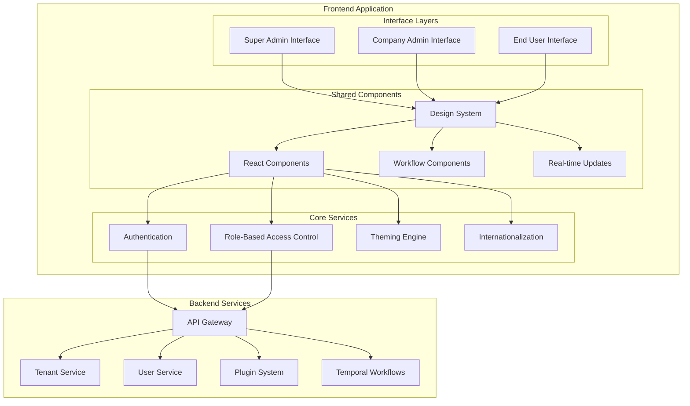

# Multi-Level UI Interfaces Design

## Overview

This design document outlines the architecture for three distinct user interface levels in ADX CORE: Super Admin Interface, Company Admin Interface, and End User Interface. Each interface provides role-appropriate functionality while sharing common components and design patterns.

## Architecture Overview



## Interface Specifications

### 1. Super Admin Interface

#### Dashboard Layout
```typescript
interface SuperAdminDashboard {
  // Platform Overview
  platformMetrics: {
    totalTenants: number;
    activeUsers: number;
    systemHealth: HealthStatus;
    resourceUtilization: ResourceMetrics;
  };
  
  // Tenant Management
  tenantOverview: {
    recentTenants: Tenant[];
    tenantAlerts: Alert[];
    licenseUsage: LicenseMetrics;
  };
  
  // System Monitoring
  systemStatus: {
    services: ServiceStatus[];
    performance: PerformanceMetrics;
    errors: ErrorSummary[];
  };
  
  // Revenue & Analytics
  businessMetrics: {
    revenue: RevenueMetrics;
    growth: GrowthMetrics;
    usage: UsageAnalytics;
  };
}

// Super Admin Navigation Structure
const superAdminNavigation = {
  dashboard: {
    label: 'Platform Dashboard',
    icon: 'dashboard',
    path: '/super-admin/dashboard',
  },
  tenants: {
    label: 'Tenant Management',
    icon: 'building',
    path: '/super-admin/tenants',
    children: {
      overview: 'Tenant Overview',
      create: 'Create Tenant',
      licenses: 'License Management',
      billing: 'Billing & Usage',
    },
  },
  system: {
    label: 'System Management',
    icon: 'server',
    path: '/super-admin/system',
    children: {
      health: 'System Health',
      monitoring: 'Monitoring',
      logs: 'System Logs',
      configuration: 'Global Config',
    },
  },
  marketplace: {
    label: 'Plugin Marketplace',
    icon: 'puzzle',
    path: '/super-admin/marketplace',
    children: {
      plugins: 'Plugin Management',
      approval: 'Plugin Approval',
      analytics: 'Marketplace Analytics',
    },
  },
  analytics: {
    label: 'Platform Analytics',
    icon: 'chart',
    path: '/super-admin/analytics',
    children: {
      usage: 'Usage Analytics',
      performance: 'Performance Metrics',
      revenue: 'Revenue Analytics',
      reports: 'Custom Reports',
    },
  },
  support: {
    label: 'Support & Maintenance',
    icon: 'support',
    path: '/super-admin/support',
    children: {
      tickets: 'Support Tickets',
      maintenance: 'Maintenance Mode',
      backups: 'System Backups',
    },
  },
};
```

#### Key Components
```typescript
// Tenant Management Component
export const TenantManagement: React.FC = () => {
  const { tenants, createTenant, updateTenant, suspendTenant } = useTenantManagement();
  const { executeWorkflow } = useTemporalWorkflow('tenant-management');
  
  const handleCreateTenant = async (tenantData: CreateTenantRequest) => {
    await executeWorkflow({
      operation: 'create_tenant',
      data: tenantData,
    });
  };
  
  return (
    <div className="tenant-management">
      <TenantOverviewCards tenants={tenants} />
      <TenantTable 
        tenants={tenants}
        onSuspend={suspendTenant}
        onUpdate={updateTenant}
      />
      <CreateTenantModal onSubmit={handleCreateTenant} />
    </div>
  );
};

// System Health Monitor
export const SystemHealthMonitor: React.FC = () => {
  const { systemHealth, services, alerts } = useSystemHealth();
  
  return (
    <div className="system-health">
      <HealthOverview health={systemHealth} />
      <ServiceStatusGrid services={services} />
      <AlertsPanel alerts={alerts} />
      <PerformanceCharts />
    </div>
  );
};
```

### 2. Company Admin Interface

#### Dashboard Layout
```typescript
interface CompanyAdminDashboard {
  // Organization Overview
  organizationMetrics: {
    totalUsers: number;
    activeProjects: number;
    storageUsage: StorageMetrics;
    licenseStatus: LicenseStatus;
  };
  
  // User Management
  userOverview: {
    recentUsers: User[];
    userActivity: ActivityMetrics;
    roleDistribution: RoleMetrics;
  };
  
  // Usage Analytics
  usageMetrics: {
    featureUsage: FeatureUsageMetrics;
    workflowMetrics: WorkflowMetrics;
    pluginUsage: PluginUsageMetrics;
  };
  
  // Customization Status
  customization: {
    brandingStatus: BrandingStatus;
    workflowCustomizations: WorkflowCustomization[];
    integrationStatus: IntegrationStatus[];
  };
}

// Company Admin Navigation Structure
const companyAdminNavigation = {
  dashboard: {
    label: 'Organization Dashboard',
    icon: 'dashboard',
    path: '/admin/dashboard',
  },
  users: {
    label: 'User Management',
    icon: 'users',
    path: '/admin/users',
    children: {
      overview: 'User Overview',
      invite: 'Invite Users',
      roles: 'Roles & Permissions',
      activity: 'User Activity',
    },
  },
  organization: {
    label: 'Organization Settings',
    icon: 'settings',
    path: '/admin/organization',
    children: {
      profile: 'Organization Profile',
      branding: 'Branding & Themes',
      domains: 'Custom Domains',
      security: 'Security Settings',
    },
  },
  workflows: {
    label: 'Workflow Management',
    icon: 'workflow',
    path: '/admin/workflows',
    children: {
      templates: 'Workflow Templates',
      automation: 'Automation Rules',
      approvals: 'Approval Processes',
    },
  },
  plugins: {
    label: 'Plugin Management',
    icon: 'puzzle',
    path: '/admin/plugins',
    children: {
      installed: 'Installed Plugins',
      marketplace: 'Plugin Marketplace',
      configuration: 'Plugin Configuration',
    },
  },
  analytics: {
    label: 'Analytics & Reports',
    icon: 'chart',
    path: '/admin/analytics',
    children: {
      usage: 'Usage Analytics',
      performance: 'Performance Reports',
      custom: 'Custom Reports',
    },
  },
  billing: {
    label: 'Billing & Usage',
    icon: 'billing',
    path: '/admin/billing',
    children: {
      overview: 'Billing Overview',
      usage: 'Usage Reports',
      invoices: 'Invoices',
    },
  },
};
```

#### Key Components
```typescript
// User Management Component
export const UserManagement: React.FC = () => {
  const { users, inviteUser, updateUserRole, suspendUser } = useUserManagement();
  const { executeWorkflow } = useTemporalWorkflow('user-management');
  
  const handleInviteUser = async (inviteData: InviteUserRequest) => {
    await executeWorkflow({
      operation: 'invite_user',
      data: inviteData,
    });
  };
  
  return (
    <div className="user-management">
      <UserOverviewCards users={users} />
      <UserTable 
        users={users}
        onInvite={handleInviteUser}
        onUpdateRole={updateUserRole}
        onSuspend={suspendUser}
      />
      <RoleManagement />
    </div>
  );
};

// Organization Branding Component
export const OrganizationBranding: React.FC = () => {
  const { branding, updateBranding } = useBranding();
  const { executeWorkflow } = useTemporalWorkflow('branding-update');
  
  const handleBrandingUpdate = async (brandingData: BrandingUpdate) => {
    await executeWorkflow({
      operation: 'update_branding',
      data: brandingData,
    });
  };
  
  return (
    <div className="organization-branding">
      <BrandingPreview branding={branding} />
      <BrandingForm 
        initialData={branding}
        onSubmit={handleBrandingUpdate}
      />
      <CustomDomainSettings />
    </div>
  );
};
```

### 3. End User Interface

#### Dashboard Layout
```typescript
interface EndUserDashboard {
  // Personal Overview
  personalMetrics: {
    tasksAssigned: number;
    tasksCompleted: number;
    recentActivity: Activity[];
    notifications: Notification[];
  };
  
  // Work Items
  workItems: {
    myTasks: Task[];
    sharedFiles: File[];
    activeWorkflows: WorkflowInstance[];
    teamProjects: Project[];
  };
  
  // Collaboration
  collaboration: {
    teamMembers: TeamMember[];
    recentMessages: Message[];
    sharedWorkspaces: Workspace[];
  };
  
  // Quick Actions
  quickActions: {
    uploadFile: boolean;
    startWorkflow: boolean;
    createProject: boolean;
    sendMessage: boolean;
  };
}

// End User Navigation Structure
const endUserNavigation = {
  dashboard: {
    label: 'My Dashboard',
    icon: 'home',
    path: '/dashboard',
  },
  tasks: {
    label: 'My Tasks',
    icon: 'tasks',
    path: '/tasks',
    children: {
      assigned: 'Assigned to Me',
      completed: 'Completed',
      overdue: 'Overdue',
    },
  },
  files: {
    label: 'Files & Documents',
    icon: 'files',
    path: '/files',
    children: {
      myFiles: 'My Files',
      shared: 'Shared with Me',
      recent: 'Recent Files',
      trash: 'Trash',
    },
  },
  workflows: {
    label: 'Workflows',
    icon: 'workflow',
    path: '/workflows',
    children: {
      active: 'Active Workflows',
      templates: 'Start New Workflow',
      history: 'Workflow History',
    },
  },
  collaboration: {
    label: 'Collaboration',
    icon: 'team',
    path: '/collaboration',
    children: {
      team: 'My Team',
      messages: 'Messages',
      workspaces: 'Shared Workspaces',
    },
  },
  profile: {
    label: 'My Profile',
    icon: 'user',
    path: '/profile',
    children: {
      settings: 'Profile Settings',
      preferences: 'Preferences',
      notifications: 'Notification Settings',
    },
  },
};
```

#### Key Components
```typescript
// Task Management Component
export const TaskManagement: React.FC = () => {
  const { tasks, completeTask, updateTask } = useTaskManagement();
  const { executeWorkflow } = useTemporalWorkflow('task-management');
  
  const handleCompleteTask = async (taskId: string, completionData: TaskCompletion) => {
    await executeWorkflow({
      operation: 'complete_task',
      data: { taskId, ...completionData },
    });
  };
  
  return (
    <div className="task-management">
      <TaskOverview tasks={tasks} />
      <TaskList 
        tasks={tasks}
        onComplete={handleCompleteTask}
        onUpdate={updateTask}
      />
      <TaskFilters />
    </div>
  );
};

// File Management Component
export const FileManagement: React.FC = () => {
  const { files, uploadFiles, shareFile } = useFileManagement();
  const { startUpload } = useFileUploadWorkflow();
  
  const handleFileUpload = async (files: File[]) => {
    await startUpload(files, {
      autoProcess: true,
      notifyOnComplete: true,
    });
  };
  
  return (
    <div className="file-management">
      <FileUploadZone onUpload={handleFileUpload} />
      <FileGrid 
        files={files}
        onShare={shareFile}
      />
      <FilePreview />
    </div>
  );
};
```

## Shared Design System

### Component Library
```typescript
// Base UI Components
export const UIComponents = {
  // Layout Components
  Layout: {
    Container: React.FC<ContainerProps>,
    Grid: React.FC<GridProps>,
    Flex: React.FC<FlexProps>,
    Stack: React.FC<StackProps>,
  },
  
  // Navigation Components
  Navigation: {
    Sidebar: React.FC<SidebarProps>,
    TopBar: React.FC<TopBarProps>,
    Breadcrumbs: React.FC<BreadcrumbsProps>,
    Tabs: React.FC<TabsProps>,
  },
  
  // Data Display Components
  DataDisplay: {
    Table: React.FC<TableProps>,
    Card: React.FC<CardProps>,
    List: React.FC<ListProps>,
    Chart: React.FC<ChartProps>,
  },
  
  // Form Components
  Forms: {
    Input: React.FC<InputProps>,
    Select: React.FC<SelectProps>,
    Checkbox: React.FC<CheckboxProps>,
    Button: React.FC<ButtonProps>,
  },
  
  // Feedback Components
  Feedback: {
    Alert: React.FC<AlertProps>,
    Toast: React.FC<ToastProps>,
    Modal: React.FC<ModalProps>,
    Loading: React.FC<LoadingProps>,
  },
};

// Design Tokens
export const designTokens = {
  colors: {
    primary: {
      50: '#f0f9ff',
      500: '#3b82f6',
      900: '#1e3a8a',
    },
    semantic: {
      success: '#10b981',
      warning: '#f59e0b',
      error: '#ef4444',
      info: '#3b82f6',
    },
  },
  
  spacing: {
    xs: '0.25rem',
    sm: '0.5rem',
    md: '1rem',
    lg: '1.5rem',
    xl: '2rem',
  },
  
  typography: {
    fontFamily: {
      sans: ['Inter', 'system-ui', 'sans-serif'],
      mono: ['JetBrains Mono', 'monospace'],
    },
    fontSize: {
      xs: '0.75rem',
      sm: '0.875rem',
      base: '1rem',
      lg: '1.125rem',
      xl: '1.25rem',
    },
  },
};
```

### Role-Based Component Rendering
```typescript
// Role-based component wrapper
export const RoleBasedComponent: React.FC<{
  allowedRoles: UserRole[];
  fallback?: React.ReactNode;
  children: React.ReactNode;
}> = ({ allowedRoles, fallback, children }) => {
  const { user } = useAuth();
  
  if (!user || !allowedRoles.includes(user.role)) {
    return fallback || null;
  }
  
  return <>{children}</>;
};

// Permission-based feature toggle
export const FeatureToggle: React.FC<{
  feature: string;
  fallback?: React.ReactNode;
  children: React.ReactNode;
}> = ({ feature, fallback, children }) => {
  const { hasPermission } = usePermissions();
  
  if (!hasPermission(feature)) {
    return fallback || null;
  }
  
  return <>{children}</>;
};

// Usage example
export const AdminOnlyButton: React.FC = () => (
  <RoleBasedComponent allowedRoles={['super_admin', 'company_admin']}>
    <Button variant="primary">Admin Action</Button>
  </RoleBasedComponent>
);
```

## Real-Time Updates Architecture

### WebSocket Integration
```typescript
// Real-time update service
export class RealTimeService {
  private ws: WebSocket | null = null;
  private subscriptions = new Map<string, Set<(data: any) => void>>();
  
  connect(userId: string, tenantId: string) {
    this.ws = new WebSocket(`/ws/realtime?user=${userId}&tenant=${tenantId}`);
    
    this.ws.onmessage = (event) => {
      const message = JSON.parse(event.data);
      this.handleMessage(message);
    };
  }
  
  subscribe(channel: string, callback: (data: any) => void) {
    if (!this.subscriptions.has(channel)) {
      this.subscriptions.set(channel, new Set());
    }
    this.subscriptions.get(channel)!.add(callback);
    
    // Send subscription request
    this.ws?.send(JSON.stringify({
      type: 'subscribe',
      channel,
    }));
  }
  
  private handleMessage(message: any) {
    const { channel, data } = message;
    const callbacks = this.subscriptions.get(channel);
    
    if (callbacks) {
      callbacks.forEach(callback => callback(data));
    }
  }
}

// React hook for real-time updates
export const useRealTimeUpdates = (channel: string) => {
  const [data, setData] = useState(null);
  const realTimeService = useRealTimeService();
  
  useEffect(() => {
    const handleUpdate = (newData: any) => {
      setData(newData);
    };
    
    realTimeService.subscribe(channel, handleUpdate);
    
    return () => {
      // Cleanup subscription
    };
  }, [channel]);
  
  return data;
};
```

## Mobile and Cross-Platform Support

### Responsive Design Strategy
```typescript
// Responsive breakpoints
export const breakpoints = {
  mobile: '320px',
  tablet: '768px',
  desktop: '1024px',
  wide: '1440px',
};

// Mobile-first component design
export const ResponsiveLayout: React.FC<{
  children: React.ReactNode;
}> = ({ children }) => {
  const { isMobile, isTablet, isDesktop } = useBreakpoint();
  
  return (
    <div className={cn(
      'layout',
      {
        'layout-mobile': isMobile,
        'layout-tablet': isTablet,
        'layout-desktop': isDesktop,
      }
    )}>
      {children}
    </div>
  );
};

// Touch-optimized components for mobile
export const TouchOptimizedButton: React.FC<ButtonProps> = (props) => {
  const { isMobile } = useBreakpoint();
  
  return (
    <Button
      {...props}
      className={cn(props.className, {
        'min-h-[44px] min-w-[44px]': isMobile, // Touch target size
      })}
    />
  );
};
```

This comprehensive design provides three distinct but cohesive user interfaces that serve different user roles while maintaining consistency, security, and excellent user experience across all levels of the platform.