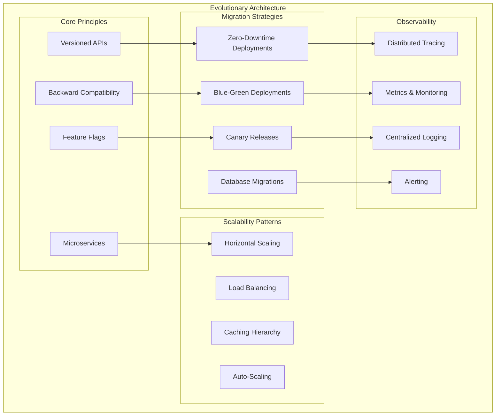

# Platform Flexibility and Migration Design

## Overview

This design document outlines the architecture for ensuring ADX CORE remains flexible, scalable, and easily migratable as it grows from initial deployment to supporting thousands of clients. The design focuses on evolutionary architecture patterns that enable continuous improvement without requiring complete rebuilds.

## Evolutionary Architecture Principles



## Database Evolution Architecture

### Schema Migration Framework
```rust
// Advanced migration system with zero-downtime capabilities
pub struct MigrationEngine {
    connection_pool: DatabasePool,
    schema_registry: SchemaRegistry,
    migration_tracker: MigrationTracker,
    rollback_manager: RollbackManager,
}

impl MigrationEngine {
    pub async fn execute_migration(
        &self,
        migration: Migration,
        strategy: MigrationStrategy,
    ) -> Result<MigrationResult, MigrationError> {
        match strategy {
            MigrationStrategy::ZeroDowntime => {
                self.execute_zero_downtime_migration(migration).await
            }
            MigrationStrategy::BlueGreen => {
                self.execute_blue_green_migration(migration).await
            }
            MigrationStrategy::Incremental => {
                self.execute_incremental_migration(migration).await
            }
        }
    }
    
    async fn execute_zero_downtime_migration(
        &self,
        migration: Migration,
    ) -> Result<MigrationResult, MigrationError> {
        // Phase 1: Add new columns/tables (backward compatible)
        self.execute_additive_changes(&migration.additive_changes).await?;
        
        // Phase 2: Dual-write to old and new schema
        self.enable_dual_write_mode(&migration).await?;
        
        // Phase 3: Backfill data
        self.backfill_data(&migration).await?;
        
        // Phase 4: Switch reads to new schema
        self.switch_read_schema(&migration).await?;
        
        // Phase 5: Remove old schema (after validation)
        self.schedule_cleanup(&migration).await?;
        
        Ok(MigrationResult::Success)
    }
    
    pub async fn rollback_migration(
        &self,
        migration_id: MigrationId,
    ) -> Result<RollbackResult, RollbackError> {
        let migration = self.migration_tracker.get_migration(migration_id).await?;
        
        // Validate rollback safety
        self.validate_rollback_safety(&migration).await?;
        
        // Execute rollback steps in reverse order
        for step in migration.rollback_steps.iter().rev() {
            self.execute_rollback_step(step).await?;
        }
        
        Ok(RollbackResult::Success)
    }
}

// Database abstraction layer for multi-provider support
pub trait DatabaseProvider: Send + Sync {
    async fn execute_query(&self, query: &str) -> Result<QueryResult, DatabaseError>;
    async fn begin_transaction(&self) -> Result<Transaction, DatabaseError>;
    async fn create_migration_lock(&self, migration_id: &str) -> Result<Lock, DatabaseError>;
    async fn supports_feature(&self, feature: DatabaseFeature) -> bool;
}

// Multi-tenant data isolation strategies
pub enum IsolationStrategy {
    DatabasePerTenant {
        connection_pool: HashMap<TenantId, DatabasePool>,
    },
    SchemaPerTenant {
        shared_pool: DatabasePool,
        schema_mapping: HashMap<TenantId, String>,
    },
    RowLevelSecurity {
        shared_pool: DatabasePool,
        tenant_context: TenantContext,
    },
}

impl IsolationStrategy {
    pub async fn execute_tenant_query(
        &self,
        tenant_id: TenantId,
        query: Query,
    ) -> Result<QueryResult, DatabaseError> {
        match self {
            IsolationStrategy::DatabasePerTenant { connection_pool } => {
                let pool = connection_pool.get(&tenant_id)
                    .ok_or(DatabaseError::TenantNotFound)?;
                pool.execute(query).await
            }
            IsolationStrategy::SchemaPerTenant { shared_pool, schema_mapping } => {
                let schema = schema_mapping.get(&tenant_id)
                    .ok_or(DatabaseError::SchemaNotFound)?;
                let scoped_query = query.with_schema(schema);
                shared_pool.execute(scoped_query).await
            }
            IsolationStrategy::RowLevelSecurity { shared_pool, tenant_context } => {
                let context_query = query.with_tenant_context(tenant_id);
                shared_pool.execute(context_query).await
            }
        }
    }
}
```

### Database Sharding and Scaling
```rust
// Horizontal sharding system
pub struct ShardingManager {
    shard_registry: ShardRegistry,
    routing_strategy: RoutingStrategy,
    rebalancer: ShardRebalancer,
}

impl ShardingManager {
    pub async fn route_query(
        &self,
        query: Query,
        tenant_id: TenantId,
    ) -> Result<QueryResult, ShardingError> {
        let shard_key = self.routing_strategy.determine_shard(tenant_id, &query);
        let shard = self.shard_registry.get_shard(shard_key).await?;
        
        // Execute with automatic retry and failover
        self.execute_with_retry(shard, query).await
    }
    
    pub async fn rebalance_shards(&self) -> Result<RebalanceResult, ShardingError> {
        let rebalance_plan = self.rebalancer.create_rebalance_plan().await?;
        
        for operation in rebalance_plan.operations {
            match operation {
                RebalanceOperation::MoveTenant { tenant_id, from_shard, to_shard } => {
                    self.move_tenant_data(tenant_id, from_shard, to_shard).await?;
                }
                RebalanceOperation::SplitShard { shard_id, split_key } => {
                    self.split_shard(shard_id, split_key).await?;
                }
                RebalanceOperation::MergeShards { shard_ids, target_shard } => {
                    self.merge_shards(shard_ids, target_shard).await?;
                }
            }
        }
        
        Ok(RebalanceResult::Success)
    }
}
```

## Microservices Evolution Framework

### Service Interface Contracts
```rust
// Service contract definition with versioning
#[derive(Debug, Clone, Serialize, Deserialize)]
pub struct ServiceContract {
    pub service_name: String,
    pub version: Version,
    pub endpoints: Vec<EndpointContract>,
    pub events: Vec<EventContract>,
    pub dependencies: Vec<ServiceDependency>,
    pub backward_compatibility: CompatibilityMatrix,
}

#[derive(Debug, Clone, Serialize, Deserialize)]
pub struct EndpointContract {
    pub path: String,
    pub method: HttpMethod,
    pub input_schema: JsonSchema,
    pub output_schema: JsonSchema,
    pub error_schemas: Vec<ErrorSchema>,
    pub deprecation_info: Option<DeprecationInfo>,
}

// Service registry with dynamic discovery
pub struct ServiceRegistry {
    services: Arc<RwLock<HashMap<String, ServiceInstance>>>,
    health_checker: HealthChecker,
    load_balancer: LoadBalancer,
}

impl ServiceRegistry {
    pub async fn register_service(
        &self,
        service: ServiceInstance,
        contract: ServiceContract,
    ) -> Result<(), RegistryError> {
        // Validate contract compatibility
        self.validate_contract_compatibility(&contract).await?;
        
        // Register service instance
        let mut services = self.services.write().await;
        services.insert(service.id.clone(), service.clone());
        
        // Start health checking
        self.health_checker.start_monitoring(service).await?;
        
        Ok(())
    }
    
    pub async fn discover_service(
        &self,
        service_name: &str,
        version_constraint: VersionConstraint,
    ) -> Result<ServiceInstance, DiscoveryError> {
        let services = self.services.read().await;
        
        let compatible_services: Vec<_> = services
            .values()
            .filter(|s| s.name == service_name)
            .filter(|s| version_constraint.matches(&s.version))
            .filter(|s| s.health_status == HealthStatus::Healthy)
            .collect();
        
        if compatible_services.is_empty() {
            return Err(DiscoveryError::NoCompatibleService);
        }
        
        // Use load balancer to select instance
        let selected = self.load_balancer.select(&compatible_services).await?;
        Ok(selected.clone())
    }
}

// Circuit breaker for service resilience
pub struct CircuitBreaker {
    state: Arc<RwLock<CircuitState>>,
    config: CircuitBreakerConfig,
    metrics: CircuitBreakerMetrics,
}

impl CircuitBreaker {
    pub async fn execute<F, T, E>(&self, operation: F) -> Result<T, CircuitBreakerError<E>>
    where
        F: Future<Output = Result<T, E>>,
    {
        let state = self.state.read().await;
        
        match *state {
            CircuitState::Closed => {
                match operation.await {
                    Ok(result) => {
                        self.metrics.record_success().await;
                        Ok(result)
                    }
                    Err(error) => {
                        self.metrics.record_failure().await;
                        
                        if self.should_open_circuit().await {
                            self.open_circuit().await;
                        }
                        
                        Err(CircuitBreakerError::OperationFailed(error))
                    }
                }
            }
            CircuitState::Open => {
                if self.should_attempt_reset().await {
                    self.half_open_circuit().await;
                    self.execute(operation).await
                } else {
                    Err(CircuitBreakerError::CircuitOpen)
                }
            }
            CircuitState::HalfOpen => {
                match operation.await {
                    Ok(result) => {
                        self.close_circuit().await;
                        Ok(result)
                    }
                    Err(error) => {
                        self.open_circuit().await;
                        Err(CircuitBreakerError::OperationFailed(error))
                    }
                }
            }
        }
    }
}
```

## Configuration Management System

### Dynamic Configuration Framework
```rust
// Configuration management with hot reloading
pub struct ConfigurationManager {
    config_store: Arc<dyn ConfigStore>,
    watchers: Arc<RwLock<HashMap<String, ConfigWatcher>>>,
    cache: Arc<RwLock<ConfigCache>>,
    encryption: ConfigEncryption,
}

impl ConfigurationManager {
    pub async fn get_config<T>(&self, key: &str) -> Result<T, ConfigError>
    where
        T: DeserializeOwned + Clone,
    {
        // Check cache first
        if let Some(cached) = self.cache.read().await.get(key) {
            if !cached.is_expired() {
                return Ok(cached.value.clone());
            }
        }
        
        // Fetch from store
        let raw_value = self.config_store.get(key).await?;
        let decrypted = self.encryption.decrypt(&raw_value)?;
        let parsed: T = serde_json::from_str(&decrypted)?;
        
        // Update cache
        self.cache.write().await.insert(key.to_string(), CachedConfig {
            value: parsed.clone(),
            expires_at: Instant::now() + Duration::from_secs(300),
        });
        
        Ok(parsed)
    }
    
    pub async fn watch_config<T, F>(
        &self,
        key: &str,
        callback: F,
    ) -> Result<WatchHandle, ConfigError>
    where
        T: DeserializeOwned + Clone + Send + 'static,
        F: Fn(T) + Send + Sync + 'static,
    {
        let watcher = ConfigWatcher::new(key, Box::new(callback));
        let handle = watcher.handle();
        
        self.watchers.write().await.insert(key.to_string(), watcher);
        self.config_store.subscribe(key, handle.clone()).await?;
        
        Ok(handle)
    }
    
    pub async fn update_config<T>(
        &self,
        key: &str,
        value: &T,
        metadata: ConfigMetadata,
    ) -> Result<(), ConfigError>
    where
        T: Serialize,
    {
        // Validate configuration
        self.validate_config(key, value).await?;
        
        // Encrypt sensitive values
        let serialized = serde_json::to_string(value)?;
        let encrypted = self.encryption.encrypt(&serialized)?;
        
        // Store with metadata
        self.config_store.set(key, encrypted, metadata).await?;
        
        // Invalidate cache
        self.cache.write().await.remove(key);
        
        // Notify watchers
        self.notify_watchers(key, value).await?;
        
        Ok(())
    }
}

// Feature flag system
pub struct FeatureFlagManager {
    config_manager: Arc<ConfigurationManager>,
    evaluator: FeatureFlagEvaluator,
    analytics: FeatureFlagAnalytics,
}

impl FeatureFlagManager {
    pub async fn is_enabled(
        &self,
        flag_name: &str,
        context: &EvaluationContext,
    ) -> Result<bool, FeatureFlagError> {
        let flag_config: FeatureFlagConfig = self.config_manager
            .get_config(&format!("feature_flags.{}", flag_name))
            .await?;
        
        let result = self.evaluator.evaluate(&flag_config, context).await?;
        
        // Record analytics
        self.analytics.record_evaluation(flag_name, context, result).await?;
        
        Ok(result)
    }
    
    pub async fn get_variant(
        &self,
        flag_name: &str,
        context: &EvaluationContext,
    ) -> Result<String, FeatureFlagError> {
        let flag_config: FeatureFlagConfig = self.config_manager
            .get_config(&format!("feature_flags.{}", flag_name))
            .await?;
        
        let variant = self.evaluator.get_variant(&flag_config, context).await?;
        
        // Record analytics
        self.analytics.record_variant_selection(flag_name, context, &variant).await?;
        
        Ok(variant)
    }
}

#[derive(Debug, Clone, Serialize, Deserialize)]
pub struct FeatureFlagConfig {
    pub enabled: bool,
    pub rollout_percentage: f64,
    pub targeting_rules: Vec<TargetingRule>,
    pub variants: Vec<FeatureVariant>,
    pub kill_switch: bool,
}

#[derive(Debug, Clone, Serialize, Deserialize)]
pub struct TargetingRule {
    pub condition: TargetingCondition,
    pub enabled: bool,
    pub rollout_percentage: f64,
}
```

## API Evolution Framework

### Versioned API System
```rust
// API versioning with backward compatibility
pub struct ApiVersionManager {
    versions: HashMap<ApiVersion, ApiDefinition>,
    compatibility_matrix: CompatibilityMatrix,
    deprecation_tracker: DeprecationTracker,
}

impl ApiVersionManager {
    pub async fn handle_request(
        &self,
        request: ApiRequest,
        requested_version: ApiVersion,
    ) -> Result<ApiResponse, ApiError> {
        // Find compatible API version
        let api_version = self.find_compatible_version(requested_version)?;
        let api_def = self.versions.get(&api_version)
            .ok_or(ApiError::VersionNotFound)?;
        
        // Transform request if needed
        let transformed_request = self.transform_request(request, requested_version, api_version).await?;
        
        // Execute request
        let response = api_def.handler.handle(transformed_request).await?;
        
        // Transform response back
        let final_response = self.transform_response(response, api_version, requested_version).await?;
        
        // Track usage for deprecation planning
        self.deprecation_tracker.record_usage(requested_version).await?;
        
        Ok(final_response)
    }
    
    pub async fn deprecate_version(
        &self,
        version: ApiVersion,
        deprecation_plan: DeprecationPlan,
    ) -> Result<(), ApiError> {
        // Validate deprecation safety
        self.validate_deprecation_safety(version, &deprecation_plan).await?;
        
        // Start deprecation process
        self.deprecation_tracker.start_deprecation(version, deprecation_plan).await?;
        
        // Notify API consumers
        self.notify_deprecation(version).await?;
        
        Ok(())
    }
}

// GraphQL schema evolution
pub struct GraphQLSchemaManager {
    schema_registry: SchemaRegistry,
    federation_gateway: FederationGateway,
    schema_validator: SchemaValidator,
}

impl GraphQLSchemaManager {
    pub async fn evolve_schema(
        &self,
        service_name: &str,
        new_schema: Schema,
        evolution_strategy: SchemaEvolutionStrategy,
    ) -> Result<SchemaEvolutionResult, SchemaError> {
        // Validate schema evolution
        let validation_result = self.schema_validator
            .validate_evolution(&new_schema, evolution_strategy)
            .await?;
        
        if !validation_result.is_safe {
            return Err(SchemaError::UnsafeEvolution(validation_result.issues));
        }
        
        match evolution_strategy {
            SchemaEvolutionStrategy::Additive => {
                self.apply_additive_changes(service_name, new_schema).await
            }
            SchemaEvolutionStrategy::Deprecation => {
                self.apply_deprecation_changes(service_name, new_schema).await
            }
            SchemaEvolutionStrategy::Breaking => {
                self.apply_breaking_changes(service_name, new_schema).await
            }
        }
    }
}
```

## Infrastructure as Code Framework

### GitOps Deployment System
```yaml
# Kubernetes deployment with GitOps
apiVersion: argoproj.io/v1alpha1
kind: Application
metadata:
  name: adx-core-platform
  namespace: argocd
spec:
  project: default
  source:
    repoURL: https://github.com/company/adx-core-infrastructure
    targetRevision: HEAD
    path: kubernetes/overlays/production
  destination:
    server: https://kubernetes.default.svc
    namespace: adx-core
  syncPolicy:
    automated:
      prune: true
      selfHeal: true
    syncOptions:
    - CreateNamespace=true
    retry:
      limit: 5
      backoff:
        duration: 5s
        factor: 2
        maxDuration: 3m
```

```rust
// Infrastructure provisioning with Terraform/Pulumi
pub struct InfrastructureManager {
    terraform_client: TerraformClient,
    state_backend: StateBackend,
    drift_detector: DriftDetector,
}

impl InfrastructureManager {
    pub async fn provision_environment(
        &self,
        environment: Environment,
        config: InfrastructureConfig,
    ) -> Result<ProvisioningResult, InfrastructureError> {
        // Generate Terraform configuration
        let tf_config = self.generate_terraform_config(&environment, &config).await?;
        
        // Plan infrastructure changes
        let plan = self.terraform_client.plan(&tf_config).await?;
        
        // Validate plan safety
        self.validate_plan_safety(&plan).await?;
        
        // Apply changes
        let apply_result = self.terraform_client.apply(&plan).await?;
        
        // Update state
        self.state_backend.update_state(&environment, &apply_result).await?;
        
        // Start drift monitoring
        self.drift_detector.start_monitoring(&environment).await?;
        
        Ok(ProvisioningResult {
            resources_created: apply_result.resources_created,
            resources_updated: apply_result.resources_updated,
            resources_destroyed: apply_result.resources_destroyed,
        })
    }
    
    pub async fn detect_and_remediate_drift(
        &self,
        environment: Environment,
    ) -> Result<DriftRemediationResult, InfrastructureError> {
        // Detect configuration drift
        let drift_report = self.drift_detector.detect_drift(&environment).await?;
        
        if drift_report.has_drift {
            // Create remediation plan
            let remediation_plan = self.create_remediation_plan(&drift_report).await?;
            
            // Apply remediation
            let remediation_result = self.apply_remediation(&remediation_plan).await?;
            
            Ok(DriftRemediationResult::Remediated(remediation_result))
        } else {
            Ok(DriftRemediationResult::NoDriftDetected)
        }
    }
}
```

## Observability and Debugging Architecture

### Distributed Tracing System
```rust
// Comprehensive observability framework
pub struct ObservabilityManager {
    tracer: Arc<dyn Tracer>,
    metrics_collector: MetricsCollector,
    log_aggregator: LogAggregator,
    alerting_engine: AlertingEngine,
}

impl ObservabilityManager {
    pub async fn trace_request<F, T>(
        &self,
        operation_name: &str,
        tenant_id: Option<TenantId>,
        operation: F,
    ) -> Result<T, Box<dyn std::error::Error>>
    where
        F: Future<Output = Result<T, Box<dyn std::error::Error>>>,
    {
        let mut span = self.tracer.start_span(operation_name);
        
        // Add tenant context
        if let Some(tenant_id) = tenant_id {
            span.set_attribute("tenant.id", tenant_id.to_string());
        }
        
        // Add correlation ID
        let correlation_id = generate_correlation_id();
        span.set_attribute("correlation.id", correlation_id.clone());
        
        // Execute operation with tracing
        let result = operation.await;
        
        // Record result
        match &result {
            Ok(_) => {
                span.set_status(SpanStatus::Ok);
                self.metrics_collector.increment_counter(
                    "operation.success",
                    &[("operation", operation_name)],
                ).await;
            }
            Err(error) => {
                span.set_status(SpanStatus::Error);
                span.set_attribute("error.message", error.to_string());
                self.metrics_collector.increment_counter(
                    "operation.error",
                    &[("operation", operation_name)],
                ).await;
            }
        }
        
        span.end();
        result
    }
    
    pub async fn collect_performance_metrics(
        &self,
        service_name: &str,
        metrics: PerformanceMetrics,
    ) -> Result<(), ObservabilityError> {
        // Record latency metrics
        self.metrics_collector.record_histogram(
            "request.duration",
            metrics.duration.as_millis() as f64,
            &[("service", service_name)],
        ).await?;
        
        // Record throughput metrics
        self.metrics_collector.record_gauge(
            "request.throughput",
            metrics.requests_per_second,
            &[("service", service_name)],
        ).await?;
        
        // Record error rate
        self.metrics_collector.record_gauge(
            "request.error_rate",
            metrics.error_rate,
            &[("service", service_name)],
        ).await?;
        
        // Check SLA violations
        if metrics.error_rate > 0.01 || metrics.duration > Duration::from_millis(1000) {
            self.alerting_engine.trigger_alert(Alert {
                severity: AlertSeverity::Warning,
                service: service_name.to_string(),
                message: format!("SLA violation detected: error_rate={}, duration={}ms", 
                    metrics.error_rate, metrics.duration.as_millis()),
                metrics: Some(metrics),
            }).await?;
        }
        
        Ok(())
    }
}

// Continuous profiling system
pub struct ContinuousProfiler {
    profiler: Arc<dyn Profiler>,
    profile_storage: ProfileStorage,
    analyzer: ProfileAnalyzer,
}

impl ContinuousProfiler {
    pub async fn start_profiling(
        &self,
        service_name: &str,
        profiling_config: ProfilingConfig,
    ) -> Result<ProfilingSession, ProfilingError> {
        let session = self.profiler.start_session(service_name, profiling_config).await?;
        
        // Schedule periodic profile collection
        let storage = self.profile_storage.clone();
        let analyzer = self.analyzer.clone();
        
        tokio::spawn(async move {
            let mut interval = tokio::time::interval(Duration::from_secs(60));
            
            loop {
                interval.tick().await;
                
                if let Ok(profile) = session.collect_profile().await {
                    // Store profile
                    if let Err(e) = storage.store_profile(&profile).await {
                        eprintln!("Failed to store profile: {}", e);
                        continue;
                    }
                    
                    // Analyze for performance issues
                    if let Ok(analysis) = analyzer.analyze_profile(&profile).await {
                        if analysis.has_performance_issues() {
                            // Trigger performance alert
                            println!("Performance issues detected: {:?}", analysis.issues);
                        }
                    }
                }
            }
        });
        
        Ok(session)
    }
}
```

This comprehensive design ensures ADX CORE can scale from hundreds to millions of users while maintaining flexibility, performance, and reliability. The evolutionary architecture patterns enable continuous improvement without requiring complete rebuilds, making it future-proof for long-term growth.