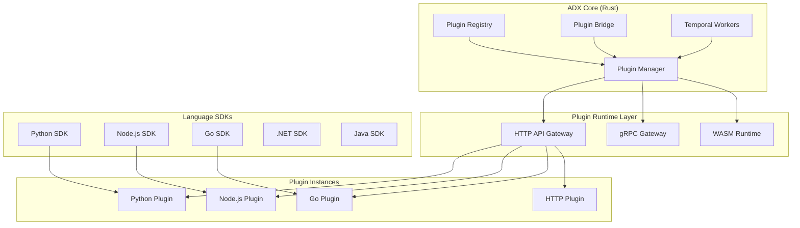

# Multi-Language Plugin Support Design

## Overview

This design document outlines the architecture for supporting plugins written in multiple programming languages, including HTTP API support for curl-style integration. The solution uses a hybrid approach combining HTTP APIs for maximum flexibility with language-specific SDKs for optimal developer experience.

## Architecture

### Core Components



## Components and Interfaces

### 1. Plugin Communication Protocol

#### Standard Message Format
```json
{
  "version": "1.0",
  "message_id": "uuid",
  "timestamp": "2024-01-01T00:00:00Z",
  "message_type": "request|response|event|error",
  "operation": "activate|deactivate|execute_workflow|handle_event",
  "tenant_id": "uuid",
  "plugin_id": "string",
  "data": {},
  "metadata": {
    "timeout": 30000,
    "retry_count": 3,
    "correlation_id": "uuid"
  }
}
```

#### HTTP API Endpoints
```
POST /plugins/{plugin_id}/lifecycle/activate
POST /plugins/{plugin_id}/lifecycle/deactivate
POST /plugins/{plugin_id}/lifecycle/uninstall
GET  /plugins/{plugin_id}/health
POST /plugins/{plugin_id}/workflows/execute
POST /plugins/{plugin_id}/activities/execute
POST /plugins/{plugin_id}/events/handle
GET  /plugins/{plugin_id}/metadata
POST /plugins/{plugin_id}/migrations/run
```

### 2. Plugin Bridge Architecture

#### Core Plugin Bridge (Rust)
```rust
pub struct PluginBridge {
    http_client: HttpClient,
    grpc_client: GrpcClient,
    wasm_runtime: WasmRuntime,
    plugin_registry: Arc<PluginRegistry>,
    temporal_client: TemporalClient,
}

impl PluginBridge {
    pub async fn execute_plugin_operation(
        &self,
        plugin_id: &str,
        operation: PluginOperation,
    ) -> Result<PluginResponse, PluginError> {
        let plugin_info = self.plugin_registry.get(plugin_id)?;
        
        match plugin_info.runtime_type {
            RuntimeType::Http => self.execute_http_operation(plugin_id, operation).await,
            RuntimeType::Grpc => self.execute_grpc_operation(plugin_id, operation).await,
            RuntimeType::Wasm => self.execute_wasm_operation(plugin_id, operation).await,
            RuntimeType::Native => self.execute_native_operation(plugin_id, operation).await,
        }
    }
    
    async fn execute_http_operation(
        &self,
        plugin_id: &str,
        operation: PluginOperation,
    ) -> Result<PluginResponse, PluginError> {
        let plugin_info = self.plugin_registry.get(plugin_id)?;
        let endpoint = format!("{}/plugins/{}/operations", plugin_info.base_url, plugin_id);
        
        let request = PluginRequest {
            version: "1.0".to_string(),
            message_id: Uuid::new_v4().to_string(),
            timestamp: Utc::now(),
            message_type: MessageType::Request,
            operation: operation.clone(),
            tenant_id: operation.tenant_id,
            plugin_id: plugin_id.to_string(),
            data: operation.data,
            metadata: RequestMetadata {
                timeout: 30000,
                retry_count: 3,
                correlation_id: Uuid::new_v4().to_string(),
            },
        };
        
        let response = self.http_client
            .post(&endpoint)
            .json(&request)
            .timeout(Duration::from_millis(request.metadata.timeout))
            .send()
            .await?;
            
        let plugin_response: PluginResponse = response.json().await?;
        Ok(plugin_response)
    }
}
```

### 3. Language-Specific SDK Architecture

#### Python SDK Structure
```python
# adx_core_sdk/__init__.py
from .plugin import AdxPlugin, PluginContext
from .temporal import workflow, activity
from .events import EventHandler
from .database import Migration, Repository
from .api import create_api_router
from .testing import TestHarness

class AdxPlugin:
    def __init__(self, plugin_id: str, config: dict):
        self.plugin_id = plugin_id
        self.config = config
        self.context = None
        
    async def activate(self, context: PluginContext) -> None:
        """Called when plugin is activated"""
        self.context = context
        
    async def deactivate(self) -> None:
        """Called when plugin is deactivated"""
        pass
        
    async def uninstall(self) -> None:
        """Called when plugin is uninstalled"""
        pass
        
    def register_workflows(self) -> List[WorkflowDefinition]:
        """Register Temporal workflows"""
        return []
        
    def register_activities(self) -> List[ActivityDefinition]:
        """Register Temporal activities"""
        return []
        
    def register_event_handlers(self) -> List[EventHandler]:
        """Register event handlers"""
        return []
        
    def register_api_routes(self) -> List[ApiRoute]:
        """Register API routes"""
        return []
        
    def register_migrations(self) -> List[Migration]:
        """Register database migrations"""
        return []

# Temporal integration
def workflow(func):
    """Decorator for Temporal workflows"""
    def wrapper(*args, **kwargs):
        return func(*args, **kwargs)
    wrapper._is_workflow = True
    wrapper._workflow_name = func.__name__
    return wrapper

def activity(func):
    """Decorator for Temporal activities"""
    def wrapper(*args, **kwargs):
        return func(*args, **kwargs)
    wrapper._is_activity = True
    wrapper._activity_name = func.__name__
    return wrapper
```

#### Node.js SDK Structure
```typescript
// @adx-core/plugin-sdk
export interface AdxPlugin {
  pluginId: string;
  config: PluginConfig;
  
  activate(context: PluginContext): Promise<void>;
  deactivate(): Promise<void>;
  uninstall(): Promise<void>;
  
  registerWorkflows(): WorkflowDefinition[];
  registerActivities(): ActivityDefinition[];
  registerEventHandlers(): EventHandler[];
  registerApiRoutes(): ApiRoute[];
  registerMigrations(): Migration[];
}

export class BaseAdxPlugin implements AdxPlugin {
  constructor(
    public pluginId: string,
    public config: PluginConfig
  ) {}
  
  async activate(context: PluginContext): Promise<void> {
    // Default implementation
  }
  
  async deactivate(): Promise<void> {
    // Default implementation
  }
  
  async uninstall(): Promise<void> {
    // Default implementation
  }
  
  registerWorkflows(): WorkflowDefinition[] {
    return [];
  }
  
  registerActivities(): ActivityDefinition[] {
    return [];
  }
  
  registerEventHandlers(): EventHandler[] {
    return [];
  }
  
  registerApiRoutes(): ApiRoute[] {
    return [];
  }
  
  registerMigrations(): Migration[] {
    return [];
  }
}

// Temporal decorators
export function workflow(target: any, propertyKey: string, descriptor: PropertyDescriptor) {
  descriptor.value._isWorkflow = true;
  descriptor.value._workflowName = propertyKey;
  return descriptor;
}

export function activity(target: any, propertyKey: string, descriptor: PropertyDescriptor) {
  descriptor.value._isActivity = true;
  descriptor.value._activityName = propertyKey;
  return descriptor;
}
```

### 4. HTTP API Plugin Support

#### Curl-Style Integration Examples
```bash
# Plugin Registration
curl -X POST http://localhost:8080/api/v1/plugins/register \
  -H "Content-Type: application/json" \
  -H "Authorization: Bearer $TOKEN" \
  -d '{
    "plugin_id": "my-http-plugin",
    "name": "My HTTP Plugin",
    "version": "1.0.0",
    "runtime_type": "http",
    "base_url": "http://localhost:3000",
    "health_check_path": "/health",
    "capabilities": ["workflows", "events", "api_routes"]
  }'

# Plugin Activation
curl -X POST http://localhost:8080/api/v1/plugins/my-http-plugin/activate \
  -H "Content-Type: application/json" \
  -H "Authorization: Bearer $TOKEN" \
  -d '{
    "tenant_id": "tenant-123",
    "config": {
      "database_url": "postgresql://...",
      "redis_url": "redis://..."
    }
  }'

# Workflow Registration
curl -X POST http://localhost:8080/api/v1/plugins/my-http-plugin/workflows \
  -H "Content-Type: application/json" \
  -H "Authorization: Bearer $TOKEN" \
  -d '{
    "workflows": [
      {
        "name": "process_data",
        "description": "Process incoming data",
        "input_schema": {
          "type": "object",
          "properties": {
            "data": {"type": "string"}
          }
        },
        "output_schema": {
          "type": "object",
          "properties": {
            "result": {"type": "string"}
          }
        }
      }
    ]
  }'

# Event Handler Registration
curl -X POST http://localhost:8080/api/v1/plugins/my-http-plugin/events \
  -H "Content-Type: application/json" \
  -H "Authorization: Bearer $TOKEN" \
  -d '{
    "handlers": [
      {
        "event_type": "user.created",
        "handler_url": "http://localhost:3000/events/user-created",
        "retry_policy": {
          "max_attempts": 3,
          "backoff_seconds": [1, 2, 4]
        }
      }
    ]
  }'
```

#### Plugin HTTP Server Template
```python
# Simple HTTP plugin server (Python Flask example)
from flask import Flask, request, jsonify
import uuid
from datetime import datetime

app = Flask(__name__)

@app.route('/health', methods=['GET'])
def health_check():
    return jsonify({
        "status": "healthy",
        "timestamp": datetime.utcnow().isoformat(),
        "version": "1.0.0"
    })

@app.route('/plugins/<plugin_id>/lifecycle/activate', methods=['POST'])
def activate_plugin(plugin_id):
    data = request.json
    
    # Plugin activation logic
    try:
        # Initialize plugin resources
        # Connect to databases, etc.
        
        return jsonify({
            "version": "1.0",
            "message_id": str(uuid.uuid4()),
            "timestamp": datetime.utcnow().isoformat(),
            "message_type": "response",
            "status": "success",
            "data": {
                "plugin_id": plugin_id,
                "activated": True
            }
        })
    except Exception as e:
        return jsonify({
            "version": "1.0",
            "message_id": str(uuid.uuid4()),
            "timestamp": datetime.utcnow().isoformat(),
            "message_type": "error",
            "status": "error",
            "error": {
                "code": "ACTIVATION_FAILED",
                "message": str(e)
            }
        }), 500

@app.route('/plugins/<plugin_id>/workflows/execute', methods=['POST'])
def execute_workflow(plugin_id):
    data = request.json
    workflow_name = data.get('operation', {}).get('workflow_name')
    workflow_input = data.get('data', {})
    
    # Execute workflow logic
    if workflow_name == 'process_data':
        result = process_data_workflow(workflow_input)
        
        return jsonify({
            "version": "1.0",
            "message_id": str(uuid.uuid4()),
            "timestamp": datetime.utcnow().isoformat(),
            "message_type": "response",
            "status": "success",
            "data": result
        })
    
    return jsonify({
        "version": "1.0",
        "message_id": str(uuid.uuid4()),
        "timestamp": datetime.utcnow().isoformat(),
        "message_type": "error",
        "status": "error",
        "error": {
            "code": "UNKNOWN_WORKFLOW",
            "message": f"Unknown workflow: {workflow_name}"
        }
    }), 400

def process_data_workflow(input_data):
    # Workflow implementation
    return {
        "result": f"Processed: {input_data.get('data', '')}"
    }

if __name__ == '__main__':
    app.run(host='0.0.0.0', port=3000)
```

## Data Models

### Plugin Registry Schema
```sql
CREATE TABLE plugin_registry (
    id UUID PRIMARY KEY DEFAULT gen_random_uuid(),
    plugin_id VARCHAR(255) UNIQUE NOT NULL,
    name VARCHAR(255) NOT NULL,
    version VARCHAR(50) NOT NULL,
    runtime_type VARCHAR(50) NOT NULL, -- 'http', 'grpc', 'wasm', 'native'
    language VARCHAR(50), -- 'python', 'nodejs', 'go', 'csharp', 'java', 'rust'
    base_url VARCHAR(500), -- For HTTP/gRPC plugins
    health_check_path VARCHAR(255),
    capabilities JSONB NOT NULL DEFAULT '[]',
    metadata JSONB NOT NULL DEFAULT '{}',
    status VARCHAR(50) NOT NULL DEFAULT 'inactive',
    created_at TIMESTAMPTZ NOT NULL DEFAULT NOW(),
    updated_at TIMESTAMPTZ NOT NULL DEFAULT NOW()
);

CREATE TABLE plugin_instances (
    id UUID PRIMARY KEY DEFAULT gen_random_uuid(),
    plugin_id VARCHAR(255) NOT NULL,
    tenant_id UUID NOT NULL,
    instance_id VARCHAR(255) NOT NULL,
    config JSONB NOT NULL DEFAULT '{}',
    status VARCHAR(50) NOT NULL DEFAULT 'inactive',
    health_status VARCHAR(50) NOT NULL DEFAULT 'unknown',
    last_health_check TIMESTAMPTZ,
    created_at TIMESTAMPTZ NOT NULL DEFAULT NOW(),
    updated_at TIMESTAMPTZ NOT NULL DEFAULT NOW(),
    FOREIGN KEY (plugin_id) REFERENCES plugin_registry(plugin_id),
    UNIQUE(plugin_id, tenant_id, instance_id)
);

CREATE TABLE plugin_workflows (
    id UUID PRIMARY KEY DEFAULT gen_random_uuid(),
    plugin_id VARCHAR(255) NOT NULL,
    workflow_name VARCHAR(255) NOT NULL,
    workflow_definition JSONB NOT NULL,
    input_schema JSONB,
    output_schema JSONB,
    created_at TIMESTAMPTZ NOT NULL DEFAULT NOW(),
    FOREIGN KEY (plugin_id) REFERENCES plugin_registry(plugin_id),
    UNIQUE(plugin_id, workflow_name)
);

CREATE TABLE plugin_event_handlers (
    id UUID PRIMARY KEY DEFAULT gen_random_uuid(),
    plugin_id VARCHAR(255) NOT NULL,
    event_type VARCHAR(255) NOT NULL,
    handler_config JSONB NOT NULL,
    created_at TIMESTAMPTZ NOT NULL DEFAULT NOW(),
    FOREIGN KEY (plugin_id) REFERENCES plugin_registry(plugin_id),
    UNIQUE(plugin_id, event_type)
);
```

## Error Handling

### Error Response Format
```json
{
  "version": "1.0",
  "message_id": "uuid",
  "timestamp": "2024-01-01T00:00:00Z",
  "message_type": "error",
  "status": "error",
  "error": {
    "code": "ERROR_CODE",
    "message": "Human readable error message",
    "details": {
      "field": "Additional error context",
      "stack_trace": "Language-specific stack trace"
    },
    "retry_after": 5000,
    "is_retryable": true
  }
}
```

### Error Codes
- `PLUGIN_NOT_FOUND`: Plugin not registered
- `PLUGIN_UNAVAILABLE`: Plugin not responding
- `ACTIVATION_FAILED`: Plugin activation failed
- `WORKFLOW_EXECUTION_FAILED`: Workflow execution error
- `INVALID_REQUEST`: Malformed request
- `PERMISSION_DENIED`: Insufficient permissions
- `TIMEOUT`: Operation timed out
- `RESOURCE_EXHAUSTED`: Resource limits exceeded

## Testing Strategy

### Unit Testing Framework
Each language SDK includes comprehensive testing utilities:

```python
# Python testing example
from adx_core_sdk.testing import TestHarness, MockPluginContext

class TestMyPlugin(unittest.TestCase):
    def setUp(self):
        self.harness = TestHarness()
        self.plugin = MyPlugin("test-plugin", {})
        
    async def test_plugin_activation(self):
        context = MockPluginContext(
            tenant_id="test-tenant",
            plugin_id="test-plugin"
        )
        
        await self.plugin.activate(context)
        self.assertTrue(self.plugin.is_active)
        
    async def test_workflow_execution(self):
        result = await self.harness.execute_workflow(
            "process_data",
            {"data": "test input"}
        )
        
        self.assertEqual(result["result"], "Processed: test input")
```

### Integration Testing
```bash
# CLI testing commands
adx-core test plugin --language python --plugin-path ./my-plugin
adx-core test integration --plugin my-plugin --scenarios basic,workflows,events
adx-core test performance --plugin my-plugin --duration 60s --concurrent-users 10
```

This design provides a comprehensive foundation for multi-language plugin support while maintaining the security, performance, and architectural principles of ADX CORE.