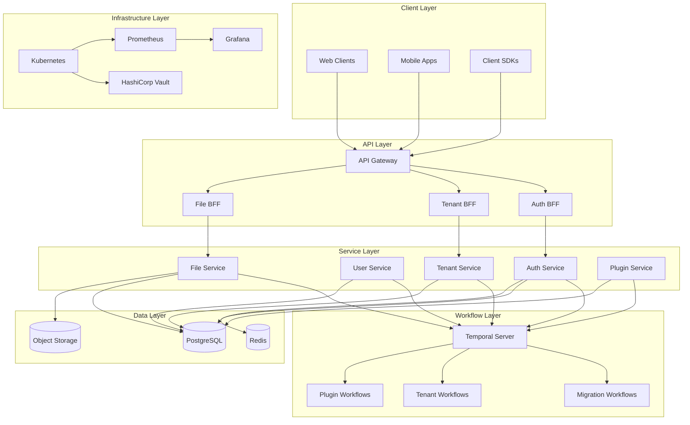

# Design Document

## Overview

This design document outlines the technical architecture for ensuring ADX CORE remains flexible, scalable, and easily migratable as it grows from initial deployment to supporting thousands of clients. The design follows a Temporal-first architecture with modular, plugin-based components that can evolve independently while maintaining backward compatibility.

The core principle is to build a platform that can adapt and scale without requiring complete rebuilds or major disruptions to existing clients. This is achieved through:

- **Temporal-first workflow orchestration** for reliable, observable business processes
- **Modular microservices architecture** with clear service boundaries
- **Database abstraction layers** enabling seamless migrations between providers
- **Plugin-based extensibility** with stable APIs and backward compatibility
- **Configuration-driven behavior** with runtime feature flags and tenant-specific settings
- **Multi-tenant isolation strategies** supporting various deployment models
- **Infrastructure as Code** with GitOps workflows for consistent deployments

## Architecture

### High-Level Architecture



### Core Architectural Principles

1. **Temporal-First Orchestration**: All multi-step operations are implemented as Temporal workflows
2. **Service Autonomy**: Each service can be developed, deployed, and scaled independently
3. **Database Abstraction**: Repository pattern with trait-based interfaces for database independence
4. **Plugin Architecture**: Extensible system with stable APIs and backward compatibility
5. **Configuration-Driven**: Runtime behavior controlled through configuration and feature flags
6. **Multi-Tenant Isolation**: Flexible tenant isolation strategies (database, schema, row-level)
7. **API Versioning**: Multiple API versions supported simultaneously with clear deprecation paths

## Components and Interfaces

### 1. Database Migration and Schema Evolution System

#### Migration Engine
```rust
pub trait MigrationEngine {
    async fn plan_migration(&self, target_version: SchemaVersion) -> Result<MigrationPlan, MigrationError>;
    async fn execute_migration(&self, plan: MigrationPlan) -> Result<MigrationResult, MigrationError>;
    async fn rollback_migration(&self, version: SchemaVersion) -> Result<(), MigrationError>;
    async fn validate_schema(&self, version: SchemaVersion) -> Result<ValidationResult, MigrationError>;
}

pub struct TemporalMigrationEngine {
    temporal_client: Arc<TemporalClient>,
    database_clients: HashMap<String, Arc<dyn DatabaseClient>>,
    migration_repository: Arc<dyn MigrationRepository>,
}

#[workflow]
pub async fn database_migration_workflow(
    migration_request: MigrationRequest,
) -> Result<MigrationResult, WorkflowError> {
    // Step 1: Validate migration plan
    let validation = call_activity(
        MigrationActivities::validate_migration_plan,
        migration_request.clone(),
    ).await?;
    
    if !validation.is_safe {
        return Err(WorkflowError::UnsafeMigration(validation.issues));
    }
    
    // Step 2: Create backup point
    let backup = call_activity(
        MigrationActivities::create_backup,
        BackupRequest {
            tenant_id: migration_request.tenant_id.clone(),
            backup_type: BackupType::PreMigration,
        },
    ).await?;
    
    // Step 3: Execute migration with rollback capability
    let migration_result = call_activity(
        MigrationActivities::execute_migration,
        migration_request.clone(),
    ).await.map_err(|e| {
        // Trigger rollback workflow on failure
        spawn_child_workflow(
            rollback_migration_workflow,
            RollbackRequest {
                backup_id: backup.id,
                migration_id: migration_request.id,
            },
        );
        e
    })?;
    
    // Step 4: Validate post-migration state
    let validation = call_activity(
        MigrationActivities::validate_post_migration,
        PostMigrationValidation {
            migration_id: migration_request.id,
            expected_version: migration_request.target_version,
        },
    ).await?;
    
    Ok(MigrationResult {
        success: true,
        new_version: migration_request.target_version,
        backup_id: backup.id,
        validation_result: validation,
    })
}
```

#### Database Abstraction Layer
```rust
pub trait DatabaseClient: Send + Sync {
    async fn execute_query(&self, query: &str, params: &[Value]) -> Result<QueryResult, DatabaseError>;
    async fn begin_transaction(&self) -> Result<Box<dyn Transaction>, DatabaseError>;
    async fn get_schema_version(&self) -> Result<SchemaVersion, DatabaseError>;
    async fn apply_migration(&self, migration: &Migration) -> Result<(), DatabaseError>;
    async fn supports_feature(&self, feature: DatabaseFeature) -> bool;
}

pub struct PostgreSQLClient {
    pool: PgPool,
    config: DatabaseConfig,
}

pub struct MySQLClient {
    pool: MySqlPool,
    config: DatabaseConfig,
}

// Database-agnostic repository pattern
pub trait Repository<T> {
    async fn find_by_id(&self, id: &str) -> Result<Option<T>, RepositoryError>;
    async fn create(&self, entity: &T) -> Result<T, RepositoryError>;
    async fn update(&self, id: &str, entity: &T) -> Result<T, RepositoryError>;
    async fn delete(&self, id: &str) -> Result<(), RepositoryError>;
    async fn find_by_criteria(&self, criteria: &SearchCriteria) -> Result<Vec<T>, RepositoryError>;
}
```

### 2. Microservices Evolution Framework

#### Service Registry and Discovery
```rust
pub struct ServiceRegistry {
    temporal_client: Arc<TemporalClient>,
    consul_client: Arc<ConsulClient>,
    service_configs: Arc<RwLock<HashMap<String, ServiceConfig>>>,
}

impl ServiceRegistry {
    pub async fn register_service(&self, service: ServiceRegistration) -> Result<(), RegistryError> {
        // Register with Consul for service discovery
        self.consul_client.register_service(&service).await?;
        
        // Register Temporal task queues and workflows
        self.temporal_client.register_workflows(&service.workflows).await?;
        
        // Update internal service configuration
        let mut configs = self.service_configs.write().await;
        configs.insert(service.name.clone(), service.config);
        
        Ok(())
    }
    
    pub async fn discover_service(&self, service_name: &str) -> Result<ServiceEndpoint, RegistryError> {
        let services = self.consul_client.discover_service(service_name).await?;
        
        // Implement load balancing and health checking
        let healthy_services: Vec<_> = services.into_iter()
            .filter(|s| s.health_status == HealthStatus::Passing)
            .collect();
        
        if healthy_services.is_empty() {
            return Err(RegistryError::NoHealthyServices(service_name.to_string()));
        }
        
        // Round-robin load balancing
        let selected = &healthy_services[rand::random::<usize>() % healthy_services.len()];
        Ok(ServiceEndpoint::from(selected))
    }
}

#[workflow]
pub async fn service_deployment_workflow(
    deployment_request: ServiceDeploymentRequest,
) -> Result<DeploymentResult, WorkflowError> {
    // Step 1: Validate deployment compatibility
    let compatibility = call_activity(
        DeploymentActivities::validate_compatibility,
        CompatibilityCheck {
            service_name: deployment_request.service_name.clone(),
            new_version: deployment_request.version.clone(),
            current_version: deployment_request.current_version.clone(),
        },
    ).await?;
    
    if !compatibility.is_compatible {
        return Err(WorkflowError::IncompatibleDeployment(compatibility.issues));
    }
    
    // Step 2: Blue-green deployment
    let blue_green = call_activity(
        DeploymentActivities::create_blue_green_deployment,
        deployment_request.clone(),
    ).await?;
    
    // Step 3: Health checks and validation
    let health_check = call_activity(
        DeploymentActivities::perform_health_checks,
        HealthCheckRequest {
            deployment_id: blue_green.deployment_id,
            service_endpoints: blue_green.green_endpoints,
        },
    ).await?;
    
    if !health_check.all_healthy {
        // Rollback to blue deployment
        call_activity(
            DeploymentActivities::rollback_deployment,
            blue_green.deployment_id,
        ).await?;
        return Err(WorkflowError::DeploymentHealthCheckFailed(health_check.failures));
    }
    
    // Step 4: Traffic switching
    call_activity(
        DeploymentActivities::switch_traffic,
        TrafficSwitchRequest {
            deployment_id: blue_green.deployment_id,
            switch_percentage: 100,
        },
    ).await?;
    
    // Step 5: Cleanup old deployment
    call_activity(
        DeploymentActivities::cleanup_blue_deployment,
        blue_green.deployment_id,
    ).await?;
    
    Ok(DeploymentResult {
        success: true,
        deployment_id: blue_green.deployment_id,
        new_endpoints: blue_green.green_endpoints,
    })
}
```

### 3. Plugin System Architecture

#### Plugin Interface and Registry
```rust
pub trait Plugin: Send + Sync {
    fn name(&self) -> &str;
    fn version(&self) -> &PluginVersion;
    fn api_version(&self) -> &ApiVersion;
    fn dependencies(&self) -> &[PluginDependency];
    
    async fn initialize(&mut self, context: &PluginContext) -> Result<(), PluginError>;
    async fn execute(&self, request: &PluginRequest) -> Result<PluginResponse, PluginError>;
    async fn shutdown(&mut self) -> Result<(), PluginError>;
}

pub struct PluginRegistry {
    plugins: Arc<RwLock<HashMap<String, Arc<dyn Plugin>>>>,
    compatibility_matrix: Arc<RwLock<CompatibilityMatrix>>,
    temporal_client: Arc<TemporalClient>,
}

impl PluginRegistry {
    pub async fn register_plugin(&self, plugin: Arc<dyn Plugin>) -> Result<(), PluginError> {
        // Validate plugin compatibility
        let compatibility = self.check_compatibility(&plugin).await?;
        if !compatibility.is_compatible {
            return Err(PluginError::IncompatiblePlugin(compatibility.issues));
        }
        
        // Initialize plugin
        let context = PluginContext {
            api_version: self.get_current_api_version(),
            temporal_client: self.temporal_client.clone(),
            configuration: self.get_plugin_config(plugin.name()).await?,
        };
        
        let mut plugin_mut = Arc::try_unwrap(plugin).map_err(|_| PluginError::PluginInUse)?;
        plugin_mut.initialize(&context).await?;
        let plugin = Arc::new(plugin_mut);
        
        // Register plugin workflows if any
        if let Some(workflows) = plugin.get_workflows() {
            self.temporal_client.register_workflows(&workflows).await?;
        }
        
        // Add to registry
        let mut plugins = self.plugins.write().await;
        plugins.insert(plugin.name().to_string(), plugin);
        
        Ok(())
    }
    
    async fn check_compatibility(&self, plugin: &Arc<dyn Plugin>) -> Result<CompatibilityResult, PluginError> {
        let matrix = self.compatibility_matrix.read().await;
        let current_api = self.get_current_api_version();
        
        // Check API version compatibility
        if !matrix.is_api_compatible(&current_api, plugin.api_version()) {
            return Ok(CompatibilityResult {
                is_compatible: false,
                issues: vec![format!("API version {} not compatible with current {}", 
                    plugin.api_version(), current_api)],
            });
        }
        
        // Check dependency compatibility
        for dep in plugin.dependencies() {
            if !self.is_dependency_satisfied(dep).await? {
                return Ok(CompatibilityResult {
                    is_compatible: false,
                    issues: vec![format!("Dependency {} not satisfied", dep.name)],
                });
            }
        }
        
        Ok(CompatibilityResult {
            is_compatible: true,
            issues: vec![],
        })
    }
}

#[workflow]
pub async fn plugin_migration_workflow(
    migration_request: PluginMigrationRequest,
) -> Result<PluginMigrationResult, WorkflowError> {
    // Step 1: Validate migration path
    let validation = call_activity(
        PluginActivities::validate_migration_path,
        migration_request.clone(),
    ).await?;
    
    if !validation.is_valid {
        return Err(WorkflowError::InvalidMigrationPath(validation.issues));
    }
    
    // Step 2: Create plugin backup
    let backup = call_activity(
        PluginActivities::backup_plugin_state,
        BackupPluginRequest {
            plugin_name: migration_request.plugin_name.clone(),
            backup_type: BackupType::PreMigration,
        },
    ).await?;
    
    // Step 3: Install new plugin version
    let installation = call_activity(
        PluginActivities::install_plugin_version,
        InstallPluginRequest {
            plugin_name: migration_request.plugin_name.clone(),
            version: migration_request.target_version.clone(),
            migration_data: migration_request.migration_data.clone(),
        },
    ).await.map_err(|e| {
        // Trigger rollback on failure
        spawn_child_workflow(
            plugin_rollback_workflow,
            PluginRollbackRequest {
                plugin_name: migration_request.plugin_name.clone(),
                backup_id: backup.id,
            },
        );
        e
    })?;
    
    // Step 4: Migrate plugin data
    if let Some(migration_data) = migration_request.migration_data {
        call_activity(
            PluginActivities::migrate_plugin_data,
            DataMigrationRequest {
                plugin_name: migration_request.plugin_name.clone(),
                from_version: migration_request.current_version,
                to_version: migration_request.target_version.clone(),
                data: migration_data,
            },
        ).await?;
    }
    
    // Step 5: Validate plugin functionality
    let validation = call_activity(
        PluginActivities::validate_plugin_functionality,
        PluginValidationRequest {
            plugin_name: migration_request.plugin_name.clone(),
            version: migration_request.target_version.clone(),
        },
    ).await?;
    
    if !validation.is_functional {
        // Rollback on validation failure
        spawn_child_workflow(
            plugin_rollback_workflow,
            PluginRollbackRequest {
                plugin_name: migration_request.plugin_name.clone(),
                backup_id: backup.id,
            },
        );
        return Err(WorkflowError::PluginValidationFailed(validation.issues));
    }
    
    Ok(PluginMigrationResult {
        success: true,
        plugin_name: migration_request.plugin_name,
        new_version: migration_request.target_version,
        backup_id: backup.id,
    })
}
```

### 4. Configuration Management System

#### Configuration Engine
```rust
pub struct ConfigurationEngine {
    temporal_client: Arc<TemporalClient>,
    vault_client: Arc<VaultClient>,
    redis_client: Arc<RedisClient>,
    config_repository: Arc<dyn ConfigurationRepository>,
}

impl ConfigurationEngine {
    pub async fn get_configuration(&self, key: &ConfigurationKey) -> Result<ConfigurationValue, ConfigError> {
        // Check cache first
        if let Some(cached) = self.redis_client.get(&key.cache_key()).await? {
            return Ok(serde_json::from_str(&cached)?);
        }
        
        // Load from repository
        let config = self.config_repository.get_configuration(key).await?;
        
        // Decrypt secrets if needed
        let decrypted_config = if config.is_secret {
            let decrypted = self.vault_client.decrypt(&config.encrypted_value).await?;
            ConfigurationValue {
                value: decrypted,
                ..config
            }
        } else {
            config
        };
        
        // Cache the result
        self.redis_client.set(
            &key.cache_key(),
            &serde_json::to_string(&decrypted_config)?,
            Some(Duration::minutes(5)),
        ).await?;
        
        Ok(decrypted_config)
    }
    
    pub async fn update_configuration(&self, key: &ConfigurationKey, value: &ConfigurationValue) -> Result<(), ConfigError> {
        // Start configuration update workflow
        let workflow_id = format!("config-update-{}-{}", key.to_string(), Uuid::new_v4());
        
        self.temporal_client.start_workflow(
            "configuration_update_workflow",
            workflow_id,
            "configuration-queue",
            ConfigurationUpdateRequest {
                key: key.clone(),
                value: value.clone(),
                updated_by: value.metadata.updated_by.clone(),
            },
        ).await?;
        
        Ok(())
    }
}

#[workflow]
pub async fn configuration_update_workflow(
    update_request: ConfigurationUpdateRequest,
) -> Result<ConfigurationUpdateResult, WorkflowError> {
    // Step 1: Validate configuration change
    let validation = call_activity(
        ConfigurationActivities::validate_configuration,
        ValidationRequest {
            key: update_request.key.clone(),
            value: update_request.value.clone(),
        },
    ).await?;
    
    if !validation.is_valid {
        return Err(WorkflowError::InvalidConfiguration(validation.errors));
    }
    
    // Step 2: Create configuration backup
    let backup = call_activity(
        ConfigurationActivities::backup_configuration,
        BackupConfigurationRequest {
            key: update_request.key.clone(),
        },
    ).await?;
    
    // Step 3: Apply configuration change
    let update_result = call_activity(
        ConfigurationActivities::apply_configuration,
        update_request.clone(),
    ).await.map_err(|e| {
        // Trigger rollback on failure
        spawn_child_workflow(
            configuration_rollback_workflow,
            ConfigurationRollbackRequest {
                key: update_request.key.clone(),
                backup_id: backup.id,
            },
        );
        e
    })?;
    
    // Step 4: Notify affected services
    let notification_result = call_activity(
        ConfigurationActivities::notify_configuration_change,
        ConfigurationChangeNotification {
            key: update_request.key.clone(),
            old_value: backup.value,
            new_value: update_request.value.clone(),
            affected_services: validation.affected_services,
        },
    ).await?;
    
    // Step 5: Validate system health after change
    let health_check = call_activity(
        ConfigurationActivities::validate_system_health,
        SystemHealthCheckRequest {
            configuration_key: update_request.key.clone(),
            timeout: Duration::minutes(2),
        },
    ).await?;
    
    if !health_check.is_healthy {
        // Rollback on health check failure
        spawn_child_workflow(
            configuration_rollback_workflow,
            ConfigurationRollbackRequest {
                key: update_request.key.clone(),
                backup_id: backup.id,
            },
        );
        return Err(WorkflowError::SystemHealthCheckFailed(health_check.issues));
    }
    
    Ok(ConfigurationUpdateResult {
        success: true,
        key: update_request.key,
        new_value: update_request.value,
        backup_id: backup.id,
        notification_result,
    })
}

// Feature Flag Management
pub struct FeatureFlagEngine {
    configuration_engine: Arc<ConfigurationEngine>,
    temporal_client: Arc<TemporalClient>,
}

impl FeatureFlagEngine {
    pub async fn is_feature_enabled(&self, flag: &FeatureFlag, context: &EvaluationContext) -> Result<bool, FeatureFlagError> {
        let flag_config = self.configuration_engine.get_configuration(&flag.config_key()).await?;
        
        match flag_config.flag_type {
            FeatureFlagType::Boolean => Ok(flag_config.value.as_bool().unwrap_or(false)),
            FeatureFlagType::Percentage => {
                let percentage = flag_config.value.as_f64().unwrap_or(0.0);
                let hash = self.calculate_hash(&context.user_id, &flag.name);
                Ok((hash % 100.0) < percentage)
            },
            FeatureFlagType::UserList => {
                let user_list: Vec<String> = flag_config.value.as_array()
                    .unwrap_or(&vec![])
                    .iter()
                    .filter_map(|v| v.as_str().map(|s| s.to_string()))
                    .collect();
                Ok(user_list.contains(&context.user_id))
            },
            FeatureFlagType::TenantList => {
                let tenant_list: Vec<String> = flag_config.value.as_array()
                    .unwrap_or(&vec![])
                    .iter()
                    .filter_map(|v| v.as_str().map(|s| s.to_string()))
                    .collect();
                Ok(tenant_list.contains(&context.tenant_id))
            },
        }
    }
}
```

## Data Models

### Core Data Structures

```rust
// Migration Models
#[derive(Debug, Clone, Serialize, Deserialize)]
pub struct Migration {
    pub id: String,
    pub version: SchemaVersion,
    pub description: String,
    pub up_script: String,
    pub down_script: String,
    pub checksum: String,
    pub created_at: DateTime<Utc>,
    pub applied_at: Option<DateTime<Utc>>,
}

#[derive(Debug, Clone, Serialize, Deserialize)]
pub struct MigrationPlan {
    pub id: String,
    pub migrations: Vec<Migration>,
    pub estimated_duration: Duration,
    pub rollback_plan: RollbackPlan,
    pub safety_checks: Vec<SafetyCheck>,
}

// Service Models
#[derive(Debug, Clone, Serialize, Deserialize)]
pub struct ServiceRegistration {
    pub name: String,
    pub version: ServiceVersion,
    pub endpoints: Vec<ServiceEndpoint>,
    pub health_check: HealthCheckConfig,
    pub workflows: Vec<WorkflowRegistration>,
    pub config: ServiceConfig,
}

#[derive(Debug, Clone, Serialize, Deserialize)]
pub struct ServiceConfig {
    pub scaling: ScalingConfig,
    pub resources: ResourceConfig,
    pub dependencies: Vec<ServiceDependency>,
    pub feature_flags: Vec<String>,
}

// Plugin Models
#[derive(Debug, Clone, Serialize, Deserialize)]
pub struct PluginMetadata {
    pub name: String,
    pub version: PluginVersion,
    pub api_version: ApiVersion,
    pub author: String,
    pub description: String,
    pub dependencies: Vec<PluginDependency>,
    pub permissions: Vec<Permission>,
}

#[derive(Debug, Clone, Serialize, Deserialize)]
pub struct PluginDependency {
    pub name: String,
    pub version_constraint: VersionConstraint,
    pub optional: bool,
}

// Configuration Models
#[derive(Debug, Clone, Serialize, Deserialize)]
pub struct ConfigurationKey {
    pub namespace: String,
    pub service: String,
    pub key: String,
    pub tenant_id: Option<String>,
    pub environment: String,
}

#[derive(Debug, Clone, Serialize, Deserialize)]
pub struct ConfigurationValue {
    pub value: serde_json::Value,
    pub is_secret: bool,
    pub encrypted_value: Option<String>,
    pub metadata: ConfigurationMetadata,
}

#[derive(Debug, Clone, Serialize, Deserialize)]
pub struct ConfigurationMetadata {
    pub created_at: DateTime<Utc>,
    pub updated_at: DateTime<Utc>,
    pub updated_by: String,
    pub version: u64,
    pub tags: Vec<String>,
}

// Multi-tenant Models
#[derive(Debug, Clone, Serialize, Deserialize)]
pub struct TenantConfiguration {
    pub tenant_id: String,
    pub isolation_strategy: IsolationStrategy,
    pub database_config: TenantDatabaseConfig,
    pub feature_flags: HashMap<String, serde_json::Value>,
    pub resource_limits: ResourceLimits,
    pub compliance_requirements: Vec<ComplianceRequirement>,
}

#[derive(Debug, Clone, Serialize, Deserialize)]
pub enum IsolationStrategy {
    DatabasePerTenant,
    SchemaPerTenant,
    RowLevelSecurity,
    Hybrid(HybridIsolationConfig),
}

// API Versioning Models
#[derive(Debug, Clone, Serialize, Deserialize)]
pub struct ApiVersion {
    pub major: u32,
    pub minor: u32,
    pub patch: u32,
}

#[derive(Debug, Clone, Serialize, Deserialize)]
pub struct ApiEndpoint {
    pub path: String,
    pub method: HttpMethod,
    pub version: ApiVersion,
    pub deprecated: bool,
    pub deprecation_date: Option<DateTime<Utc>>,
    pub removal_date: Option<DateTime<Utc>>,
    pub migration_guide: Option<String>,
}
```

## Error Handling

### Comprehensive Error Management

```rust
// Migration Errors
#[derive(Debug, thiserror::Error)]
pub enum MigrationError {
    #[error("Database connection failed: {0}")]
    DatabaseConnection(String),
    
    #[error("Migration validation failed: {issues:?}")]
    ValidationFailed { issues: Vec<String> },
    
    #[error("Migration rollback failed: {0}")]
    RollbackFailed(String),
    
    #[error("Schema version conflict: expected {expected}, found {actual}")]
    VersionConflict { expected: String, actual: String },
    
    #[error("Unsafe migration detected: {0}")]
    UnsafeMigration(String),
}

// Plugin Errors
#[derive(Debug, thiserror::Error)]
pub enum PluginError {
    #[error("Plugin not found: {0}")]
    NotFound(String),
    
    #[error("Plugin initialization failed: {0}")]
    InitializationFailed(String),
    
    #[error("Plugin API version incompatible: plugin {plugin_version}, system {system_version}")]
    ApiVersionIncompatible { plugin_version: String, system_version: String },
    
    #[error("Plugin dependency not satisfied: {dependency}")]
    DependencyNotSatisfied { dependency: String },
    
    #[error("Plugin execution failed: {0}")]
    ExecutionFailed(String),
}

// Configuration Errors
#[derive(Debug, thiserror::Error)]
pub enum ConfigError {
    #[error("Configuration not found: {key}")]
    NotFound { key: String },
    
    #[error("Configuration validation failed: {errors:?}")]
    ValidationFailed { errors: Vec<String> },
    
    #[error("Secret decryption failed: {0}")]
    DecryptionFailed(String),
    
    #[error("Configuration update conflict: version {expected} expected, found {actual}")]
    UpdateConflict { expected: u64, actual: u64 },
}

// Workflow Error Handling
impl From<MigrationError> for WorkflowError {
    fn from(err: MigrationError) -> Self {
        WorkflowError::ActivityFailed("migration".to_string(), err.to_string())
    }
}

impl From<PluginError> for WorkflowError {
    fn from(err: PluginError) -> Self {
        WorkflowError::ActivityFailed("plugin".to_string(), err.to_string())
    }
}

impl From<ConfigError> for WorkflowError {
    fn from(err: ConfigError) -> Self {
        WorkflowError::ActivityFailed("configuration".to_string(), err.to_string())
    }
}

// Retry Policies for Different Error Types
pub fn get_retry_policy(error: &dyn std::error::Error) -> RetryPolicy {
    if error.to_string().contains("connection") {
        RetryPolicy::exponential_backoff(5, Duration::seconds(2))
    } else if error.to_string().contains("timeout") {
        RetryPolicy::exponential_backoff(3, Duration::seconds(5))
    } else if error.to_string().contains("validation") {
        RetryPolicy::no_retry()
    } else {
        RetryPolicy::exponential_backoff(3, Duration::seconds(1))
    }
}
```

## Testing Strategy

### Comprehensive Testing Approach

```rust
// Migration Testing
#[cfg(test)]
mod migration_tests {
    use super::*;
    use temporal_sdk_core_test_utils::TestWorkflowEnvironment;
    
    #[tokio::test]
    async fn test_database_migration_workflow() {
        let test_env = TestWorkflowEnvironment::new().await;
        
        let mock_activities = MockMigrationActivities::new()
            .expect_validate_migration_plan()
            .returning(|_| Ok(ValidationResult { is_safe: true, issues: vec![] }))
            .expect_create_backup()
            .returning(|_| Ok(BackupResult { id: "backup-123".to_string() }))
            .expect_execute_migration()
            .returning(|_| Ok(MigrationExecutionResult { success: true }));
        
        let result = test_env.execute_workflow(
            database_migration_workflow,
            MigrationRequest {
                id: "migration-123".to_string(),
                target_version: SchemaVersion::new(2, 0, 0),
                tenant_id: Some("tenant-123".to_string()),
            },
        ).await;
        
        assert!(result.is_ok());
        let migration_result = result.unwrap();
        assert!(migration_result.success);
    }
    
    #[tokio::test]
    async fn test_migration_rollback_on_failure() {
        let test_env = TestWorkflowEnvironment::new().await;
        
        let mock_activities = MockMigrationActivities::new()
            .expect_validate_migration_plan()
            .returning(|_| Ok(ValidationResult { is_safe: true, issues: vec![] }))
            .expect_create_backup()
            .returning(|_| Ok(BackupResult { id: "backup-123".to_string() }))
            .expect_execute_migration()
            .returning(|_| Err(MigrationError::DatabaseConnection("Connection lost".to_string())));
        
        let result = test_env.execute_workflow(
            database_migration_workflow,
            MigrationRequest {
                id: "migration-123".to_string(),
                target_version: SchemaVersion::new(2, 0, 0),
                tenant_id: Some("tenant-123".to_string()),
            },
        ).await;
        
        assert!(result.is_err());
        // Verify rollback workflow was triggered
        test_env.verify_child_workflow_started("rollback_migration_workflow").await;
    }
}

// Plugin Testing
#[cfg(test)]
mod plugin_tests {
    use super::*;
    
    #[tokio::test]
    async fn test_plugin_registration() {
        let registry = PluginRegistry::new_for_testing().await;
        let test_plugin = Arc::new(TestPlugin::new("test-plugin", "1.0.0"));
        
        let result = registry.register_plugin(test_plugin).await;
        assert!(result.is_ok());
        
        let registered = registry.get_plugin("test-plugin").await;
        assert!(registered.is_some());
    }
    
    #[tokio::test]
    async fn test_plugin_compatibility_check() {
        let registry = PluginRegistry::new_for_testing().await;
        let incompatible_plugin = Arc::new(TestPlugin::new_with_api_version(
            "incompatible-plugin", 
            "1.0.0", 
            ApiVersion::new(999, 0, 0)
        ));
        
        let result = registry.register_plugin(incompatible_plugin).await;
        assert!(result.is_err());
        
        match result.unwrap_err() {
            PluginError::ApiVersionIncompatible { .. } => {},
            _ => panic!("Expected API version incompatibility error"),
        }
    }
}

// Configuration Testing
#[cfg(test)]
mod configuration_tests {
    use super::*;
    
    #[tokio::test]
    async fn test_configuration_update_workflow() {
        let test_env = TestWorkflowEnvironment::new().await;
        
        let mock_activities = MockConfigurationActivities::new()
            .expect_validate_configuration()
            .returning(|_| Ok(ValidationResult { is_valid: true, errors: vec![], affected_services: vec![] }))
            .expect_backup_configuration()
            .returning(|_| Ok(BackupResult { id: "backup-123".to_string(), value: serde_json::Value::Null }))
            .expect_apply_configuration()
            .returning(|_| Ok(ConfigurationApplyResult { success: true }));
        
        let result = test_env.execute_workflow(
            configuration_update_workflow,
            ConfigurationUpdateRequest {
                key: ConfigurationKey {
                    namespace: "test".to_string(),
                    service: "auth".to_string(),
                    key: "max_sessions".to_string(),
                    tenant_id: None,
                    environment: "development".to_string(),
                },
                value: ConfigurationValue {
                    value: serde_json::Value::Number(serde_json::Number::from(100)),
                    is_secret: false,
                    encrypted_value: None,
                    metadata: ConfigurationMetadata {
                        created_at: Utc::now(),
                        updated_at: Utc::now(),
                        updated_by: "test-user".to_string(),
                        version: 1,
                        tags: vec![],
                    },
                },
                updated_by: "test-user".to_string(),
            },
        ).await;
        
        assert!(result.is_ok());
    }
}

// Integration Testing
#[cfg(test)]
mod integration_tests {
    use super::*;
    
    #[tokio::test]
    async fn test_end_to_end_migration_flow() {
        let test_env = IntegrationTestEnvironment::new().await;
        
        // Test complete migration flow through API
        let response = test_env.api_client
            .post("/api/migrations")
            .json(&MigrationRequest {
                id: "test-migration".to_string(),
                target_version: SchemaVersion::new(2, 0, 0),
                tenant_id: Some("test-tenant".to_string()),
            })
            .send()
            .await
            .unwrap();
        
        assert_eq!(response.status(), 200);
        
        let workflow_response: WorkflowResponse = response.json().await.unwrap();
        match workflow_response {
            WorkflowResponse::Started { operation_id, .. } => {
                let final_result = test_env.poll_workflow_completion(&operation_id).await;
                assert!(final_result.is_ok());
            }
            _ => panic!("Expected workflow to be started"),
        }
    }
    
    #[tokio::test]
    async fn test_plugin_lifecycle() {
        let test_env = IntegrationTestEnvironment::new().await;
        
        // Register plugin
        let plugin_registration = PluginRegistrationRequest {
            name: "test-plugin".to_string(),
            version: "1.0.0".to_string(),
            binary_url: "https://example.com/plugin.wasm".to_string(),
        };
        
        let response = test_env.api_client
            .post("/api/plugins")
            .json(&plugin_registration)
            .send()
            .await
            .unwrap();
        
        assert_eq!(response.status(), 201);
        
        // Test plugin execution
        let execution_request = PluginExecutionRequest {
            plugin_name: "test-plugin".to_string(),
            input: serde_json::json!({"test": "data"}),
        };
        
        let response = test_env.api_client
            .post("/api/plugins/test-plugin/execute")
            .json(&execution_request)
            .send()
            .await
            .unwrap();
        
        assert_eq!(response.status(), 200);
    }
}

// Load Testing
#[cfg(test)]
mod load_tests {
    use super::*;
    use tokio::time::{sleep, Duration};
    
    #[tokio::test]
    #[ignore] // Run only when specifically testing load
    async fn test_concurrent_migrations() {
        let test_env = LoadTestEnvironment::new().await;
        
        let migration_tasks: Vec<_> = (0..100).map(|i| {
            let env = test_env.clone();
            tokio::spawn(async move {
                let request = MigrationRequest {
                    id: format!("migration-{}", i),
                    target_version: SchemaVersion::new(2, 0, i as u32),
                    tenant_id: Some(format!("tenant-{}", i)),
                };
                
                env.execute_migration(request).await
            })
        }).collect();
        
        let results = futures::future::join_all(migration_tasks).await;
        
        let successful = results.iter().filter(|r| r.is_ok()).count();
        assert!(successful >= 95, "At least 95% of migrations should succeed");
    }
}
```

This design provides a comprehensive foundation for platform flexibility and migration capabilities, ensuring ADX CORE can evolve and scale while maintaining reliability and backward compatibility through Temporal-first orchestration.
### 5. A
PI Versioning and Evolution System

#### API Version Management
```rust
pub struct ApiVersionManager {
    temporal_client: Arc<TemporalClient>,
    version_registry: Arc<RwLock<HashMap<String, Vec<ApiVersion>>>>,
    deprecation_scheduler: Arc<DeprecationScheduler>,
}

impl ApiVersionManager {
    pub async fn register_api_version(&self, api: ApiDefinition) -> Result<(), ApiError> {
        // Validate backward compatibility
        let compatibility = self.check_backward_compatibility(&api).await?;
        if !compatibility.is_compatible {
            return Err(ApiError::BackwardCompatibilityBroken(compatibility.breaking_changes));
        }
        
        // Register new version
        let mut registry = self.version_registry.write().await;
        let versions = registry.entry(api.name.clone()).or_insert_with(Vec::new);
        versions.push(api.version.clone());
        versions.sort();
        
        // Schedule deprecation of old versions if needed
        if let Some(deprecation_policy) = api.deprecation_policy {
            self.deprecation_scheduler.schedule_deprecation(
                api.name.clone(),
                api.version.clone(),
                deprecation_policy,
            ).await?;
        }
        
        Ok(())
    }
    
    pub async fn route_request(&self, request: &ApiRequest) -> Result<ApiResponse, ApiError> {
        let requested_version = request.version.as_ref()
            .unwrap_or(&self.get_latest_version(&request.endpoint)?);
        
        // Check if version is deprecated
        if self.is_version_deprecated(&request.endpoint, requested_version).await? {
            // Add deprecation warning to response headers
            let warning = format!("API version {} is deprecated. Please migrate to version {}",
                requested_version, self.get_latest_version(&request.endpoint)?);
            request.add_header("Warning", &warning);
        }
        
        // Route to appropriate handler
        let handler = self.get_version_handler(&request.endpoint, requested_version)?;
        handler.handle_request(request).await
    }
}

#[workflow]
pub async fn api_deprecation_workflow(
    deprecation_request: ApiDeprecationRequest,
) -> Result<ApiDeprecationResult, WorkflowError> {
    // Step 1: Analyze current usage
    let usage_analysis = call_activity(
        ApiActivities::analyze_version_usage,
        UsageAnalysisRequest {
            api_name: deprecation_request.api_name.clone(),
            version: deprecation_request.version.clone(),
            analysis_period: Duration::days(30),
        },
    ).await?;
    
    // Step 2: Notify API consumers
    call_activity(
        ApiActivities::notify_deprecation,
        DeprecationNotificationRequest {
            api_name: deprecation_request.api_name.clone(),
            version: deprecation_request.version.clone(),
            consumers: usage_analysis.active_consumers,
            deprecation_timeline: deprecation_request.timeline.clone(),
        },
    ).await?;
    
    // Step 3: Wait for deprecation period
    sleep(deprecation_request.timeline.warning_period).await;
    
    // Step 4: Check migration progress
    let migration_status = call_activity(
        ApiActivities::check_migration_progress,
        MigrationProgressRequest {
            api_name: deprecation_request.api_name.clone(),
            version: deprecation_request.version.clone(),
        },
    ).await?;
    
    if migration_status.remaining_consumers > 0 {
        // Extend deprecation period if needed
        call_activity(
            ApiActivities::extend_deprecation_period,
            ExtendDeprecationRequest {
                api_name: deprecation_request.api_name.clone(),
                version: deprecation_request.version.clone(),
                extension_period: Duration::days(30),
                reason: "Active consumers still using deprecated version".to_string(),
            },
        ).await?;
        
        // Wait for extension period
        sleep(Duration::days(30)).await;
    }
    
    // Step 5: Remove deprecated version
    call_activity(
        ApiActivities::remove_api_version,
        RemoveApiVersionRequest {
            api_name: deprecation_request.api_name.clone(),
            version: deprecation_request.version.clone(),
        },
    ).await?;
    
    Ok(ApiDeprecationResult {
        success: true,
        api_name: deprecation_request.api_name,
        deprecated_version: deprecation_request.version,
        final_removal_date: Utc::now(),
    })
}
```

### 6. Multi-Tenant Data Isolation and Migration

#### Tenant Isolation Engine
```rust
pub struct TenantIsolationEngine {
    temporal_client: Arc<TemporalClient>,
    database_clients: HashMap<IsolationStrategy, Arc<dyn DatabaseClient>>,
    tenant_registry: Arc<dyn TenantRegistry>,
}

impl TenantIsolationEngine {
    pub async fn migrate_tenant_isolation(&self, migration_request: TenantIsolationMigrationRequest) -> Result<(), TenantError> {
        let workflow_id = format!("tenant-isolation-migration-{}-{}", 
            migration_request.tenant_id, Uuid::new_v4());
        
        self.temporal_client.start_workflow(
            "tenant_isolation_migration_workflow",
            workflow_id,
            "tenant-migration-queue",
            migration_request,
        ).await?;
        
        Ok(())
    }
    
    pub async fn get_tenant_database_client(&self, tenant_id: &str) -> Result<Arc<dyn DatabaseClient>, TenantError> {
        let tenant_config = self.tenant_registry.get_tenant_config(tenant_id).await?;
        
        match tenant_config.isolation_strategy {
            IsolationStrategy::DatabasePerTenant => {
                let db_config = tenant_config.database_config.unwrap();
                Ok(Arc::new(PostgreSQLClient::new(db_config).await?))
            },
            IsolationStrategy::SchemaPerTenant => {
                let client = self.database_clients.get(&IsolationStrategy::SchemaPerTenant)
                    .ok_or(TenantError::IsolationStrategyNotSupported)?;
                Ok(client.clone())
            },
            IsolationStrategy::RowLevelSecurity => {
                let client = self.database_clients.get(&IsolationStrategy::RowLevelSecurity)
                    .ok_or(TenantError::IsolationStrategyNotSupported)?;
                Ok(client.clone())
            },
            IsolationStrategy::Hybrid(config) => {
                // Implement hybrid isolation logic
                self.get_hybrid_database_client(tenant_id, &config).await
            },
        }
    }
}

#[workflow]
pub async fn tenant_isolation_migration_workflow(
    migration_request: TenantIsolationMigrationRequest,
) -> Result<TenantIsolationMigrationResult, WorkflowError> {
    // Step 1: Validate migration feasibility
    let validation = call_activity(
        TenantActivities::validate_isolation_migration,
        migration_request.clone(),
    ).await?;
    
    if !validation.is_feasible {
        return Err(WorkflowError::MigrationNotFeasible(validation.issues));
    }
    
    // Step 2: Create tenant data backup
    let backup = call_activity(
        TenantActivities::backup_tenant_data,
        TenantBackupRequest {
            tenant_id: migration_request.tenant_id.clone(),
            backup_type: BackupType::PreIsolationMigration,
            include_metadata: true,
        },
    ).await?;
    
    // Step 3: Prepare target isolation environment
    let target_preparation = call_activity(
        TenantActivities::prepare_target_isolation,
        TargetPreparationRequest {
            tenant_id: migration_request.tenant_id.clone(),
            target_strategy: migration_request.target_isolation_strategy.clone(),
            resource_requirements: validation.resource_requirements,
        },
    ).await.map_err(|e| {
        // Cleanup on failure
        spawn_child_workflow(
            tenant_isolation_cleanup_workflow,
            TenantIsolationCleanupRequest {
                tenant_id: migration_request.tenant_id.clone(),
                backup_id: backup.id,
            },
        );
        e
    })?;
    
    // Step 4: Migrate tenant data
    let data_migration = call_activity(
        TenantActivities::migrate_tenant_data,
        TenantDataMigrationRequest {
            tenant_id: migration_request.tenant_id.clone(),
            source_strategy: migration_request.current_isolation_strategy.clone(),
            target_strategy: migration_request.target_isolation_strategy.clone(),
            target_environment: target_preparation.environment_id,
            migration_options: migration_request.migration_options.clone(),
        },
    ).await.map_err(|e| {
        // Rollback on failure
        spawn_child_workflow(
            tenant_isolation_rollback_workflow,
            TenantIsolationRollbackRequest {
                tenant_id: migration_request.tenant_id.clone(),
                backup_id: backup.id,
                target_environment: target_preparation.environment_id,
            },
        );
        e
    })?;
    
    // Step 5: Update tenant configuration
    call_activity(
        TenantActivities::update_tenant_configuration,
        TenantConfigurationUpdateRequest {
            tenant_id: migration_request.tenant_id.clone(),
            new_isolation_strategy: migration_request.target_isolation_strategy.clone(),
            new_database_config: target_preparation.database_config,
        },
    ).await?;
    
    // Step 6: Validate migration success
    let validation = call_activity(
        TenantActivities::validate_migration_success,
        MigrationValidationRequest {
            tenant_id: migration_request.tenant_id.clone(),
            expected_isolation_strategy: migration_request.target_isolation_strategy.clone(),
            data_integrity_checks: true,
        },
    ).await?;
    
    if !validation.is_successful {
        // Rollback on validation failure
        spawn_child_workflow(
            tenant_isolation_rollback_workflow,
            TenantIsolationRollbackRequest {
                tenant_id: migration_request.tenant_id.clone(),
                backup_id: backup.id,
                target_environment: target_preparation.environment_id,
            },
        );
        return Err(WorkflowError::MigrationValidationFailed(validation.issues));
    }
    
    // Step 7: Cleanup old isolation environment
    call_activity(
        TenantActivities::cleanup_old_isolation,
        IsolationCleanupRequest {
            tenant_id: migration_request.tenant_id.clone(),
            old_strategy: migration_request.current_isolation_strategy,
            cleanup_delay: Duration::days(7), // Keep for rollback window
        },
    ).await?;
    
    Ok(TenantIsolationMigrationResult {
        success: true,
        tenant_id: migration_request.tenant_id,
        new_isolation_strategy: migration_request.target_isolation_strategy,
        migration_duration: validation.migration_duration,
        backup_id: backup.id,
    })
}
```

### 7. Infrastructure as Code and GitOps Integration

#### GitOps Engine
```rust
pub struct GitOpsEngine {
    temporal_client: Arc<TemporalClient>,
    git_client: Arc<dyn GitClient>,
    terraform_client: Arc<TerraformClient>,
    kubernetes_client: Arc<KubernetesClient>,
}

impl GitOpsEngine {
    pub async fn deploy_infrastructure_change(&self, change_request: InfrastructureChangeRequest) -> Result<(), GitOpsError> {
        let workflow_id = format!("infrastructure-deployment-{}-{}", 
            change_request.environment, Uuid::new_v4());
        
        self.temporal_client.start_workflow(
            "infrastructure_deployment_workflow",
            workflow_id,
            "infrastructure-queue",
            change_request,
        ).await?;
        
        Ok(())
    }
}

#[workflow]
pub async fn infrastructure_deployment_workflow(
    deployment_request: InfrastructureChangeRequest,
) -> Result<InfrastructureDeploymentResult, WorkflowError> {
    // Step 1: Validate infrastructure changes
    let validation = call_activity(
        InfrastructureActivities::validate_infrastructure_changes,
        InfrastructureValidationRequest {
            git_ref: deployment_request.git_ref.clone(),
            environment: deployment_request.environment.clone(),
            changes: deployment_request.changes.clone(),
        },
    ).await?;
    
    if !validation.is_valid {
        return Err(WorkflowError::InvalidInfrastructureChanges(validation.errors));
    }
    
    // Step 2: Create infrastructure backup/snapshot
    let backup = call_activity(
        InfrastructureActivities::create_infrastructure_snapshot,
        InfrastructureSnapshotRequest {
            environment: deployment_request.environment.clone(),
            snapshot_type: SnapshotType::PreDeployment,
        },
    ).await?;
    
    // Step 3: Plan infrastructure changes
    let plan = call_activity(
        InfrastructureActivities::plan_infrastructure_changes,
        InfrastructurePlanRequest {
            git_ref: deployment_request.git_ref.clone(),
            environment: deployment_request.environment.clone(),
            terraform_workspace: deployment_request.terraform_workspace.clone(),
        },
    ).await?;
    
    // Step 4: Apply infrastructure changes
    let apply_result = call_activity(
        InfrastructureActivities::apply_infrastructure_changes,
        InfrastructureApplyRequest {
            plan_id: plan.id,
            environment: deployment_request.environment.clone(),
            auto_approve: deployment_request.auto_approve,
        },
    ).await.map_err(|e| {
        // Trigger rollback on failure
        spawn_child_workflow(
            infrastructure_rollback_workflow,
            InfrastructureRollbackRequest {
                environment: deployment_request.environment.clone(),
                snapshot_id: backup.id,
            },
        );
        e
    })?;
    
    // Step 5: Deploy application changes
    if !deployment_request.application_changes.is_empty() {
        let app_deployment = call_activity(
            InfrastructureActivities::deploy_application_changes,
            ApplicationDeploymentRequest {
                environment: deployment_request.environment.clone(),
                changes: deployment_request.application_changes.clone(),
                infrastructure_state: apply_result.new_state,
            },
        ).await.map_err(|e| {
            // Rollback both infrastructure and applications
            spawn_child_workflow(
                infrastructure_rollback_workflow,
                InfrastructureRollbackRequest {
                    environment: deployment_request.environment.clone(),
                    snapshot_id: backup.id,
                },
            );
            e
        })?;
    }
    
    // Step 6: Run post-deployment tests
    let test_results = call_activity(
        InfrastructureActivities::run_post_deployment_tests,
        PostDeploymentTestRequest {
            environment: deployment_request.environment.clone(),
            test_suites: deployment_request.test_suites.clone(),
        },
    ).await?;
    
    if !test_results.all_passed {
        // Rollback on test failures
        spawn_child_workflow(
            infrastructure_rollback_workflow,
            InfrastructureRollbackRequest {
                environment: deployment_request.environment.clone(),
                snapshot_id: backup.id,
            },
        );
        return Err(WorkflowError::PostDeploymentTestsFailed(test_results.failures));
    }
    
    // Step 7: Update deployment status
    call_activity(
        InfrastructureActivities::update_deployment_status,
        DeploymentStatusUpdate {
            environment: deployment_request.environment.clone(),
            git_ref: deployment_request.git_ref.clone(),
            status: DeploymentStatus::Successful,
            deployed_at: Utc::now(),
        },
    ).await?;
    
    Ok(InfrastructureDeploymentResult {
        success: true,
        environment: deployment_request.environment,
        git_ref: deployment_request.git_ref,
        infrastructure_changes: apply_result.applied_changes,
        application_changes: deployment_request.application_changes,
        backup_id: backup.id,
    })
}
```

### 8. Observability and Debugging System

#### Observability Engine
```rust
pub struct ObservabilityEngine {
    temporal_client: Arc<TemporalClient>,
    prometheus_client: Arc<PrometheusClient>,
    jaeger_client: Arc<JaegerClient>,
    elasticsearch_client: Arc<ElasticsearchClient>,
}

impl ObservabilityEngine {
    pub async fn create_debugging_session(&self, request: DebuggingSessionRequest) -> Result<DebuggingSession, ObservabilityError> {
        let session_id = format!("debug-session-{}", Uuid::new_v4());
        
        // Start debugging workflow
        let workflow_handle = self.temporal_client.start_workflow(
            "debugging_session_workflow",
            session_id.clone(),
            "debugging-queue",
            request.clone(),
        ).await?;
        
        Ok(DebuggingSession {
            id: session_id,
            workflow_handle,
            created_at: Utc::now(),
            request,
        })
    }
    
    pub async fn get_distributed_trace(&self, trace_id: &str) -> Result<DistributedTrace, ObservabilityError> {
        // Collect trace data from multiple sources
        let jaeger_trace = self.jaeger_client.get_trace(trace_id).await?;
        let temporal_trace = self.temporal_client.get_workflow_trace(trace_id).await?;
        let logs = self.elasticsearch_client.get_logs_for_trace(trace_id).await?;
        
        Ok(DistributedTrace {
            id: trace_id.to_string(),
            jaeger_spans: jaeger_trace.spans,
            temporal_events: temporal_trace.events,
            correlated_logs: logs,
            duration: jaeger_trace.duration,
            services_involved: jaeger_trace.services,
        })
    }
}

#[workflow]
pub async fn debugging_session_workflow(
    session_request: DebuggingSessionRequest,
) -> Result<DebuggingSessionResult, WorkflowError> {
    // Step 1: Collect system state
    let system_state = call_activity(
        ObservabilityActivities::collect_system_state,
        SystemStateCollectionRequest {
            tenant_id: session_request.tenant_id.clone(),
            time_range: session_request.time_range.clone(),
            services: session_request.services.clone(),
        },
    ).await?;
    
    // Step 2: Analyze performance metrics
    let performance_analysis = call_activity(
        ObservabilityActivities::analyze_performance_metrics,
        PerformanceAnalysisRequest {
            tenant_id: session_request.tenant_id.clone(),
            time_range: session_request.time_range.clone(),
            metrics: session_request.metrics_to_analyze.clone(),
        },
    ).await?;
    
    // Step 3: Correlate logs and traces
    let correlation_analysis = call_activity(
        ObservabilityActivities::correlate_logs_and_traces,
        CorrelationAnalysisRequest {
            tenant_id: session_request.tenant_id.clone(),
            time_range: session_request.time_range.clone(),
            trace_ids: session_request.trace_ids.clone(),
        },
    ).await?;
    
    // Step 4: Detect anomalies
    let anomaly_detection = call_activity(
        ObservabilityActivities::detect_anomalies,
        AnomalyDetectionRequest {
            tenant_id: session_request.tenant_id.clone(),
            time_range: session_request.time_range.clone(),
            baseline_period: Duration::days(7),
        },
    ).await?;
    
    // Step 5: Generate debugging report
    let report = call_activity(
        ObservabilityActivities::generate_debugging_report,
        DebuggingReportRequest {
            session_id: session_request.session_id.clone(),
            system_state,
            performance_analysis,
            correlation_analysis,
            anomaly_detection,
        },
    ).await?;
    
    Ok(DebuggingSessionResult {
        session_id: session_request.session_id,
        report,
        recommendations: generate_debugging_recommendations(&report),
        created_at: Utc::now(),
    })
}

// Metrics Collection
pub struct MetricsCollector {
    prometheus_client: Arc<PrometheusClient>,
    temporal_client: Arc<TemporalClient>,
}

impl MetricsCollector {
    pub async fn collect_tenant_metrics(&self, tenant_id: &str, time_range: TimeRange) -> Result<TenantMetrics, MetricsError> {
        let queries = vec![
            format!("sum(rate(http_requests_total{{tenant_id=\"{}\"}}[5m]))", tenant_id),
            format!("histogram_quantile(0.95, rate(http_request_duration_seconds_bucket{{tenant_id=\"{}\"}}[5m]))", tenant_id),
            format!("sum(temporal_workflow_executions_total{{tenant_id=\"{}\"}})", tenant_id),
            format!("sum(temporal_activity_executions_total{{tenant_id=\"{}\"}})", tenant_id),
        ];
        
        let mut metrics = TenantMetrics::new(tenant_id.to_string());
        
        for query in queries {
            let result = self.prometheus_client.query_range(&query, time_range.clone()).await?;
            metrics.add_metric_series(result);
        }
        
        Ok(metrics)
    }
}
```

This comprehensive design document provides the technical foundation for implementing all the platform flexibility and migration requirements. The Temporal-first architecture ensures reliable, observable, and maintainable operations while supporting the platform's evolution from initial deployment to thousands of clients.

<function_calls>
<invoke name="userInput">
<parameter name="question">**Does the design look good? If so, we can move on to the implementation plan.**