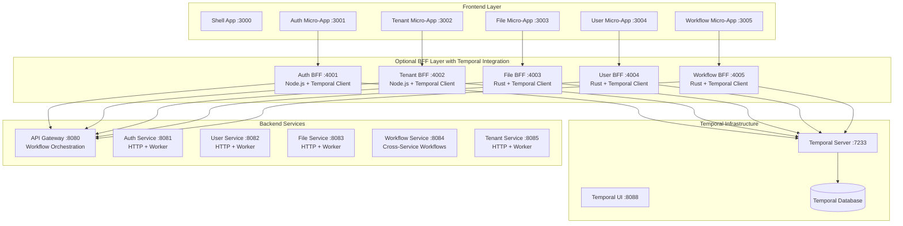
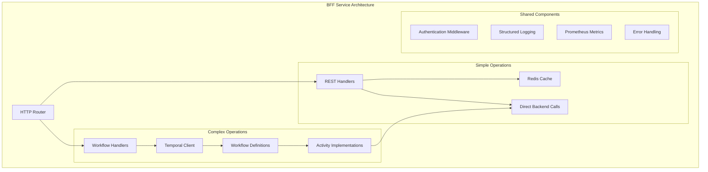

# Temporal BFF Integration Design

## Overview

This design integrates Temporal.io workflows into optional Backend for Frontend (BFF) services within the ADX CORE temporal-first microservices architecture. BFF services act as Temporal workflow clients to provide optimized data aggregation and caching while frontend microservices retain the ability to call the API Gateway directly for both simple operations and workflow initiation.

## Architecture

### High-Level Architecture



### BFF Service Architecture Pattern

Each BFF service implements a hybrid pattern with both traditional REST endpoints and Temporal workflow orchestration:



## Components and Interfaces

### 1. Hybrid BFF Router

Each BFF service implements a router that determines whether to use REST or workflow patterns:

**Decision Matrix:**
- **Simple REST**: Single service call, <1 second, no rollback needed
- **Temporal Workflow**: Multiple services, >1 second, requires compensation, complex state management

**TypeScript Interface (Node.js BFF):**
```typescript
interface BFFRouter {
  // Simple REST endpoints
  get(path: string, handler: RestHandler): void;
  post(path: string, handler: RestHandler): void;
  
  // Workflow endpoints
  workflow(path: string, workflowType: string, options: WorkflowOptions): void;
  
  // Hybrid endpoints (auto-decide based on request)
  hybrid(path: string, simpleHandler: RestHandler, workflowType: string): void;
}

interface WorkflowOptions {
  timeout: Duration;
  retryPolicy: RetryPolicy;
  compensation: CompensationConfig;
}
```

**Rust Interface (Rust BFF):**
```rust
pub trait BFFRouter {
    async fn simple_endpoint<H>(&self, path: &str, handler: H) 
    where H: RestHandler;
    
    async fn workflow_endpoint(&self, path: &str, workflow_type: WorkflowType, options: WorkflowOptions);
    
    async fn hybrid_endpoint<H>(&self, path: &str, simple_handler: H, workflow_type: WorkflowType)
    where H: RestHandler;
}
```

### 2. Workflow Activity Definitions

Activities encapsulate backend service calls with proper error handling and retries:

**Node.js Activities:**
```typescript
interface BackendActivity {
  callAuthService(request: AuthRequest): Promise<AuthResponse>;
  callUserService(request: UserRequest): Promise<UserResponse>;
  callTenantService(request: TenantRequest): Promise<TenantResponse>;
  callFileService(request: FileRequest): Promise<FileResponse>;
}

interface CompensationActivity {
  rollbackUserChanges(userId: string): Promise<void>;
  rollbackTenantChanges(tenantId: string): Promise<void>;
  rollbackFileChanges(fileId: string): Promise<void>;
}
```

**Rust Activities:**
```rust
#[async_trait]
pub trait BackendActivity {
    async fn call_auth_service(&self, request: AuthRequest) -> Result<AuthResponse, ActivityError>;
    async fn call_user_service(&self, request: UserRequest) -> Result<UserResponse, ActivityError>;
    async fn call_tenant_service(&self, request: TenantRequest) -> Result<TenantResponse, ActivityError>;
    async fn call_file_service(&self, request: FileRequest) -> Result<FileResponse, ActivityError>;
}

#[async_trait]
pub trait CompensationActivity {
    async fn rollback_user_changes(&self, user_id: &str) -> Result<(), ActivityError>;
    async fn rollback_tenant_changes(&self, tenant_id: &str) -> Result<(), ActivityError>;
    async fn rollback_file_changes(&self, file_id: &str) -> Result<(), ActivityError>;
}
```

### 3. Workflow Definitions

Common workflow patterns for each BFF domain:

**Tenant Switching Workflow:**
```typescript
export async function tenantSwitchWorkflow(
  userId: string,
  fromTenantId: string,
  toTenantId: string
): Promise<TenantSwitchResult> {
  // Step 1: Validate permissions
  const permissions = await callActivity(validateTenantAccess, { userId, toTenantId });
  
  // Step 2: Update user context
  const userUpdate = await callActivity(updateUserTenant, { userId, toTenantId });
  
  // Step 3: Load tenant-specific data
  const tenantData = await callActivity(loadTenantData, { userId, toTenantId });
  
  // Step 4: Update session
  const sessionUpdate = await callActivity(updateSession, { userId, toTenantId });
  
  return {
    success: true,
    tenantData,
    userContext: userUpdate,
    sessionId: sessionUpdate.sessionId
  };
}
```

**File Upload Workflow:**
```rust
pub async fn file_upload_workflow(
    file_metadata: FileMetadata,
    upload_request: UploadRequest,
) -> Result<FileUploadResult, WorkflowError> {
    // Step 1: Validate file and permissions
    let validation = call_activity(validate_file_upload, &upload_request).await?;
    
    // Step 2: Create file record
    let file_record = call_activity(create_file_record, &file_metadata).await?;
    
    // Step 3: Upload to storage
    let storage_result = call_activity(upload_to_storage, &upload_request).await?;
    
    // Step 4: Update file metadata with storage info
    let final_metadata = call_activity(
        update_file_metadata, 
        &UpdateMetadataRequest {
            file_id: file_record.id,
            storage_path: storage_result.path,
            checksum: storage_result.checksum,
        }
    ).await?;
    
    Ok(FileUploadResult {
        file_id: file_record.id,
        metadata: final_metadata,
        storage_path: storage_result.path,
    })
}
```

### 4. Frontend Integration Patterns

**Synchronous Pattern (for quick workflows):**
```typescript
// Frontend calls BFF and waits for completion
const result = await fetch('/api/tenant/switch', {
  method: 'POST',
  body: JSON.stringify({ toTenantId: 'tenant-123' })
});
```

**Asynchronous Pattern (for long-running workflows):**
```typescript
// Start workflow and get operation ID
const { operationId } = await fetch('/api/files/upload/start', {
  method: 'POST',
  body: formData
}).then(r => r.json());

// Poll for status or use WebSocket
const status = await fetch(`/api/operations/${operationId}/status`);

// Or use WebSocket for real-time updates
const ws = new WebSocket(`/api/operations/${operationId}/stream`);
ws.onmessage = (event) => {
  const update = JSON.parse(event.data);
  updateProgressBar(update.progress);
};
```

## Data Models

### Workflow Execution Context

```typescript
interface WorkflowExecutionContext {
  executionId: string;
  workflowType: string;
  userId: string;
  tenantId: string;
  startTime: Date;
  status: 'running' | 'completed' | 'failed' | 'cancelled';
  progress?: WorkflowProgress;
  result?: any;
  error?: WorkflowError;
}

interface WorkflowProgress {
  currentStep: string;
  totalSteps: number;
  completedSteps: number;
  estimatedTimeRemaining?: number;
}
```

### BFF Configuration

```typescript
interface BFFWorkflowConfig {
  workflows: {
    [workflowType: string]: {
      timeout: number;
      retryPolicy: RetryPolicy;
      compensationEnabled: boolean;
      progressTracking: boolean;
    };
  };
  activities: {
    [activityType: string]: {
      timeout: number;
      retryPolicy: RetryPolicy;
      circuitBreaker: CircuitBreakerConfig;
    };
  };
}
```

## Error Handling

### Workflow Error Patterns

1. **Activity Failures**: Automatic retries with exponential backoff
2. **Timeout Handling**: Graceful degradation and user notification
3. **Compensation**: Automatic rollback of completed steps
4. **Circuit Breaker**: Prevent cascading failures to backend services

**Error Handling Implementation:**
```typescript
export async function handleWorkflowError(
  error: WorkflowError,
  context: WorkflowExecutionContext
): Promise<ErrorResponse> {
  // Log error with full context
  logger.error('Workflow failed', {
    workflowId: context.executionId,
    workflowType: context.workflowType,
    error: error.message,
    stack: error.stack,
    userId: context.userId,
    tenantId: context.tenantId
  });

  // Execute compensation if needed
  if (error.requiresCompensation) {
    await executeCompensation(context);
  }

  // Return user-friendly error
  return {
    error: 'operation_failed',
    message: getUserFriendlyMessage(error),
    canRetry: error.retryable,
    operationId: context.executionId
  };
}
```

## Testing Strategy

### Unit Testing

**Workflow Testing:**
```typescript
describe('Tenant Switch Workflow', () => {
  it('should successfully switch tenant with valid permissions', async () => {
    const testEnv = await TestWorkflowEnvironment.createTimeSkipping();
    
    const { client, nativeConnection } = testEnv;
    const worker = await Worker.create({
      connection: nativeConnection,
      taskQueue: 'test-task-queue',
      workflowsPath: require.resolve('./workflows'),
      activitiesPath: require.resolve('./activities'),
    });

    const result = await client.workflow.execute(tenantSwitchWorkflow, {
      args: ['user-123', 'tenant-old', 'tenant-new'],
      workflowId: 'test-tenant-switch',
      taskQueue: 'test-task-queue',
    });

    expect(result.success).toBe(true);
    expect(result.tenantData.id).toBe('tenant-new');
  });
});
```

**Activity Testing:**
```typescript
describe('Backend Activities', () => {
  it('should handle service failures gracefully', async () => {
    const mockBackendService = jest.fn().mockRejectedValue(new Error('Service unavailable'));
    
    const activity = new BackendActivityImpl(mockBackendService);
    
    await expect(activity.callUserService({ userId: 'test' }))
      .rejects.toThrow('Service unavailable');
    
    expect(mockBackendService).toHaveBeenCalledTimes(1);
  });
});
```

### Integration Testing

**End-to-End Workflow Testing:**
```typescript
describe('BFF Integration Tests', () => {
  it('should complete tenant switch workflow end-to-end', async () => {
    // Start with authenticated user
    const authToken = await getTestAuthToken();
    
    // Call BFF endpoint
    const response = await request(app)
      .post('/api/tenant/switch')
      .set('Authorization', `Bearer ${authToken}`)
      .send({ toTenantId: 'tenant-123' })
      .expect(200);
    
    // Verify workflow completed
    expect(response.body.success).toBe(true);
    
    // Verify backend state changes
    const userContext = await getUserContext(testUserId);
    expect(userContext.currentTenantId).toBe('tenant-123');
  });
});
```

### Performance Testing

**Load Testing Workflows:**
```typescript
describe('Workflow Performance', () => {
  it('should handle concurrent tenant switches', async () => {
    const concurrentSwitches = 100;
    const promises = Array.from({ length: concurrentSwitches }, (_, i) => 
      switchTenant(`user-${i}`, `tenant-${i}`)
    );
    
    const results = await Promise.allSettled(promises);
    const successful = results.filter(r => r.status === 'fulfilled').length;
    
    expect(successful).toBeGreaterThan(concurrentSwitches * 0.95); // 95% success rate
  });
});
```

## Deployment and Operations

### Development Environment

**docker compose Integration:**
```yaml
# Add to existing docker-compose.dev.yml
services:
  temporal-bff-worker-auth:
    build: ./bff-services/auth-bff
    environment:
      - TEMPORAL_SERVER_URL=temporal:7233
      - BACKEND_API_URL=http://api-gateway:8080
    depends_on:
      - temporal
      - api-gateway

  temporal-bff-worker-file:
    build: ./bff-services/file-bff
    environment:
      - TEMPORAL_SERVER_URL=temporal:7233
      - BACKEND_API_URL=http://api-gateway:8080
    depends_on:
      - temporal
      - api-gateway
```

### Monitoring and Observability

**Metrics Collection:**
```typescript
interface BFFWorkflowMetrics {
  workflowExecutions: Counter;
  workflowDuration: Histogram;
  workflowErrors: Counter;
  activityRetries: Counter;
  compensationExecutions: Counter;
}

// Prometheus metrics
const metrics = {
  workflowExecutions: new Counter({
    name: 'bff_workflow_executions_total',
    help: 'Total number of workflow executions',
    labelNames: ['workflow_type', 'bff_service', 'status']
  }),
  
  workflowDuration: new Histogram({
    name: 'bff_workflow_duration_seconds',
    help: 'Workflow execution duration',
    labelNames: ['workflow_type', 'bff_service'],
    buckets: [0.1, 0.5, 1, 2, 5, 10, 30]
  })
};
```

**Structured Logging:**
```typescript
interface WorkflowLogContext {
  workflowId: string;
  workflowType: string;
  userId: string;
  tenantId: string;
  activityName?: string;
  step?: string;
}

const logger = createLogger({
  format: combine(
    timestamp(),
    json(),
    addWorkflowContext()
  )
});
```

### Deployment Strategy

**Gradual Rollout:**
1. **Phase 1**: Deploy workflow infrastructure alongside existing REST endpoints
2. **Phase 2**: Migrate complex operations to workflows with feature flags
3. **Phase 3**: Optimize and tune workflow performance
4. **Phase 4**: Deprecate old REST patterns for complex operations

**Feature Flags:**
```typescript
interface BFFFeatureFlags {
  useWorkflowForTenantSwitch: boolean;
  useWorkflowForFileUpload: boolean;
  useWorkflowForUserOnboarding: boolean;
  workflowTimeoutSeconds: number;
  enableWorkflowCompensation: boolean;
}
```

This design provides a comprehensive approach to integrating Temporal workflows into your BFF services while maintaining the flexibility to use simple REST endpoints where appropriate. The hybrid pattern ensures optimal performance for simple operations while providing robust orchestration for complex multi-service workflows.