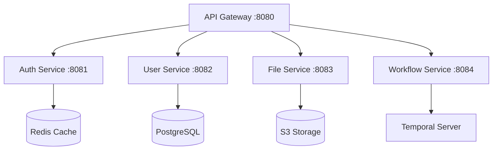

# 🎯 AI Team Handoff Protocol

## Handoff Mission

> **"Seamless knowledge transfer. Zero context loss. Maximum velocity."**

This protocol ensures smooth transitions between AI development teams while maintaining project momentum and quality.

## 🔄 Handoff Process

### 1. Pre-Handoff Preparation (30 minutes)
```markdown
# 📋 Handoff Checklist Template

## Current Team Information
- **Team ID**: Team-X-[Domain]
- **Handoff Date**: YYYY-MM-DD HH:MM UTC
- **Duration Active**: X weeks/days
- **Primary Focus**: [Service/Feature/Phase]

## 🎯 Work Completed
### Major Achievements
- [ ] ✅ [Feature/Service] - Fully implemented and tested
- [ ] ✅ [Bug Fix] - Critical issue resolved
- [ ] ✅ [Infrastructure] - Setup completed
- [ ] 🟡 [Feature] - In progress (80% complete)
- [ ] 🔴 [Issue] - Blocked, requires attention

### Code Changes Summary
- **Files Modified**: X files
- **Lines of Code**: +X/-X
- **New Services**: [list]
- **New Workflows**: [list]
- **New Activities**: [list]

### Database Changes
- [ ] Schema migrations: [file paths]
- [ ] New tables: [table names]
- [ ] Index additions: [descriptions]
- [ ] Data migrations: [if any]

## 🚨 Current Blockers & Issues
### Critical Blockers (Immediate Attention)
1. **[Issue Title]**
   - **Impact**: High/Medium/Low
   - **Description**: [detailed description]
   - **Attempted Solutions**: [what was tried]
   - **Next Steps**: [recommendations]
   - **Resources**: [links, docs, contacts]

### Technical Debt
1. **[Technical Debt Item]**
   - **Location**: [file/service]
   - **Description**: [what needs improvement]
   - **Priority**: High/Medium/Low
   - **Estimated Effort**: [time estimate]

## 🎯 Next Priorities (Ranked)
1. **[Task 1]** - [Brief description] (Estimated: X hours)
2. **[Task 2]** - [Brief description] (Estimated: X hours)
3. **[Task 3]** - [Brief description] (Estimated: X hours)

## 🧪 Testing Status
- **Unit Tests**: X passing, X failing
- **Integration Tests**: X passing, X failing
- **Manual Testing**: [status/notes]
- **Performance Tests**: [results/concerns]

## 📚 Key Learnings & Insights
### Architecture Decisions
1. **[Decision]** - [Rationale] - [Impact]
2. **[Decision]** - [Rationale] - [Impact]

### Performance Optimizations
1. **[Optimization]** - [Results] - [Metrics]
2. **[Optimization]** - [Results] - [Metrics]

### Security Considerations
1. **[Security Item]** - [Implementation] - [Validation]
2. **[Security Item]** - [Implementation] - [Validation]

## 🔗 Important Resources
- **Specification Files**: [key spec files for your work]
- **Configuration Files**: [important config files]
- **External Dependencies**: [new or modified dependencies]
- **Documentation**: [any docs created or updated]

## 🤝 Handoff Notes
### For Next Team
- **Recommended Focus**: [where to start]
- **Key Contacts**: [if any external people were involved]
- **Environment Setup**: [any special setup notes]
- **Debugging Tips**: [helpful debugging information]

### Questions for Next Team
1. [Question about project direction]
2. [Question about technical approach]
3. [Question about priorities]
```

### 2. Handoff Execution (15 minutes)
```bash
#!/bin/bash
# Handoff execution script

# 1. Update PROJECT_TRACKING.md with current status
echo "📊 Updating project tracking..."
update_project_tracking() {
    # Add handoff entry to PROJECT_TRACKING.md
    local handoff_entry="
## 🔄 Team Handoff - $(date '+%Y-%m-%d %H:%M UTC')

### Outgoing Team: $CURRENT_TEAM
### Incoming Team: $NEXT_TEAM

### Status Summary:
- **Phase**: $CURRENT_PHASE
- **Completion**: $COMPLETION_PERCENTAGE%
- **Active Services**: $ACTIVE_SERVICES
- **Critical Issues**: $CRITICAL_ISSUES

### Key Achievements:
$ACHIEVEMENTS_LIST

### Immediate Priorities:
$PRIORITY_LIST

### Blockers:
$BLOCKER_LIST
"
    
    echo "$handoff_entry" >> PROJECT_TRACKING.md
}

# 2. Commit all current work
echo "💾 Committing current work state..."
git add .
git commit -m "🔄 Team handoff: Current work state

$(cat handoff-summary.md)

Team: $CURRENT_TEAM -> $NEXT_TEAM
Phase: $CURRENT_PHASE
Status: $COMPLETION_PERCENTAGE% complete

[handoff]" || echo "No changes to commit"

# 3. Create handoff branch
echo "🌿 Creating handoff branch..."
git checkout -b "handoff/$(date '+%Y%m%d')-$CURRENT_TEAM-to-$NEXT_TEAM"
git push origin "handoff/$(date '+%Y%m%d')-$CURRENT_TEAM-to-$NEXT_TEAM"

# 4. Create GitHub issue for handoff
echo "📋 Creating handoff issue..."
gh issue create \
    --title "🔄 Team Handoff: $CURRENT_TEAM → $NEXT_TEAM" \
    --body-file handoff-summary.md \
    --label "handoff,team-transition" \
    --assignee "$NEXT_TEAM_LEAD"

# 5. Run final validation
echo "✅ Running final validation..."
./scripts/dev-start.sh &
DEV_PID=$!
sleep 30  # Wait for services to start

# Test all services
curl -f http://localhost:8080/health || echo "❌ API Gateway health check failed"
curl -f http://localhost:8081/health || echo "❌ Auth Service health check failed"
curl -f http://localhost:8082/health || echo "❌ User Service health check failed"

# Stop development environment
kill $DEV_PID

echo "🎯 Handoff preparation complete!"
echo "📋 Review handoff-summary.md and share with incoming team"
```

### 3. Knowledge Transfer Session (30 minutes)
```markdown
# 🎓 Knowledge Transfer Agenda

## Session Structure (30 minutes)

### Opening (5 minutes)
- **Introductions**
- **Current project status overview**
- **Handoff objectives**

### Technical Deep Dive (15 minutes)
#### Architecture Review
- **Service interactions**
- **Workflow patterns used**
- **Database schema changes**
- **Performance considerations**

#### Code Walkthrough
- **Key files and modules**
- **Recent changes and reasoning**
- **Testing approach**
- **Debugging strategies**

### Current Challenges (5 minutes)
- **Immediate blockers**
- **Technical debt**
- **Performance issues**
- **Security concerns**

### Next Steps (5 minutes)
- **Priority recommendations**
- **Resource allocation**
- **Timeline expectations**
- **Success metrics**

## 📝 Knowledge Transfer Template

### System Architecture


### Key Workflows Implemented
1. **user_onboarding_workflow**
   - Purpose: Complete user registration process
   - Duration: ~5 seconds typical
   - Activities: validate_user, create_account, send_welcome_email
   - Error Handling: Compensation pattern for rollback

2. **file_processing_workflow**
   - Purpose: Process uploaded files
   - Duration: Variable (30s-10min)
   - Activities: virus_scan, metadata_extraction, thumbnail_generation
   - Error Handling: Retry with exponential backoff

### Performance Characteristics
- **API Response Times**: 95th percentile < 100ms
- **Database Query Times**: Average < 10ms
- **Workflow Start Times**: < 200ms
- **Memory Usage**: ~200MB per service

### Security Implementation
- **JWT Authentication**: RS256 with 15-minute expiry
- **Multi-tenant Isolation**: Row-level security enabled
- **Rate Limiting**: 1000 req/min per user
- **Audit Logging**: All sensitive operations logged

### Testing Strategy
- **Unit Tests**: 85% coverage target
- **Integration Tests**: Key workflows tested
- **Performance Tests**: Load testing setup
- **Security Tests**: Penetration testing checklist
```

## 🚀 Onboarding New Team (15 minutes)

### 1. Environment Setup Validation
```bash
#!/bin/bash
# New team onboarding script

echo "🚀 ADX Core - New Team Onboarding"
echo "=================================="

# 1. Verify prerequisites
echo "🔍 Checking prerequisites..."
check_prereq() {
    local cmd=$1
    local name=$2
    if command -v $cmd >/dev/null 2>&1; then
        echo "✅ $name installed"
    else
        echo "❌ $name missing - install required"
        return 1
    fi
}

check_prereq "rustc" "Rust"
check_prereq "docker" "Docker"
check_prereq "psql" "PostgreSQL Client"
check_prereq "redis-cli" "Redis Client"

# 2. Clone and setup
echo "📦 Setting up project..."
git clone https://github.com/hscale/adx-core.git 2>/dev/null || echo "Repository already exists"
cd adx-core

# 3. Start development environment
echo "🔧 Starting development environment..."
./scripts/dev-start.sh &
DEV_PID=$!

# Wait for services to be ready
echo "⏳ Waiting for services to start..."
sleep 30

# 4. Validate all services
echo "🧪 Validating services..."
validate_service() {
    local port=$1
    local name=$2
    if curl -f http://localhost:$port/health >/dev/null 2>&1; then
        echo "✅ $name (port $port) is healthy"
    else
        echo "❌ $name (port $port) is not responding"
    fi
}

validate_service 8080 "API Gateway"
validate_service 8081 "Auth Service"
validate_service 8082 "User Service"
validate_service 8083 "File Service" 2>/dev/null || echo "⚠️  File Service not running (expected if not implemented)"
validate_service 8084 "Workflow Service" 2>/dev/null || echo "⚠️  Workflow Service not running (expected if not implemented)"

# 5. Test authentication flow
echo "🔐 Testing authentication flow..."
AUTH_RESPONSE=$(curl -s -X POST http://localhost:8081/api/v1/auth/login \
  -H 'Content-Type: application/json' \
  -d '{
    "email": "admin@example.com",
    "password": "password",
    "tenant_id": "550e8400-e29b-41d4-a716-446655440000"
  }')

if echo "$AUTH_RESPONSE" | grep -q "access_token"; then
    echo "✅ Authentication flow working"
else
    echo "❌ Authentication flow failed"
    echo "Response: $AUTH_RESPONSE"
fi

# 6. Test database connection
echo "🗄️  Testing database connection..."
if docker exec $(docker ps -q -f name=postgres) psql -U adx_user -d adx_core -c "SELECT COUNT(*) FROM users;" >/dev/null 2>&1; then
    echo "✅ Database connection working"
else
    echo "❌ Database connection failed"
fi

# 7. Test Temporal UI
echo "⚡ Testing Temporal UI..."
if curl -f http://localhost:8088 >/dev/null 2>&1; then
    echo "✅ Temporal UI accessible at http://localhost:8088"
else
    echo "❌ Temporal UI not accessible"
fi

# Cleanup
kill $DEV_PID 2>/dev/null

echo ""
echo "🎯 Onboarding complete!"
echo "📚 Next steps:"
echo "  1. Review PROJECT_TRACKING.md for current status"
echo "  2. Check GitHub issues for immediate tasks"
echo "  3. Read handoff documentation in handoff-summary.md"
echo "  4. Start development with ./scripts/dev-start.sh"
echo ""
echo "🔗 Important links:"
echo "  - Temporal UI: http://localhost:8088"
echo "  - API Gateway: http://localhost:8080"
echo "  - Specifications: .kiro/specs/"
echo "  - Project Board: https://github.com/hscale/adx-core/projects"
```

### 2. Quick Win Identification
```markdown
# 🎯 Quick Win Strategy for New Team

## Immediate Tasks (Day 1)

### High-Impact, Low-Effort Tasks
1. **Fix Compilation Warnings**
   - Location: Run `cargo clippy --workspace`
   - Effort: 30 minutes
   - Impact: Code quality improvement

2. **Add Missing Unit Tests**
   - Location: Check coverage with `cargo tarpaulin`
   - Effort: 1-2 hours
   - Impact: Improved reliability

3. **Update Documentation**
   - Location: README.md, API docs
   - Effort: 30 minutes
   - Impact: Better developer experience

### Medium-Impact Tasks (Week 1)
1. **Performance Optimization**
   - Location: Slow database queries
   - Effort: 2-4 hours
   - Impact: Better response times

2. **Security Hardening**
   - Location: Security audit results
   - Effort: 2-3 hours
   - Impact: Improved security posture

3. **Integration Test Coverage**
   - Location: tests/ directory
   - Effort: 4-6 hours
   - Impact: Better regression testing

## Success Metrics
- **Day 1**: Environment running, basic changes committed
- **Week 1**: First feature/fix deployed
- **Week 2**: Major contribution completed
```

## 📊 Handoff Success Metrics

### Quality Gates
- [ ] All services starting successfully
- [ ] All tests passing
- [ ] No critical security issues
- [ ] Documentation updated
- [ ] Handoff issue created
- [ ] Knowledge transfer completed

### Knowledge Transfer Validation
- [ ] New team can start development environment
- [ ] New team understands current architecture
- [ ] New team knows immediate priorities
- [ ] New team has access to all resources
- [ ] New team can make first commit within 2 hours

### Continuity Metrics
- [ ] Zero downtime during handoff
- [ ] No regression in test coverage
- [ ] No increase in response times
- [ ] All workflows continue functioning
- [ ] Monitoring and alerts maintained

---

**Smooth handoffs create unstoppable momentum. Make every transition seamless!** 🤝
